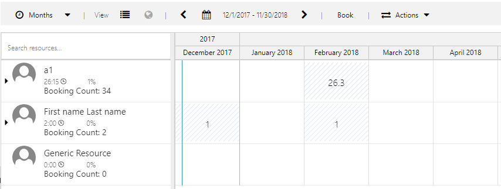

## Extend Schedule Board Functionality with UFX

Applies to: Dynamics 365 for Field Service, Dynamics 365 for Project Service, Universal resource Scheduling, Dynamics 365 9.0.x
### Overview

This topic provides you with sample code to implement common schedule board extensibility use cases, and to  customize the schedule board and other scenarios using **Universal FetchXML (UFX)**.

If you’re brand new to building queries in Dynamics 365, first check out the article Build a query with FetchXML for background. Universal FetchXML takes the capabilities of FetchXML and adds to them to enable schedule board extensibility.

UFX is an advanced query language that allows you to query data using dynamic FetchXML, and then shape and prepare the resulting data for consumption by the **Universal Resource Scheduling(URS)** solution. 

This query language enables you to create custom queries to customize and extend the schedule board and schedule assistant filters to meet the unique business needs of the organization. 

To help you get a head start on building your own queries with UFX, we’ve given you access to the out-of-the-box queries for filtering resources or searching for availability on the schedule board, and allow you to modify the front-end filter control that resource managers and schedulers use to interact with the schedule board. 

Here are some of the examples that shows how users can extend schedule board functionality. 


### Find total bookings scheduled during a date range

Use UFX to build a query that allows a user to use the date range displayed on the schedule board to return matching bookings within that date range.

There are two values available for the input bag of the retrieve resource query: schedule board visible start and schedule board visible end date. The keys for these two values are  `$input/ScheduleBoard/StartDate and $input/ScheduleBoard/EndDate`.

The values are bound to the current schedule board’s visible data range and can be used in the UFX query condition to select data based on the visible dates.
Follow the steps below to add the UFX block to the default Retrieve Resource Query.

-	Navigate to **Resource Scheduling > Schedule Board**.
-	Click the **+** icon next to initial public view and click on **Open Default Settings**.


                        
-	Scroll down to **Retrieve Resource query** and click on **gear** icon.
-	Add the sample code block shown below.

```xml
<!-- Booking join -->
<link-entity name="bookableresourcebooking" from="resource" to="bookableresourceid" link-type="outer">
<attribute name="name" aggregate="countcolumn" alias="bookingcount" />
<filter>
 <condition attribute="statecode" operator="eq" value="0" />
 <condition attribute="starttime" operator="le">
 <ufx:value select="$input/ScheduleBoard/EndDate" attribute="value" />  
</condition>
 <condition attribute="endtime" operator="ge">
 <ufx:value select="$input/ScheduleBoard/StartDate" attribute="value" />
</condition>s
</filter>
</link-entity>
```
- Click on **Save as**, name the query and click **Save**

### Create a custom Template for Resource cell

Change the appearence of resource cell and visualize data specific to business in the resource cell on the schedule board using universal fetchXML

To achieve this goal, follow the steps below.
- Create a new entity called **Zone**, and create some sample data for the entity.
-	Link the **Resource** entity to **Zone** entity, and then associate resources to zone.
-	Navigate to **Resource Scheduling > Schedule Board**.
-	Click **+** icon next to initial public view and click on **Open Default Settings**.
        
  
        
-	Scroll down to **Resource Cell Template** and **Retrieve Resource query** and click on **gear** icon to edit.
-	Add new **Zone column** to each resource in the query.
         
```xml  
<?xml version="1.0" encoding="utf-8" ?>
<bag xmlns:ufx="http://schemas.microsoft.com/dynamics/2017/universalfetchxml">
  <Resources ufx:source="fetch">
    <fetch mapping="logical" aggregate="true">
      <entity name="bookableresource">
        <attribute name="bookableresourceid" alias="bookableresourceid" groupby="true"/>
        <attribute name="name" alias="name" groupby="true"/>
        <attribute name="calendarid" alias="calendarid" groupby="true"/>
        <attribute name="resourcetype" alias="resourcetype" groupby="true"/>
        <attribute name="msdyn_startlocation" alias="startlocation" groupby="true"/>
        <attribute name="new_zone" alias="new_zone" groupby="true"/>
        <!-- Let the database sort by name, unless we have characteristics - in which case we'll sort by the count of characteristics -->
```
-	Update the HTML template used by the board to render each resource ad add the new Zone column to the resource.


```html
<div class='resource-card-wrapper {{iif ResourceCellSelected "resource-cell-selected" ""}} {{iif ResourceUnavailable "resource-unavailable" ""}} {{iif IsMatchingAvailability "availability-match" ""}}'>
    {{#if imagepath}}
    
    {{else}}
    <div class='resource-image unknown-resource'></div>
    {{/if}}
    <div class='resource-info'>
        <div class='resource-name primary-text ellipsis' title='{{name}}'>{{name}}</div>
        <div class='secondary-text ellipsis'>
// this is the ufx code line to add a new zone column to the template//
            {{ [new_zone@ufx-formatvalue] }}
            {{#if (eq (is-sa-grid-view) false) }}
            <div class='booked-duration'>{{BookedDuration}}<div class='fo-sch-clock'></div></div>
            <div class='booked-percentage'>{{BookedPercentage}}%</div>
            {{/if}}
        </div>
        {{#if (eq (is-sa-grid-view) false) }}
        <div class='matching-indicator'></div>
        {{/if}}
    </div>
    {{#if (eq (is-sa-grid-view) false) }}
    {{> resource-map-pin-template this }}
    {{/if}}
</div>
```

The schedule board now displays the new Zone column for each resource.


### Custom Resource Filtering
Schedulers can filter resources on the schedule board based on the custom filters. Schedulers need to use the existing filter control to diaplay and apply their custom filters.
To achieve this goal, followe the steps below, 
- Navigate to ** Resource Scheduling > Schedule Board**.
- Click **+** icon next to initial public view and click on **Open Default Settings**.
- Scroll down to **Filter Layout** and click on **gear** icon to edit.
- Update the filter layout to show the Zone entity as a filter as shown below. You can remove the default filters.  


- Click on **Save as**, name the layout and click **Save**.
- Now, edit the **Resource Query** as shown below to query resources.


