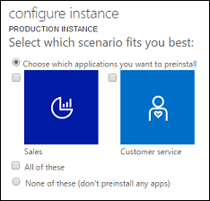

# Add an instance to your subscription

[!INCLUDE[applies-to](../includes/cc_applies_to_ce.md)]

You can add Production and non-Production (Sandbox) instances to a subscription. Each new instance creates a separate organization that can be used by different departments, locations, or for non-production purposes such as development. For more information on the instance types available to you, see [Pricing and licensing](https://go.microsoft.com/fwlink/p/?LinkID=615167).   
  
 Purchase the [!INCLUDE[pn_crm_online_subsequent](../includes/pn-crm-online-subsequent.md)] instance on the [Microsoft online services portal Purchase subscriptions](https://admin.microsoft.com/Commerce/Catalog.aspx) page. Additional storage and instances can be purchased by customers who have a paid Professional user license subscription.  
  
 You must have the [!INCLUDE[pn_MS_Office_365](../includes/pn-ms-office-365.md)] Global administrator (however, see **Note** below) to do these tasks. For more information, see [Assigning administrator roles](https://support.office.com/article/Assign-admin-roles-in-Office-365-eac4d046-1afd-4f1a-85fc-8219c79e1504).  

> [!NOTE]
> Consider using the less privileged service admin role instead of the global admin role. See [Use the service admin role to manage your tenant](use-service-admin-role-manage-tenant.md).

## What information do I need to create an instance?
 When you add an instance, you can accept the default values, or enter different values to create an instance.

- **Select which scenario fits you best**. The apps you can choose depend on the licenses you've purchased. If you haven't purchased any [!INCLUDE[pn_dyn_365](../includes/pn-crm-shortest.md)] licenses, you'll only see **None of these (don't preinstall any apps)**.

  

- **Name**. This is typically the name of your organization and is displayed in the model-driven apps in Dynamics 365, such as Dynamics 365 Sales and Customer Service.

- **URL**. The URL is used to construct the URL for users to sign-in to the model-driven apps in Dynamics 365. Therefore, we recommend that you limit the length of URL name to reduce the overall length of the URL.

- **Purpose**. This value is used to associate the instance with a specific intent and is only displayed in the instance picker, which is accessed through the [!INCLUDE[pn_dyn_365_admin_center](../includes/pn-dyn-365-admin-center.md)]. For example, if this instance is for exclusive use by your sales and marketing departments you can enter *Contoso Sales and Marketing* or if the instance is for development and for testing purposes enter a relevant name such as *Contoso Development*.

- **Security Group**. This value is used to determine the [!INCLUDE[pn_MS_Online_Services](../includes/pn-ms-online-services.md)] security group that includes the users who will have access to this instance. For more information, see [Control user access to instances: security groups and licenses](../admin/add-instance-subscription.md#BKMK_man_sec_group).

  > [!IMPORTANT]
  >  If you do not specify a security group, all users associated with the subscription who have a license will be added to the new instance.

- **Country/Region**. You can specify a region for the instance.

  > [!NOTE]
  >  To request the ability to create instances (Production and non-Production) in more than one geographical region, please contact your account manager or [Technical Support](contact-technical-support.md).

- **Currency**. When you add an instance, you must select a base currency before the instance is provisioned. Although you can add currencies in the model-driven apps in Dynamics 365, only the base currency will be used for reporting.

    > [!WARNING]
    >  Once set, the base currency cannot be changed.

## Add an additional instance
 The following steps apply to customers who do not purchase using volume licensing. Volume license customers should see: [Microsoft Volume Licensing Service Center](https://www.microsoft.com/Licensing/servicecenter/default.aspx).

### Step 1: Purchase the additional instance

1. Sign in to the [Microsoft 365 admin center](https://admin.microsoft.com) as an [!INCLUDE[pn_Office_365](../includes/pn-office-365.md)] Global administrator. In the navigation pane, click **Billing** > **Purchase Services**.

2. Scroll down to the **Add-on subscriptions** section, and then hover over **Dynamics 365 Enterprise Edition - Additional Non-Production Instance** or **Dynamics 365 Enterprise - Additional Production Instance**, and then click **Buy now**.

3. Proceed through the screens to purchase additional instances.

    For more information, see [Pricing and licensing](https://go.microsoft.com/fwlink/p/?LinkID=615167).

> [!TIP]
>  Close your browser session and open a new session to force an update to the **Manage your Dynamics 365 instances** page.

### Step 2: Configure the additional instance

1. [!INCLUDE[proc_office365_signin](../includes/proc-office365-signin.md)]

2. [!INCLUDE[proc_office365_choose_admin_crm](../includes/proc-office365-choose-admin-crm.md)]

3. Choose the **Instances** tab.

4. Select the instance that you want to configure, and then click **Configure**.

   > [!TIP]
   >  If the instance does not appear in the list or is in a state other than **ready to configure**, wait a few minutes and then try again. Or, close your browser session and open a new session to force an update to the **Manage your Dynamics 365 instances** page.
   >
   >  You cannot start a new instance until you click **Configure** and complete the configuration process.
   >
   > Instances will not come prepared with sample data when configured by an [!INCLUDE[pn_Office_365](../includes/pn-office-365.md)] Global administrator who does not have a license. Sample data may be added later, after the instance is configured and ready to use, by a [!INCLUDE[pn_crm_online_subsequent](../includes/pn-crm-online-subsequent.md)] apps licensed user who has the System administrator security role. For more information, see [Add or remove sample data](add-remove-sample-data.md).

5. On the **configure new instance** page, enter your settings, and then click **Next**.

6. On the **Confirm some details** page, verify that the country/region and currency displayed are correct. Although you can add currencies in the model-driven apps in Dynamics 365, only the base currency will be used for reporting.

   > [!WARNING]
   >  After a base currency is selected it cannot be changed.

    After you have verified that the base currency is correct, click **Finish**.

7. Once your instance is set up, make note of the URL and click or tap it to launch model-driven apps in Dynamics 365. Prepare the instance for users by assigning security roles, creating teams, customizing, and importing data. [!INCLUDE[proc_more_information](../includes/proc-more-information.md)] [Getting Started](getting-started.md).

## What is the effect of an additional instance on storage?
 When you add a new instance, the new instance and any existing instances will consume the existing storage that is available to the account. Warnings will be communicated when storage is near capacity.

## Control user access to instances: security groups and licenses

See: [Control user access to environments: security groups and licenses](https://docs.microsoft.com/power-platform/admin/control-user-access)

<!--
 If your company has multiple instances, you can use security groups to control which licensed users can be a member of a particular instance.

 Consider the following example scenario:

|Instance|Security Group|Purpose|
|--------------|--------------------|-------------|
|Coho Winery Sales|Sales_SG|Provide access to the organization that creates sales opportunities, handles quotes, and closes deals.|
|Coho Winery Marketing|Marketing_SG|Provide access to the organization that drives marketing efforts through marketing campaigns and advertising.|
|Coho Winery Service|Marketing_SG|Provide access to the organization that processes customer cases.|
|Coho Winery Dev|Developer_SG|Provide access to the Sandbox instance used for development and testing.|

 In this example, four security groups provide controlled access to a specific organization.

 Note the following about security groups:

- When users are added to the security group, they are added to the instance.

- When users are removed from the group, they are disabled in the instance.

- When a security group is associated with an existing instance with users, all users in the instance that are not members of the group will be disabled.

- If an instance does not have an associated security group, all users with a license will be created as users and enabled in the instance.

- If a security group is associated with an instance, only users with licenses that are members of the instance security group will be created as users in the instance.

- When you remove a security group that is associated with a instance, either by editing the instance and removing the security group or by deleting the security group, licensed users who were members of the security group will have the same access to model-driven apps in Dynamics 365.

- When you assign a security group to an instance, that instance will not show up in the **Instances** tab (instance picker) in the [!INCLUDE[pn_dyn_365_admin_center](../includes/pn-dyn-365-admin-center.md)] for users not in the group.

- If you do not assign a security group to an instance, the instance will show up in the **Instances** tab (instance picker) in the [!INCLUDE[pn_dyn_365_admin_center](../includes/pn-dyn-365-admin-center.md)] even for those who have not been assigned a security role in that instance.

- Nested security groups are not supported.

> [!NOTE]
> All licensed users, whether or not they are members of the security groups, must be assigned security roles to access model-driven apps in Dynamics 365. You assign the security roles in the web application. Users can’t access instances until they are assigned at least one security role for that instance. More information: [Grant users access](../admin/grant-users-access.md).

### Create a security group and add members to the security group

1.  Sign in to the [Microsoft 365 admin center](https://admin.microsoft.com).

2.  Click **Groups** > **Groups**.

3.  Click **+ Add a group**.

4.  Change the type to **Security group**, add the group **Name** and **Description**. Click **Add** > **Close**.

5.  Click the group you created, and then next to **Members**, click **Edit**.

6.  Click **+ Add members**. Select the users to add to the security group, and then click **Save** > **Close** several times to return to the **Groups** list.

7.  To remove a user from the security group, select the security group, next to **Members**, click **Edit**. Click **- Remove members**, and then click **X** for each member you want to remove.

> [!NOTE]
>  If the users you want to add to the security group are not created, create the users and assign to them the licenses.
>
>  To add multiple users, see: [bulk add users to Office365 groups](https://go.microsoft.com/fwlink/p/?LinkID=615203).

### Create a user and assign license

1. In the [!INCLUDE[pn_office_365_admin_center](../includes/pn-office-365-admin-center.md)], click **Users** > **Active users** > **+ Add a user**. Enter the user information, select licenses, and then click **Add**.

   [!INCLUDE[proc_more_information](../includes/proc-more-information.md)] [Add users individually to Office 365 - Admin Help](https://go.microsoft.com/fwlink/p/?LinkID=615205)

### Associate a security group with an instance

1. In the [!INCLUDE[pn_office_365_admin_center](../includes/pn-office-365-admin-center.md)], click **Admin centers** > **Dynamics 365**.

2. Click the **Instances** tab, select an instance, and then click **Edit**.

3. In **security settings**, search for a specific security group, and then click **Next** > **Save**.

> [!TIP]
>  To force an immediate synchronization between the [!INCLUDE[pn_MS_Online_Services_Portal](../includes/pn-ms-online-services-portal.md)] and model-driven apps in Dynamics 365, do the following:
>
> - Sign out of model-driven apps in Dynamics 365 and the [!INCLUDE[pn_MS_Online_Services_Portal](../includes/pn-ms-online-services-portal.md)].
> - Close all open browsers used for model-driven apps in Dynamics 365 and the [!INCLUDE[pn_MS_Online_Services_Portal](../includes/pn-ms-online-services-portal.md)].
> - Sign back in to model-driven apps in Dynamics 365 and the [!INCLUDE[pn_MS_Online_Services_Portal](../includes/pn-ms-online-services-portal.md)].
-->

### See also
[Create and manage environments in the Power Platform admin center](https://docs.microsoft.com/power-platform/admin/create-environment)