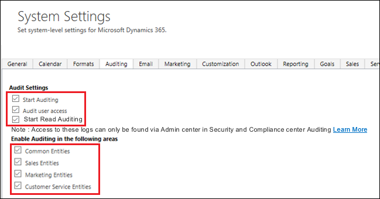
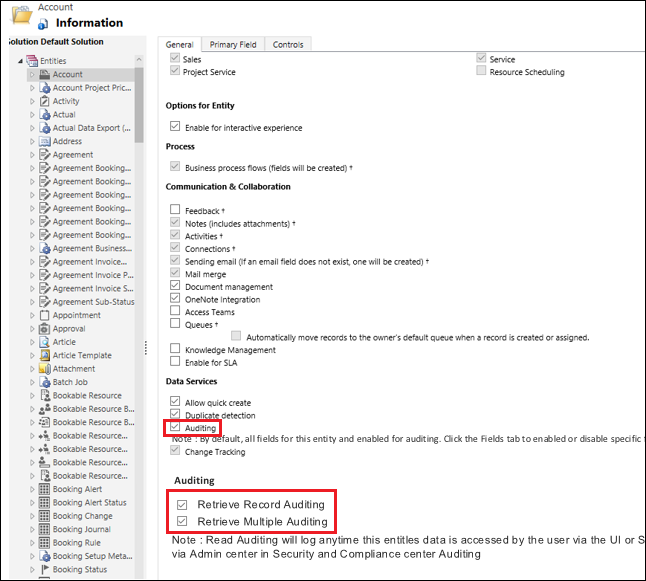

# Enable Security Compliance Center auditing

Protecting data, preserving privacy, and complying with regulations such as the [General Data Protection Regulation](https://www.microsoft.com/en-us/TrustCenter/Privacy/gdpr/default.aspx) are certainly some of the highest priorities for your business. It's critical that you audit the entirety of data processing actions taking place to be able to analyze for possible security breaches.  

A user can have many interactions with various Office and Dynamics applications. You need to capture all these actions to sort through and find the relevant data.

This topic covers how you can set [!INCLUDE [pn-ms-dyn-365](../includes/pn-ms-dyn-365.md)] to audit a broad range of data processing activities and use the [Office 365 Security and Compliance Center](https://support.office.com/en-us/article/go-to-the-office-365-security-compliance-center-7e696a40-b86b-4a20-afcc-559218b7b1b8?ui=en-US&rs=en-US&ad=US) to review the data in activity reports.

## Scenarios to features

Consider the following scenarios you, the admin, will likely encounter and the features needed to address them.

|Scenario |  |Feature  |
|---------|---------|---------|
|Must be able to: <ul><li>Record and analyze unauthorized data access</li> <li>Record and analyze alteration of data</li> <li>Record and analyze accidental or unlawful destruction of data</li>     |         |Must be able to:  <li>Clearly identify all the creates and read actions done by the user</li> <li>Clearly identify all the update actions done by the user</li> <li>Clearly identify any accidental delete action done by the admin</li> <li>Clearly identify the request origin</li></ul> |

We'll show you how to set up the features needed to capture and review the data in these scenarios.

## What events are audited
The following are the admin and user events you can audit.

### Admin-related events

|Event  |Description  |
|---------|---------|
|Publishing customizations  |An admin publishes a new customization which overrides a change done by the previous one. The action requires auditing for analysis.    |
|Attribute deletes     |Admin accidentally deletes an attribute. This action also deletes the data. |
|Team, user management     |Who was added, who was deleted, what access rights a user/team had is important for analyzing impact.|
|Configure instance     |Adding solutions to an instance.|
|Backup and restore     |Backup and restore actions at the tenant.|
|Manage applications     |New instance added, existing instance deleted, trials converted to paid, etc.|

### User and support-related events 

|Event  |Description  |
|---------|---------|
|Create, read, update, delete (CRUD)     |Logging all CRUD activities essential for understanding the impact of a problem and being compliant with data protection impact assessments (DPIA). |
|Multiple record view     |Users of Dynamics view information in bulk, like grid views, reports etc. Critical customer content information is part of these views.|
|Export to Excel     |Exporting data to Excel moves the data outside of the secure environment and is vulnerable to threats.|
|SDK calls via surround or custom apps     |Actions taken via the core platform or surround apps calling into the SDK to perform an action needs to be logged.|
|All support CRUD activities     |Microsoft support engineer activities on customer environment.|
|Admin activities     |Admin activities on customer tenant.|
|Backend commands     |Microsoft support engineer activities on customer tenant and environment.|

## Enable auditing in Dynamics 365
<slide 17-18, req 5-9>
1. In Dynamics 365 (online), choose Settings > Administration > System Settings > Auditing tab.
2. Under **Audit Settings**, enable the following check boxes:
   - **Start Auditing**
   - **Audit user access**
   - **Start Read Auditing** (Note: this only appears if you enable **Start Auditing**.)
3. Under **Enable Auditing in the following areas**, enable the check boxes for the areas you want to audit and then choose **OK**.
   
4. Go to **Settings** > **Customizations** > **Customize the System**
5. Select an entity to audit, such as **Account**.
6. Scroll down and under **Data Services** enable **Auditing**.
7. Under **Auditing**, enable the following check boxes:
   - **Retrieve Record Auditing**
   - **Retrieve Multiple Auditing**
8. Choose **Save**.
9. Repeat steps 5 - 8 for other entities you want to audit.
   

## Review your audit data using reports in Office 365 Security and Compliance Center
<req 56>
You can review your audit data in the Office 365 Security and Compliance Center. See [Search the audit log](https://support.office.com/article/search-the-audit-log-for-user-and-admin-activity-in-office-365-57ca5138-0ae0-4d34-bd40-240441ef2fb6)

## Create reports
<See: https://support.office.com/en-us/article/search-the-audit-log-in-the-office-365-security-compliance-center-0d4d0f35-390b-4518-800e-0c7ec95e946c?ui=en-US&rs=en-US&ad=US#run&PickTab=BYB>

## Additional considerations
- data goes back 90 days?
- further back? use SIEM tool?
- mention Azure Auditing? <req 1>

### See also
 [Audit data and user activity for security and compliance](audit-data-user-activity.md) 
 [Search the audit log in the Office 365 Security & Compliance Center](https://support.office.com/article/search-the-audit-log-in-the-office-365-security-compliance-center-0d4d0f35-390b-4518-800e-0c7ec95e946c)