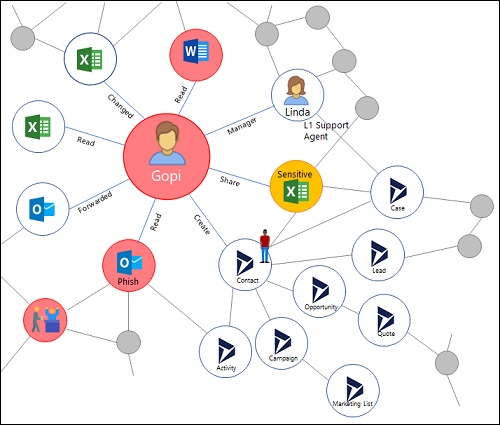

# Enable Security Compliance Center auditing

<intro slide 3-5, slide 44-45>
-  mention Azure Auditing? <req 1>

No doubt, of highest priority to your business is protecting data, preserving privacy, and complying with regulations such as the [General Data Protection Regulation](https://www.microsoft.com/en-us/TrustCenter/Privacy/gdpr/default.aspx). It's critical that you get that you audit the entirety of actions taking place with your data to be able to analyze for security incidences.  

A typical user will have many interactions with various Office and Dynamics applications. You need to capture all these actions to sort through and find the relevant data.

This topic covers how you can set [!INCLUDE [pn-ms-dyn-365](../includes/pn-ms-dyn-365.md)] to audit activities and use the [Office 365 Security and Compliance Center](https://support.office.com/en-us/article/go-to-the-office-365-security-compliance-center-7e696a40-b86b-4a20-afcc-559218b7b1b8?ui=en-US&rs=en-US&ad=US) to review activity reports.

## Scenarios to features

Consider the following scenarios you, as the admin, will likely encounter and the features needed to address them.

|Scenario |  |Feature  |
|---------|---------|---------|
|Must be able to: <ul><li>Record and analyze unauthorized data access</li> <li>Record and analyze alteration of data</li> <li>Record and analyze accidental or unlawful destruction of data</li>     |         |Must be able to: <li>Clearly identify all the creates and read actions done by the user</li> <li>Clearly identify all the update actions done by the user</li> <li>Clearly identify any accidental delete action done by the admin</li> <li>Clearly identify the request origin</li></ul> |

## What events are audited
<intro>
### Admin-related events
<table - slide 9>
### User-related events
<table - slide 10>

## What an audit log looks like
<slide 12>

## Enable auditing in Dynamics 365
<slide 17-18, req 5-9>

## Set up auditing in Office 365
<on by default>

## Use reports in Office 365 Security and Compliance Center
<req 56>

## Create reports
<See: https://support.office.com/en-us/article/search-the-audit-log-in-the-office-365-security-compliance-center-0d4d0f35-390b-4518-800e-0c7ec95e946c?ui=en-US&rs=en-US&ad=US#run&PickTab=BYB>

### See also
 [Audit data and user activity for security and compliance](audit-data-user-activity.md)