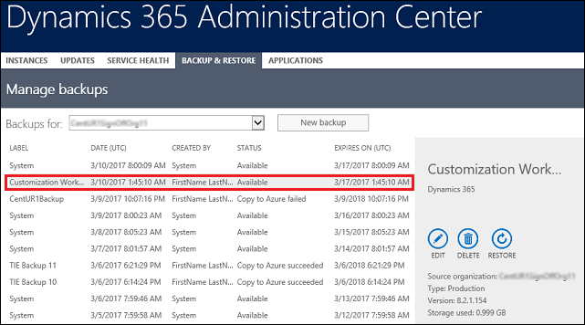
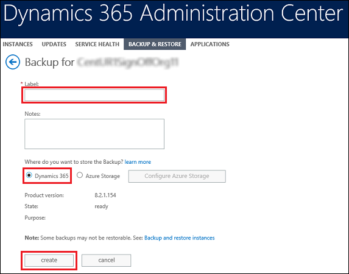

# Back up and restore instances

Protecting your data in model-driven apps in Dynamics 365, such as Dynamics 365 Sales and Customer Service, and providing continuous availability of service is important for you and for us. You have multiple options for backing up and restoring your instances.   

> [!NOTE]
> - Consider using the less privileged service admin role instead of the global admin role. See [Use the service admin role to manage your tenant](use-service-admin-role-manage-tenant.md).
> - Obtaining a copy of your database backup isn't available. If you want to move your online data to Dynamics 365 Customer Engagement (on-premises), this requires data migration. For smaller datasets, consider [exporting and importing data using Excel](/dynamics365/customer-engagement/basics/import-export-data). For larger datasets, find a third-party data migration solution on [Microsoft AppSource](https://appsource.microsoft.com/). 
  
  
 
## System backups  
 Good news! Backups take place without you having to do anything.  
  
 About **system backups**:  
  
- All your instances are backed up.  
  
- System backups occur continuously.  Since we use Azure SQL, see [Azure Sql automated backups](https://docs.microsoft.com/azure/sql-database/sql-database-automated-backups) for details.
  
- System backups for production-type instances are retained up to 28 days. Other instance-type backups are retained up to 7 days. Check your expiration date.

> [!NOTE]
> We are working on updating the expiration date interface. Correct dates will show once this work is completed.
>
> The retention period specified in Azure SQL documentation may be different from our retention period since we manage the retention period.

  

- System backups do not count against your storage limits.  
  
- System backups are identified as created by **System** on the **Manage backups** page.  
  
    
  
### See your system backups  
  
1. [!INCLUDE[proc_office365_signin](../includes/proc-office365-signin.md)] You can also sign in with System Administrator or Delegated Admin security roles.  
  
2. Click **Admin centers** > **Dynamics 365**.  
  
3. Click the **Backup & Restore** tab.  
  
4. Choose an instance from the **Backups for** drop-down list.  
  
   System-created backups appear under **Created By** as **System**.  
  
     
  
   

## On-demand backup: managed  
 Automated system backups are great, but you will want to be able to make your own backups before making some significant customization change or applying a version update. You can do this with on-demand managed backups.  
  
> [!NOTE]
>  A backup is created for you when we update your instance.  
  
 About Dynamics 365 apps managed **on-demand backups**:  
  
- You can back up production and Sandbox instances.  
  
- **You can only restore to a Sandbox instance**. To restore to a production instance, first switch it to a Sandbox instance. See [Switch an instance](../admin/switch-instance.md).  
  
- Only [!INCLUDE[pn_crm_8_1_0_online_subsequent](../includes/pn-crm-8-1-0-online-subsequent.md)] or later versions are supported for backup.  
  
- On-demand backups are retained for up to 7 days. Check your expiration date.  
  
    
  
- You are not limited in the number of on-demand backups you can make.

- On-demand backups do not count against your storage limits.  

- On-demand backups are identified by having a label you created and by the presence of **Edit** | **Delete** | **Restore** in the details section. System backups have only **Restore**.  
  
    
  
   

### Create an on-demand backup of an instance  
  
1. [!INCLUDE[proc_office365_signin](../includes/proc-office365-signin.md)] You can also sign in with System Administrator or Delegated Admin security roles.  
  
2. Click **Admin centers** > **Dynamics 365**.  
  
3. Click the **Backup & Restore** tab.  
  
4. Choose an instance from the **Backups for** drop-down list.  
  
5. Click **New backup**.  
  
     
  
6. Type a label and any notes to help identify this backup for future restoration.  
  
7. Click **Create**.  
  
     
  
   A notification will be displayed to confirm the backup is being created.  The status column in the list provides the status of the backup.  
  
> [!NOTE]
>  The instance remains available while being backed up.  
  
   

### Edit an on-demand backup  
 Edit a backup to change its label and your notes about the backup.  
  
1. [!INCLUDE[proc_office365_signin](../includes/proc-office365-signin.md)] You can also sign in with System Administrator or Delegated Admin security roles.  
  
2. Click **Admin centers** > **Dynamics 365**.  
  
3. Click the **Backup and Restore** tab.  
  
4. Choose an instance from the **Backups for** drop-down list.  
  
5. Choose an on-demand backup from the list of backups.  
  
6. Click **Edit**.  
  
     
  
7. Change the information as needed, and then click **Save**.  
  
   

### Restore an on-demand backup  
You can only restore to Sandbox instances. To restore to a production instance, first switch it to a Sandbox instance. See [Switch an instance](switch-instance.md).

> [!IMPORTANT]
> Note that changing an instance type to Sandbox will immediately reduce backup retention to 7 days. If you do not need backups (restore points) older than 7 days, then you can safely switch the type. If you think you may need restore points older than 7 days, we strongly recommend that you keep the instance as production and consider restoring to a different instance of type Sandbox.
  
1. [!INCLUDE[proc_office365_signin](../includes/proc-office365-signin.md)] You can also sign in with System Administrator or Delegated Admin security roles.  
  
2. Click **Admin centers** > **Dynamics 365**.  
  
3. Click the **Backup and Restore** tab.  
  
4. Choose an instance from the **Backups for** drop-down list.  
  
5. Choose an on demand backup from the list of backups.  
  
6. Click **Restore**.  
  
     
  
7. Click **Select target**  to pick a target instance.  
  
8. Click **Next**. Verify the details, and then click **Restore**.  
  
     
  
   A notification will be displayed confirming that the backup is being restored.  It can take some time for the restoration to complete.  
  
> [!NOTE]
>  The instance remains unavailable while being restored.  
  
   

### Delete an on-demand backup  
 You can use the [!INCLUDE[pn_dyn_365_admin_center](../includes/pn-dyn-365-admin-center.md)] to delete Dynamics 365 apps-managed, on-demand backups.  You can't delete system backups.  
  
1. [!INCLUDE[proc_office365_signin](../includes/proc-office365-signin.md)] You can also sign in with System Administrator or Delegated Admin security roles.  
  
2. Click **Admin centers** > **Dynamics 365**.  
  
3. Click the **Backup & Restore** tab.  
  
4. Choose an instance from the **Backups for** drop-down list.  
  
5. Choose an on-demand backup from the list of backups.  
  
6. Click **Delete**.  
  
     
  
7. Click **Confirm**.  

## FAQ

### How are system backups taken?
In the current version of the product, system backups occur continuously; this is different from previous versions where we took backups once a day. Since we use Azure SQL, please see [Azure SQL automated backups](https://docs.microsoft.com/azure/sql-database/sql-database-automated-backups) for details.

### How are manual/on-demand backups taken?
In the current version of the product, system backups occur continuously; this is different from previous versions where we took backups once a day. Since we use Azure SQL, please see [Azure SQL automated backups](https://docs.microsoft.com/azure/sql-database/sql-database-automated-backups) for details.

Since Azure SQL takes backups continuously, there is no need to take additional backups or specify Azure SQL to take additional backups or an on-demand full backup. So our on-demand backup is just a label and a time-stamp that we store in our system and use during restore requests. This is different from previous versions where took a full backup during an on-demand backup. 

### Should I open a support ticket for taking a full backup?
No. In the current version of the product, system backups occur continuously; this is different from previous versions where we took backups once a day. Since we use Azure SQL, please see [Azure Sql automated backups](https://docs.microsoft.com/azure/sql-database/sql-database-automated-backups) for details.

Since Azure SQL takes continuous backups and no specific way to take additional on-demand backups, we recommend you use our on-demand backup feature to label your backups. 

### How long are my manual/on-demand backups and system backups retained?
System backups for production-type instances are retained up to 28 days. Other instance-type backups are retained up to 7 days.

### Can I extend my backup to be retained beyond the standard number of days?
You can't extend your system backups or manual/on-demand backups. However, if you want to keep the data for longer than the standard retention period, we recommend you copy your instance to an additional instance and do not modify that additional instance. 

### Can I move my data from an online instance to an on-premises version?
Obtaining a copy of your database backup isn't available. If you want to move your online data to Customer Engagement (on-premises), this requires data migration. For smaller datasets, consider exporting and [importing data using Excel](../basics/import-export-data.md). For larger datasets, find a third-party data migration solution on [Microsoft AppSource](https://appsource.microsoft.com/).

### Do we have any database size restriction to take a backup or restoring an organization through user interface (UI) or API?
We do not have any restriction on database size to take a backup or restore an organization through UI or API. So please use the UI or API to do self-service. Open a support ticket if the operation fails.

### Can I restore to a production instance?
In order to prevent accidental overwrites, we don't allow users to directly restore to a production instance. To restore to a production instance, first switch it to a Sandbox instance. See [Switch an instance](switch-instance.md). Note that changing an instance type to Sandbox will immediately reduce backup retention to 7 days. If you do not need backups (restore points) older than 7 days, then you can safely switch the type. If you think you may need restore points older than 7 days, we strongly recommend that you keep the instance as production and consider restoring to a different instance of type Sandbox.

### Why is my organization in administration mode after a restore and how do I disable it?
The newly restored instance is placed in administration mode. To disable administration mode, see [Set administration mode](manage-sandbox-instances.md#set-administration-mode).  
