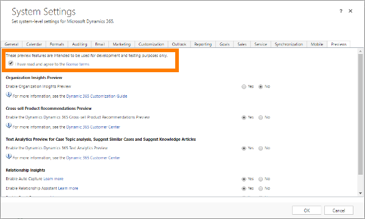

# Preview feature: Configure Relationship Insights features to better understand customer interactions
We're introducing a new suite of features called  *Relationship Insights*. These features continuously analyze the vast collection of customer-interaction data already stored in your [!INCLUDE[pn_dynamics_crm](../includes/pn-dynamics-crm.md)] and [!INCLUDE[pn_Microsoft_Exchange](../includes/pn-microsoft-exchange.md)] databases, to help you better understand your business relationships, evaluate your activities in relation to previous successes, and choose the best path forward.  
  
 Relationship Insights includes the following features, which all work together to amplify their individual strengths:  
  
-   Relationship assistant  
  
-   Email engagement  
  
-   Auto capture  
  
 [!INCLUDE[proc_more_information](../includes/proc-more-information.md)] [Preview feature: Relationship Insights overview](../admin/relationship-insights-overview.md)  
  
 A preview feature is a feature that is not complete, but is made available before it’s officially in a release so customers can get early access and provide feedback. Preview features aren’t meant for production use and may have limited or restricted functionality.  
  
 When fully included in the product, Relationship Insights will help sales and support people work more effectively while nurturing and enhancing their business relationships.  
  
> [!IMPORTANT]
>  Microsoft doesn't provide support for this preview feature. [!INCLUDE[pn_microsoftcrm](../includes/pn-microsoftcrm.md)] technical support won’t be able to help you with issues or questions. Preview features aren't meant for production use and are subject to a separate [supplemental terms of use for preview features](http://go.microsoft.com/fwlink/p/?LinkId=511446).  
  
   
## Send us feedback  
 We are making this preview available so that you can try it and let us know what you think. Your feedback will help us prioritize work to include the capabilities you need most. We ask that you give us your suggestions and report problems by using our publicly-available feedback site: [Microsoft Ideas](https://go.microsoft.com/fwlink/p/?LinkId=825778)  
  
   
## Getting started  
 The Relationship Insights  preview is not enabled by default. You need to enable each feature before you can use it. You can enable and use each feature individually or in any combination. To enable a preview feature, you must be a [!INCLUDE[pn_crm_shortest](../includes/pn-crm-shortest.md)] administrator.  
  
1. [!INCLUDE[proc_settings_administration](../includes/proc-settings-administration.md)]  
  
2.  Choose **System Settings**, and then click the **Previews** tab.  
  
3.  Read the [license terms](http://go.microsoft.com/fwlink/p/?LinkId=511446), and if you agree, select the **I’ve read and agree to the license terms** check box.  
  
   
  
4.  Scroll down to the **Relationship Insights** section and    select the **Yes** radio button for each preview feature you want to enable.  
  
    > [!NOTE]
    >  If you enable email engagement, then we strongly recommend that you also enable the relationship assistant because email engagement relies on some of its features.  
  
 [!INCLUDE[proc_more_information](../includes/proc-more-information.md)] [What are Preview features and how do I enable them?](what-are-preview-features-how-do-i-enable-them.md)  
  
> [!NOTE]
>  Once you have enabled each of the preview features that you want to use, they become available as options on your site, just as they are expected to be in the final release. However, you'll still need to  set up each feature as needed, and some features require additional prerequisites. See the remainder of this topic for details.  
  
   
## Requirements and prerequisites  
 All Relationship Insights features are available as preview features in the [!INCLUDE[pn_crm_8_2_0_online](../includes/pn-crm-8-2-0-online.md)] and are only available in North American sites that use US English (en-us). Some features are also available in the [!INCLUDE[pn_crm_8_2_0_op](../includes/pn-crm-8-2-0-op.md)]. Additional restrictions apply depending on which versions of [!INCLUDE[pn_dynamics_crm](../includes/pn-dynamics-crm.md)] and [!INCLUDE[pn_Microsoft_Exchange](../includes/pn-microsoft-exchange.md)] you are running, as detailed in the following table.  
  
|Product version|Available Relationship Insights features|  
|---------------------|----------------------------------------------|  
|[!INCLUDE[pn_crm_8_2_0_online](../includes/pn-crm-8-2-0-online.md)] with [!INCLUDE[pn_Microsoft_Exchange_Online](../includes/pn-microsoft-exchange-online.md)]|-   Relationship assistant -   Email engagement -   Auto capture|  
|[!INCLUDE[pn_crm_8_2_0_online](../includes/pn-crm-8-2-0-online.md)] with [!INCLUDE[pn_Microsoft_Exchange](../includes/pn-microsoft-exchange.md)] (on-premises)|-   Relationship assistant (not including cards for [!INCLUDE[pn_Exchange](../includes/pn-exchange.md)]) -   Email engagement|  
|[!INCLUDE[pn_crm_8_2_0_op_subsequent](../includes/pn-crm-8-2-0-op-subsequent.md)]|-   Only the relationship assistant is available, and only its *base cards* are supported. [!INCLUDE[proc_more_information](../includes/proc-more-information.md)] [Preview feature: Action cards reference](../admin/preview-feature-action-cards-reference.md) -   No features or action cards are available for [!INCLUDE[pn_Exchange](../includes/pn-exchange.md)], so your [!INCLUDE[pn_Exchange](../includes/pn-exchange.md)] version is not important.|  
  
 **Auto capture also requires the following:**  
  
-   You must use [!INCLUDE[pn_Microsoft_Exchange_Online](../includes/pn-microsoft-exchange-online.md)] as your email server.  
  
-   Users must use the web client for [!INCLUDE[pn_crm_online_shortest](../includes/pn-crm-online-shortest.md)] (other front ends are not supported).  
  
-   For each user that requires access to this feature, you must approve their email address to allow queries against [!INCLUDE[pn_Exchange](../includes/pn-exchange.md)] (requires tenant-level admin privileges). [!INCLUDE[proc_more_information](../includes/proc-more-information.md)] [Approve email](https://technet.microsoft.com/library/mt622056.aspx#BKMK_ApproveEmail)  
  
-   To track incoming email messages, you must set up server-side synchronization. [!INCLUDE[proc_more_information](../includes/proc-more-information.md)] [Set up server-side synchronization of email, appointments, contacts, and tasks](https://technet.microsoft.com/library/dn531109.aspx)  
  
 **Email engagement also requires the following:**  
  
-   To use followed email attachments, [!INCLUDE[pn_onedrive_for_business](../includes/pn-onedrive-for-business.md)] must be available to your [!INCLUDE[pn_dynamics_crm](../includes/pn-dynamics-crm.md)] server. [!INCLUDE[proc_more_information](../includes/proc-more-information.md)] [Enable OneDrive for Business](https://technet.microsoft.com/library/mt622109.aspx)  
  
-   To use followed email attachments, you must also enable document management for email in [!INCLUDE[pn_dynamics_crm](../includes/pn-dynamics-crm.md)]. [!INCLUDE[proc_more_information](../includes/proc-more-information.md)] [Enable SharePoint document management for specific entities](../admin/enable-sharepoint-document-management-specific-entities.md)  
  
-   To enable delivery-time recommendations based on recipients' time zones, you must enable [!INCLUDE[pn_bing_maps](../includes/pn-bing-maps.md)] in [!INCLUDE[pn_dynamics_crm](../includes/pn-dynamics-crm.md)]. [!INCLUDE[proc_more_information](../includes/proc-more-information.md)] [System Settings dialog box - General tab](../admin/system-settings-dialog-box-general-tab.md)  
  
   
## Assign user privileges to give access to Relationship Assistant features  
 The privileges required to access Relationship Insights features are automatically enabled for all out-of-the-box security roles, but are initially disabled for all custom roles. If you enable *any* Relationship Insights features, then you must check the settings listed in the following table to ensure that your users can access those features, and also to ensure that other features don't stop working as a result of privilege cascades related to these features.  
  
|Privilege|Security role tab|Description and requirements|  
|---------------|-----------------------|----------------------------------|  
|**Action Card**|**Core Records**|Gives the ability to view and interact with action cards that are generated by the relationship assistant. **Warning:**  If the relationship assistant is enabled, then all users *must* have a role with read access for this privilege. Because of cascading, users without this privilege will lose access to many [!INCLUDE[pn_dynamics_crm](../includes/pn-dynamics-crm.md)] features when the relationship assistant is enabled.|  
|**Action Card User Settings**|**Core Records**|Gives the ability to view and change user preferences for action cards that are generated by the relationship assistant. **Warning:**  If the relationship assistant is enabled, then all users *must* have a role with read access for this privilege. Because of cascading, users without this privilege will lose access to many [!INCLUDE[pn_dynamics_crm](../includes/pn-dynamics-crm.md)] features when the relationship assistant is enabled.|  
  
 [!INCLUDE[proc_more_information](../includes/proc-more-information.md)] [Security roles and privileges](https://technet.microsoft.com/library/dn531090.aspx)  
  
   
## Open the Relationship Insights settings to enable and configure its features  
 Administrator settings for all Relationship Insights features are available on  a single settings page, which provides a tab for each feature. To open the settings, go to **Settings** > **Relationship Insights**.  
  
   
  
 If this is the first time you are using Relationship Insights, then you see a privacy disclaimer, legal terms, and other important information. Read the information and, if you agree with the terms, click to continue to the settings page. You only need to do this once; after that you'll go straight to the settings.  
  
> [!IMPORTANT]
>  Relationship Insights provides features that track behavior and collect information about contacts. Make sure you understand the related privacy issues that these features raise, and enable the features only if you are certain that they do not violate any privacy policies already in place in your organization. Always take steps to protect the privacy of your contacts. For complete details, see [Important privacy information](#privacy), later in this topic.  
  
   
## Activate and configure the relationship assistant  
 The relationship assistant is automatically enabled after you  opt in to the preview and accept the agreement on first opening the **Relationship Insights** settings. After this, you can disable and re-enable it at any time by doing the following:  
  
1.  Go to **Settings** > **Relationship Insights** to open the settings page, and then open the **Relationship Assistant** tab.  
  
   
  
2.  Select the **Turn on the relationship assistant for your organization** check box at the top of the page to enable the relationship assistant on your site. Clear this box to disable the feature.  
  
    > [!IMPORTANT]
    >  By enabling this feature, you consent to share data about your customers' email activity with an external system. Data imported from external systems into [!INCLUDE[pn_crm_shortest](../includes/pn-crm-shortest.md)] are subject to our privacy statement. For complete details, see [Important privacy information](#privacy), later in this topic.  
  
3.  The rest of the settings on this page let you configure which cards to use and fine tune their behavior. Work with the settings here as follows:  
  
    -   Cards are categorized by type, with a section for each type that you can expand or collapse as needed.  
  
    -   Enable or disable specific action cards as needed by using the check boxes provided for each card.  
  
    -   Some cards have extra configuration settings that modify their behavior. These settings are provided to the right of the check box for the relevant cards only.  
  
    -   If you're not sure what a card does, hover your mouse pointer over the preview symbol  and a description of the card will pop up as a tool tip.  
  
     For complete details about each available action card, including details about the configuration settings available for each of them and other details, see [Preview feature: Action cards reference](../admin/preview-feature-action-cards-reference.md).  
  
4.  Click the **Save** button at the top of the page to save your settings.  
  
 For more information about the relationship assistant and how it can help your users, see [Preview feature: Relationship assistant](../admin/preview-feature-relationship-assistant.md).  
  
> [!NOTE]
>  Users can also set their own personal preferences for their action cards. They can't add cards that you disable here, but they can disable cards that you have enabled if they don't find them useful. They can also change the configuration settings for those cards that have them, though your settings will be the defaults. [!INCLUDE[proc_more_information](../includes/proc-more-information.md)] [Preview feature: Relationship assistant](../admin/preview-feature-relationship-assistant.md)  
  
   
## Activate and configure email engagement  
  
> [!NOTE]
>  If you enable email engagement, then we strongly recommend that you also enable the relationship assistant, because email engagement relies on some of its features.  
  
 To configure, enable, or disable email engagement:  
  
1.  Go to **Settings** > **Relationship Insights** to open the settings page, and then open the **Email Engagement** tab.  
  
     If you've never enabled email engagement before, then the **Email Engagement** tab shows a checkbox next to a privacy disclaimer. Read the disclaimer carefully, and follow its links for complete details. If you agree with its terms, select the checkbox and then click the **Begin Setup** button to initialize the feature, which might take a few minutes. When setup is complete, the standard email engagement settings are shown. You only have to do this once.  
  
2.  Select the **Turn on email engagement for your organization** check box at the top of the page to enable email engagement on your site. Clear this box to disable the feature.  
  
    > [!IMPORTANT]
    >  By enabling this feature, you consent to share data about your customers' email activity with an external system. Data imported from external systems into [!INCLUDE[pn_crm_shortest](../includes/pn-crm-shortest.md)] are subject to our privacy statement. For complete details, see [Important privacy information](#privacy), later in this topic.  
  
3.  Click the **Save** button at the top of the panel to save your settings.  
  
 For more information about email engagement and how this feature can help your users, see [Preview feature: Email engagement](../admin/preview-feature-email-engagement.md).  
  
   
## Activate and configure auto capture  
 Auto capture is automatically enabled after you opt in to the preview and accept the agreement on opening the **Relationship Insights** settings. You can disable and re-enable it at any time by doing the following:  
  
1.  Go to **Settings** > **Relationship Insights** to open the settings page, and then open the **Auto Capture** tab.  
  
2.  Select the **Enable auto capture in the organization** check box at the top of the page to enable email engagement on your site. Clear this box to disable the feature.  
  
    > [!IMPORTANT]
    >  By enabling this feature, you consent to share data about your customers' email activity with an external system. Data imported from external systems into [!INCLUDE[pn_crm_shortest](../includes/pn-crm-shortest.md)] are subject to our privacy statement. For complete details, see [Important privacy information](#privacy), later in this topic.  
  
3.  Click the **Save** button at the top of the page to save your settings.  
  
 For more information about auto capture and how this feature can help your users, see [Preview feature: Auto capture](../admin/preview-feature-auto-capture.md).  
  
   
## Important privacy information  
[!INCLUDE[cc_privacy_relationship_insights_relationship_assistant](../includes/cc-privacy-relationship-insights-relationship-assistant.md)]
  
[!INCLUDE[cc_privacy_relationship_insights_email_engagement](../includes/cc-privacy-relationship-insights-email-engagement.md)]
  
[!INCLUDE[cc_privacy_relationship_insights_auto_capture](../includes/cc-privacy-relationship-insights-auto-capture.md)]
  
### See also  
 [What are Preview features and how do I enable them?](what-are-preview-features-how-do-i-enable-them.md)   
 [Preview feature: Relationship Insights overview](../admin/relationship-insights-overview.md)   
 [Preview feature: Relationship assistant](../admin/preview-feature-relationship-assistant.md)   
 [Preview feature: Action cards reference](../admin/preview-feature-action-cards-reference.md)   
 [Preview feature: Email engagement](../admin/preview-feature-email-engagement.md)   
 [Preview feature: Auto capture](../admin/preview-feature-auto-capture.md)