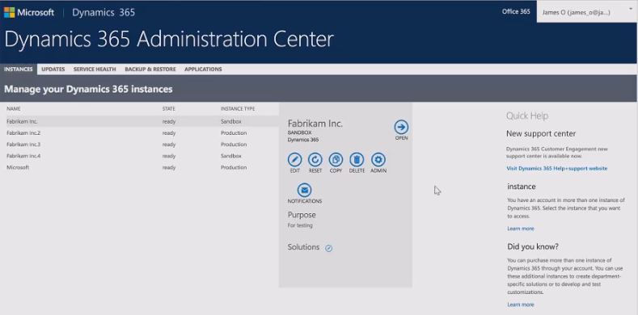
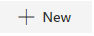
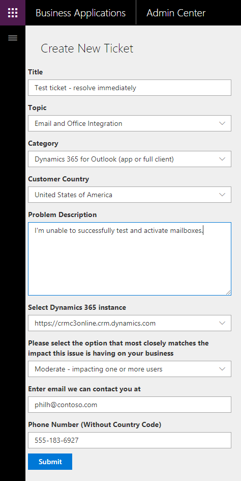

# Contact Technical Support 

[!INCLUDE[cc-applies-to-update-9-0-0](../includes/cc_applies_to_update_9_0_0.md)] [!INCLUDE[cc-applies-to-update-8-2-0](../includes/cc_applies_to_update_8_2_0.md)]

> [!NOTE]
>  This topic is under construction. We’re updating content based on changes to the feature, so check back soon!

## Preview feature: Dynamics 365 new support center 

As of February 2018, we're introducing a new process for admins to request assistance for [!INCLUDE [pn-crm-online](../includes/pn-crm-online.md)] that will allow us to more speedily help you by getting your information to the right support staff quickly and accurately.

### Prerequisites

-  This is a Preview feature that is not complete, but is made available before it’s officially in a release so customers can get early access and provide feedback.

-  For [!INCLUDE [pn-crm-online](../includes/pn-crm-online.md)].

-  Currently for organizations in North America (NAM) region. Other regions should see the [section below](#contacting-support-for-regions-other-than-north-america-nam). 

-  For the following [support plans](https://www.microsoft.com/en-us/dynamics365/support).
   
   - Subscription Support
   - Enhanced Support
   - Professional Direct Support

   Premier Support plan members can use the contact method provided for their plan.

-  You must be an Office 365 or Dynamics 365 (online) admin to enter service requests.

### Enter a service request through the new support center

> [!NOTE]
> The user interface is currently a work in progress so expect procedural and graphic changes. Check back for updated content.

1. Go to [https://admin.dynamics.com](https://admin.dynamics.com).
<!--
   -OR- 

   Select the support link from the Dynamics 365 Administration Center

    -->

2. Select New. 

3. Fill in your information, and then select **Submit**.

   

Your ticket will appear in the list of Support Tickets.

## Contacting support for regions other than North America (NAM)

 You have to be a [!INCLUDE[pn_microsoftcrm](../includes/pn-microsoftcrm.md)] administrator to contact technical support. If you are not an administrator, contact your local administrator.  

For contact information, see [Self-Help Resources](https://mbs.microsoft.com/customersource/northamerica/CRM/support/support-lifecycle/CRMSupport)
  
