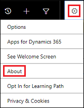
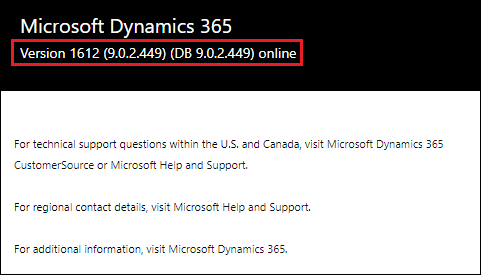
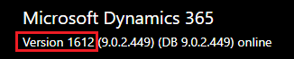
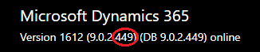

# Determine your version 

[!INCLUDE[cc-applies-to-update-9-0-0](../includes/cc_applies_to_update_9_0_0.md)] [!INCLUDE[cc-applies-to-update-8-2-0](../includes/cc_applies_to_update_8_2_0.md)]

https://blogs.msdn.microsoft.com/crm/2015/04/14/new-naming-conventions-for-microsoft-dynamics-crm-updates/

https://blogs.msdn.microsoft.com/crm/2018/06/19/de-mystifying-versioning-in-dynamics-365/

Version information can be useful for feature version requirements and managing updates. It's easy to determine your version of Dynamics 365.

On the Dynamics 365 nav bar, select **Settings** () > **About**.

Version info appears.

Let's break down what these numbers mean.

|Version number  |Meaning  |
|---------|---------|
|     | ?        |
|     |Major release         |
|     |Minor release         |
|     |Minor incremental update         |
|     |? Minor incremental update version         |

# Why two version numbers?

As updates are deployed to the Dynamics 365 service, there are two separate versions that are tracked.

## App version

Application version represents the binary version that is deployed to the Dynamics 365 servers. These updates contain product improvements and bug fixes that are delivered through application code changes.

## DB version

Database version represents the version of the organization’s database. These updates contain customization changes to support new features, product enhancements, and bug fixes.

## Why do the app version and DB version sometimes differ?

There are two primary scenarios where the app Version and DB version will not match.

**App-only update**: As we continue to increase the frequency of updates to Dynamics 365, it is common for a release to only include application updates with no database updates required. In such a scenario, the application version will be incremented, but the DB version will remain the same.  On a subsequent release that involves both application and database changes, the versions will once again align.

**Update sequence**: During the update sequence, application servers are updated first, followed by the update of the organizations themselves. Multiple organizations are batched together and updated concurrently to speed up the overall release. Depending on when an organization is picked up for processing, the versions may not match during this window of time.

## What should I do when the versions do not match?

As described in the scenarios above, it's entirely normal for the app version and DB version to occasionally differ.  The application is built specifically to support compatibility with previous database releases, so mismatched versions are generally (except very rare scenarios) not a cause for concern.

# More information on versions

Check out these additional sources for more information on versioning and updates:
- [Microsoft Dynamics 365 Online releases](https://support.microsoft.com/help/2925359/microsoft-dynamics-crm-online-releases)
- [Release notes](https://docs.microsoft.com/business-applications-release-notes/)
- [Manage updates](manage-updates.md)

