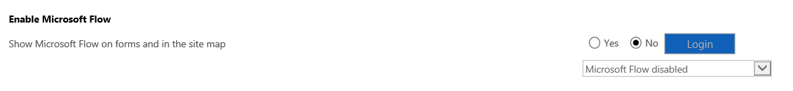

# Enable Flow integration to automate processes

[!INCLUDE[cc-applies-to-update-9-0-0](../includes/cc_applies_to_update_9_0_0.md)]

Microsoft Flow lets you create automated processes between your favorite apps and services. The ability to run flows from within [!INCLUDE[pn_microsoftcrm](../includes/pn-dynamics-crm.md)] apps makes it simple for users to combine a broad spectrum of services that can be initiated from within [!INCLUDE [pn-crm-shortest](../includes/pn-crm-shortest.md)] apps, such as messaging, social engagement, and document routing services.  

[!INCLUDE[pn_microsoftcrm](../includes/pn-dynamics-crm.md)] instances use the default Flow environment. For more information about Flow environments, see [Using environments within Microsoft Flow](https://flow.microsoft.com/documentation/environments-overview-admin/)
  
The Flow integration feature is not available in the following service or geographic regions.
- Microsoft Dynamics 365 for Customer Engagement apps Government
- Germany

Once the Flow integration feature is enabled, the following privileges are added in the **Miscellaneous** section of the **Customization** tab for security roles.  
  
- Name: prvFlow  
  
- Name: prvFlow  
  
## Prerequisites  
  
- A Flow connection for [!INCLUDE [pn-crm-shortest](../includes/pn-crm-shortest.md)] apps (recommended). [!INCLUDE[proc_more_information](../includes/proc-more-information.md)] [Connectors](https://docs.microsoft.com/connectors/)  
  
- One or more flows created in the Flow environment to use with [!INCLUDE [pn-crm-shortest](../includes/pn-crm-shortest.md)] apps. [!INCLUDE[proc_more_information](../includes/proc-more-information.md)] [Create a flow by using Dynamics 365 for Customer Engagement apps (online)](https://flow.microsoft.com/documentation/connection-dynamics365/)  
  
## Enable or disable Flow in your Dynamics 365 for Customer Engagement apps organization  
 By default, all security roles allow users to run flows on the records that they have access to.  
  
 To enable or disable Flow integration in your organization, follow these steps.  
  
1.  Go to the **Settings** > **Administration** > **System Settings** > **Customization** tab.  
  
2.  Enable or disable Flow in your organization.  
  
    -   To enable, under **Enable Microsoft Flow** click **Yes**.  
    
    -   To disable, under **Enable Microsoft Flow** click **No**.  
  
          
  
3.  Click **OK** to close System Settings. 

> [!TIP]
   >  The Flows menu only list flows that begin with the *When a record is selected* Common Data Service trigger and contain at least one trigger or action that references that entity.
   >  
 
### See also  
 [Create and edit web resources](../customize/create-edit-web-resources.md)
