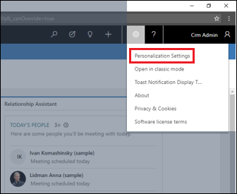
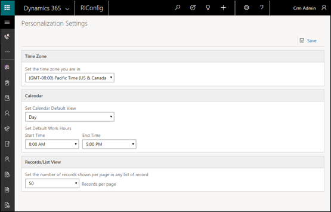

# Enable the hybrid experience

Many of the core functionalities of sales and customer service have moved to the [Unified Interface](about-unified-interface.md) experience. Some of the features that are not yet on Unified Interface can be accessed in the Unified Interface client. 

The following features are not yet moved to but can be enabled for viewing in the Unified Interface.

- [Advanced Find](../basics/save-advanced-find-search.md) 
- [Bulk edit](manage-your-data.md)
- [Merge records](../basics/merge-duplicate-records-accounts-contacts-leads.md)
- [Record sharing](../basics/assign-record-user-team.md)
- All options under **Set Personal Options** ()

These features are enabled by default through a setting in System Settings.

1. Go to **Settings** > **Administration** > **System Settings**.  
2. Select the **General** tab.  

With embedding of legacy dialogs enabled, when you select one of the above features...

...the legacy web client dialog opens in the Unified Interface client.

If you disable embedding of legacy dialogs, a Unified Interface Personalization Settings page opens.

### See also  
 [Unified Interface](about-unified-interface.md)