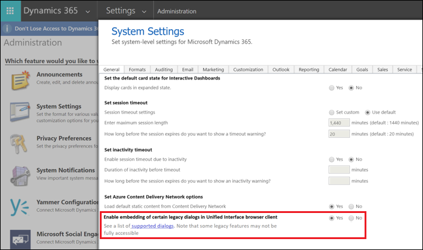
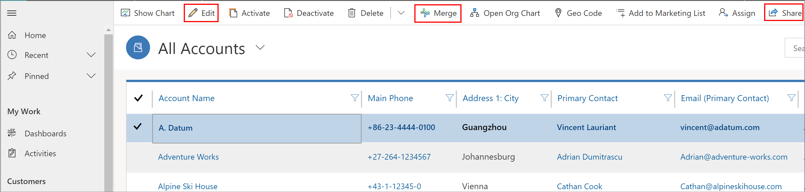
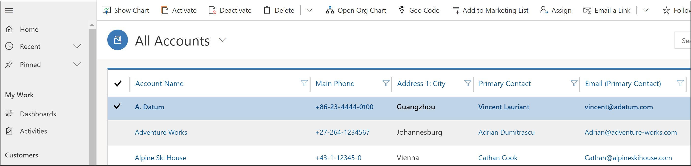

# Enable the hybrid experience

[!INCLUDE[cc-applies-to-update-9-0-0](../includes/cc_applies_to_update_9_0_0.md)]

Most of the core functionalities of sales and customer service have moved to the [Unified Interface](about-unified-interface.md) experience. Some of the features that are not yet on Unified Interface can now be accessed in the Unified Interface client. 

The following features are not yet present in the Unified Interface but can be enabled for display as legacy dialogs in the Unified Interface through the hybrid experience.

- [Advanced Find](../basics/save-advanced-find-search.md) 
- [Bulk edit](manage-your-data.md)
- [Merge records](../basics/merge-duplicate-records-accounts-contacts-leads.md)
- [Record sharing](../basics/assign-record-user-team.md)
- [Audit History](../developer/auditing-overview.md)
- All options under **Set Personal Options** ()

These features are enabled through a setting in System Settings.

1. Go to **Settings** > **Administration** > **System Settings**.  
2. Select the **General** tab.  
3. Set **Enable embedding of certain legacy dialogs in Unified Interface browser client** to **Yes**.

When you enable the hybrid experience, commands appear on the command bar. For example, when you select an account, **Edit**, **Merge**, and **Share** commands are available.

You can select **Share** to share this account with another user or team.

If you disable the hybrid experience, these commands are not available in the command bar.

### See also  
 [Unified Interface](about-unified-interface.md)
