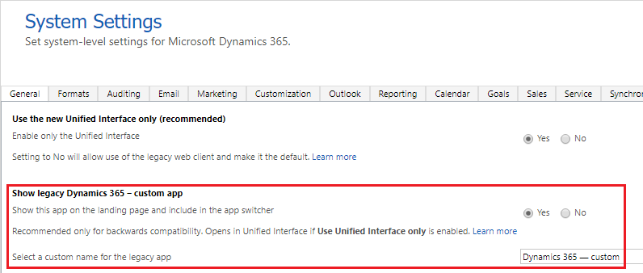

# Enable Unified Interface Only

[!INCLUDE[cc-applies-to-update-9-0-0](../includes/cc_applies_to_update_9_0_0.md)]

In 2018, we introduced [Unified Interface](https://docs.microsoft.com/powerapps/user/unified-interface), the latest generation of web app design for the PowerApps model-driven apps and Dynamics 365 Customer Engagement for apps. It brings the best in usability, accessibility, functionality, and speed to every user. Improve how your business applications run by using only the Unified Interface. For more information, see How to enable Unified Interface Only.

## When does Unified Interface Only experience become available, and which environments are affected?

All new Dynamics 365 Customer Engagement environments (instances) and Common Data Service environments, including those created in existing tenants, will be provisioned in Unified Interface Only mode per the schedule below. Server version [text needed].

Note that some geographical regions will get the changes well ahead of schedule by as much as 2-3 weeks. 

|Environments (instances) types  |Release date  |
|---------|---------|
|New Trial Dynamics 365 Customer Engagement instances     | Dec 12, 2018         |
|New Trial and Production Common Data Service environments     | Feb 2, 2019        |
|New Production and Sandbox Dynamics 365 Customer Engagement instances     | Apr 12, 2019        |

Environments that were created before the scheduled release dates (created before version [text needed]) require administrators to change the environment settings to get the Unified Interface Only experience. We recommend that admins switch to this mode by following the steps at How to enable Unified Interface Only.

> [!IMPORTANT]
> For existing environments, it’s recommended that you:
>
> - Read What experiences are available in Unified Interface Only and understand how it affects end users in your environment 
> - Test the changes in your Trial or Sandbox environments before applying to your Production environment

## What experiences are available in Unified Interface Only mode 

### New immersive home page experience on web

Unified Interface Only mode provides easier and quicker access to apps, and gives users the ease of working in simple purpose-built apps. Users with just one app available to their security roles land in the app after signing in using the environment URL (for e.g. https://contoso.crm.dynamics.com/). The first page they see is determined by the first page of the app. 

Users with multiple apps see the list of apps available to them, and can navigate to them by clicking on the app tile. 

> [!div class="mx-imgBorder"] 
> 

Note  This change applies to environment URL based sign-in (for e.g. https://contoso.crm.dynamics.com/) on web. It doesn’t impact users on mobile, or users who sign in using home.dynamics.com or other portals.

### Run all apps in Unified Interface only

Unified Interface is centered around the concept of modular applications known as model-driven apps (https://docs.microsoft.com/en-us/powerapps/maker/model-driven-apps/model-driven-app-overview). 

These apps allow developers and admins to streamline the data and functionality to provide exactly what end users need. 

In Unified Interface Only mode, all model-driven apps, including those created for the legacy web client, run in Unified Interface to provide superior performance and usability. 

### Deep linking apps and pages

With Unified Interface Only mode, all URLs (or deep links) open in Unified Interface, in the context of the app that is being referenced. For more information on constructing links, see Open forms, views, dialogs, and reports with a URL (https://docs.microsoft.com/en-us/powerapps/developer/model-driven-apps/open-forms-views-dialogs-reports-url).

If no app is referenced in the URL, the record or page opens without any navigation elements on the page. Navigation elements like sitemap are defined using an app, and hence URLs without apps don’t have them. Users can use the App Switcher to navigate to an app and continue their work.

### Dynamics 365 - custom

The legacy web client app, also known as Dynamics 365 - custom, is hidden from end users when a new environment is provisioned. It is always visible to System Administrator and System Customizer roles, and to other custom roles with privileges similar to them. It is recommended only for backwards compatibility while you migrate your environments to complete use of Unified Interface.

<need image of KS>

When Unified Interface Only mode is enabled, Dynamics 365 - custom opens in Unified Interface and not the legacy web client. If a user only has access to the Dynamics 365 – custom app, and no other model-driven apps, they won’t be redirected automatically when signing in using the environment URL (for e.g. https://contoso.crm.dynamics.com/). Access to this app can be enabled in one of these two ways:

- System Settings, go to the General tab (https://docs.microsoft.com/en-us/dynamics365/customer-engagement/admin/system-settings-dialog-box-general-tab) and change the following setting.

> [!div class="mx-imgBorder"] 
> 

- Power Platform Admin Center,  go to the Behavior settings (https://docs.microsoft.com/en-us/power-platform/admin/settings-behavior) and change the following setting.

<need image>

### Advanced settings

When Unified Interface Only mode is enabled, environment settings can be accessed via a menu on the navigation bar, as shown below. Follow these steps to navigate to Advanced Settings:

1. Select **Settings** () on the navigation bar.
2. Select **Advanced Settings**.

<image>

## How to enable Unified Interface Only mode

Unified Interface Only can be turned on and off in one of these two ways:

- System Settings, go to the General tab (https://docs.microsoft.com/en-us/dynamics365/customer-engagement/admin/system-settings-dialog-box-general-tab) and change the following setting.

  <image>

- Power Platform Admin Center, access the environments by following the steps in Manage settings (https://docs.microsoft.com/en-us/power-platform/admin/admin-settings), or navigating directly  (https://admin.powerplatform.microsoft.com/environments), go to the Behavior settings (https://docs.microsoft.com/en-us/power-platform/admin/settings-behavior) and change the following setting.

  <image>

## FAQs

### My instance is still using the legacy web client (fully or partially), and business users are used to it. How does this new setting (April 2019 release) impact my instance?

There are no changes for environments created before version [need text]. To take advantage of the benefits of Unified Interface Only, admins can choose to turn this on, admins can 

### I want to use Unified Interface for all the apps, but still want Dynamics 365 – custom in the legacy web client, as a fallback option. Is that possible?

1. Customers can achieve such a use case by setting all apps to be UCI apps. They wont get the UCI-first sign in experience, and that’s a selling point for the UCI-only mode.
2. We really want customers to try UCI for everything that they do – including the D365-custom. If it doesn’t work, we want to know why, so we could fix the issues.
3. https://contoso.crm.dynamics.com/main.aspx?forceClassic=1

