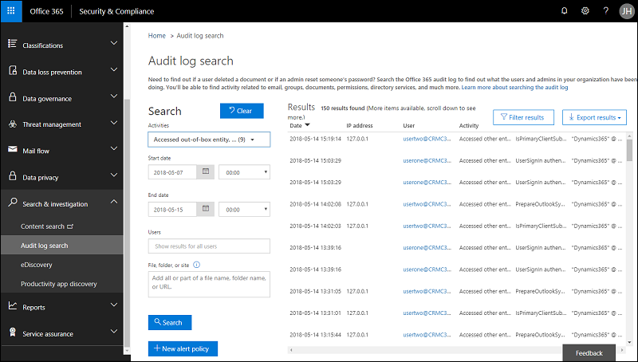

# Preview feature: Enable and use comprehensive auditing

[!INCLUDE[cc-applies-to-update-9-0-0](../includes/cc_applies_to_update_9_0_0.md)]

> [!IMPORTANT]
> - This feature currently has limited availability.
> - [!INCLUDE[cc_preview_features_definition](../includes/cc-preview-features-definition.md)]  
> - [!INCLUDE[cc_preview_features_expect_changes](../includes/cc-preview-features-expect-changes.md)]  
> - [!INCLUDE[cc_preview_features_no_MS_support](../includes/cc-preview-features-no-ms-support.md)]  

Protecting data, preserving privacy, and complying with regulations such as the [General Data Protection Regulation](https://www.microsoft.com/en-us/TrustCenter/Privacy/gdpr/default.aspx) are certainly some of the highest priorities for your business. It's critical that you audit the entirety of data processing actions taking place to be able to analyze for possible security breaches. This information from comprehensive auditing can be used when you perform a Data Protection Impact Assessment (DPIA) addressing the use of Office and Dynamics 365.  

This topic covers how you can set [!INCLUDE [pn-ms-dyn-365](../includes/pn-ms-dyn-365.md)] to audit a broad range of data processing activities and use the [Office 365 Security and Compliance Center](https://support.office.com/en-us/article/go-to-the-office-365-security-compliance-center-7e696a40-b86b-4a20-afcc-559218b7b1b8?ui=en-US&rs=en-US&ad=US) to review the data in activity reports.

## Requirements
An Office 365 Enterprise [E3](https://products.office.com/business/office-365-enterprise-e3-business-software) or [E5](https://products.office.com/business/office-365-enterprise-e5-business-software) subscription is required to do comprehensive auditing.

## How this differs from past audit logging
Audit logging as described in [Audit data and user activity for security and compliance](audit-data-user-activity.md) covers enabling and viewing logging for specific entities and attributes which you select. What is logged is largely based on the context of the activity. Open a record and activities such as who created the record, what values were entered and changed, who updated it, etc, are logged for that particular record.

Comprehensive auditing has two significant differences with prior [!INCLUDE [pn-ms-dyn-365](../includes/pn-ms-dyn-365.md)] auditing:

1. You can log user and admin activities across Office and Dynamics 365 apps.

   

2. Auditing occurs at the SDK layer of Dynamics 365 which means much more data is logged than just activities. Consider the following example.

[JimHoltz: I need example from Varun. Lead to Opportunity conversion. One User action results in 10 different platform actions which are logged.]

## What events are audited
Logging takes place at the SDK layer which means a single action can trigger multiple events that are logged. The following are a sample of admin and user events you can audit.

### Admin-related events

|Event  |Description  |
|---------|---------|
|Publishing customizations  |An admin publishes a new customization which overrides a change done by the previous one. The action requires auditing for analysis.    |
|Attribute deletes     |Admin accidentally deletes an attribute. This action also deletes the data. |
|Team, user management     |Who was added, who was deleted, what access rights a user/team had is important for analyzing impact.|
|Configure instance     |Adding solutions to an instance.|
|Backup and restore     |Backup and restore actions at the tenant.|
|Manage applications     |New instance added, existing instance deleted, trials converted to paid, etc.|

### User and support-related events 

|Event  |Description  |
|---------|---------|
|Create, read, update, delete (CRUD)     |Logging all CRUD activities essential for understanding the impact of a problem and being compliant with data protection impact assessments (DPIA). |
|Multiple record view     |Users of Dynamics view information in bulk, like grid views, reports etc. Critical customer content information is part of these views.|
|Export to Excel     |Exporting data to Excel moves the data outside of the secure environment and is vulnerable to threats.|
|SDK calls via surround or custom apps     |Actions taken via the core platform or surround apps calling into the SDK to perform an action needs to be logged.|
|All support CRUD activities     |Microsoft support engineer activities on customer environment.|
|Admin activities     |Admin activities on customer tenant.|
|Backend commands     |Microsoft support engineer activities on customer tenant and environment.|

## Base schema
[JimHoltz: I'll need help with intro text.]

|Field name  |Type  |Mandatory  |Description  |
|---------|---------|---------|---------|
|Date     |Edm.Date|         |         |
|IP address     |Edm.String         |         |         |
|Id     |Edm.Guid         |         |         |
|Result Status     |Edm.String         |         |         |
|Organization Id     |Edm.Guid         |         |         |
|ClientIP     |Edm.String         |         |         |
|CreationTime     |Edm.Date         |         |         |
|CrmOrganizationUniqueName     |Edm.Date         |         |         |
|Message     |Edm.String         |         |         |
|Operation     |Edm.Date         |         |         |
|OrganizationId     |Edm.Date         |         |         |
|UserKey     |Edm.String         |         |         |
|UserType     |Self.UserType         |         |         |

## Dynamics 365 schema
[JimHoltz: I'll need help with intro text.]

|Field name  |Type  |Mandatory  |Description  |
|---------|---------|---------|---------|
|User     |Edm.String        |         |         |
|User Id     |Edm.String         |         |         |
|Crm Organization Unique Name     |Edm.String         |         |         |
|Instance Url     |Edm.String         |         |         |
|Item Url     |Edm.String         |         |         |
|Item Type     |Edm.String         |         |         |
|User Agent     |Edm.String         |         |         |
|CorrelationId     |Edm.Guid         |         |         |
|EntityId     |Edm.Guid        |         |         |
|EntityName     |Edm.String         |         |         |
|Fields     |Edm.String          |         |         |
|Id     |Edm.String          |         |         |
|InstanceUrl     |Edm.String          |         |         |
|ItemType     |Edm.String          |         |         |
|ItemUrl     |Edm.String          |         |         |
|PrimaryFieldValue     |Edm.String         |         |         |
|Query     |Edm.String         |         |         |
|QueryResults     |Edm.String         |         |         |
|ServiceContextId     |Edm.Guid         |         |         |
|ServiceContextIdType     |Edm.String         |         |         |
|ServiceName     |Edm.String         |         |         |
|SystemUserId     |Edm.Guid         |         |         |
|UserAgent     |Edm.Guid          |        |         |
|UserId     |Edm.Guid          |         |         |
|UserUpn     |Edm.String         |         |         |

## Enable auditing in Dynamics 365

1. In Dynamics 365 (online), choose **Settings** > **Administration** > **System Settings** > **Auditing tab**.
2. Under **Audit Settings**, enable the following check boxes:
   - **Start Auditing**
   - **Audit user access**
   - **Start Read Auditing** (Note: this only appears if you enable **Start Auditing**.)
3. Under **Enable Auditing in the following areas**, enable the check boxes for the areas you want to audit and then choose **OK**.
   
   
4. Go to **Settings** > **Customizations** > **Customize the System**
5. Under **Components**, expand **Entities** and select an entity to audit, such as **Account**.
6. Scroll down and under **Data Services** enable **Auditing**.
7. Under **Auditing**, enable the following check boxes:
   - **Single record auditing. Log a record when opened.**
   - **Multiple record auditing. Log all records displayed on an opened page.**

   
8. Choose **Save**.
9. Choose **Publish** to publish the customization.
10. Repeat steps 5 - 9 for other entities you want to audit.
11. Turn on audit logging in Office 365. See [Turn Office 365 audit log search on or off](https://support.office.com/article/turn-office-365-audit-log-search-on-or-off-e893b19a-660c-41f2-9074-d3631c95a014).

## Review your audit data using reports in Office 365 Security and Compliance Center

You can review your audit data in the Office 365 Security and Compliance Center. See [Search the audit log for user and admin activity in Office 365](https://support.office.com/article/search-the-audit-log-for-user-and-admin-activity-in-office-365-57ca5138-0ae0-4d34-bd40-240441ef2fb6).

To use the preconfigured Dynamics 365 reports, go to https://protection.office.com > **Search & investigation** > **Audit log search** and select the **Dynamics 365 activities** tab.

The following are the preconfigured Dynamics 365 reports:

|  |  |   |
|---------|---------|---------|
|Accessed out-of-box entity     |Accessed custom entity |Accessed admin entity  |
|Performed bulk actions (such as delete and import)  |Accessed other entity type   |Accessed Dynamics 365 admin center  |
|Accessed internal management tool |Signed in or out  |Activated process or plug-in  |

## Create reports
You can create your own reports to review your audit data. See [Search the audit log in the Office 365 Security & Compliance Center](https://support.office.com/article/search-the-audit-log-in-the-office-365-security-compliance-center-0d4d0f35-390b-4518-800e-0c7ec95e946c).

## What's logged

For a list of what's logged with comprehensive auditing, see [Microsoft.Crm.Sdk.Messages Namespace](https://docs.microsoft.com/dotnet/api/microsoft.crm.sdk.messages?view=dynamics-general-ce-9).

## What's not logged
The following are not logged with comprehensive auditing:
- WhoAmI
-	RetrieveFilteredForms
-	TriggerServiceEndpointCheck
-	QueryExpressionToFetchXml
-	FetchXmlToQueryExpression
-	FireNotificationEvent
-	RetrieveMetadataChanges
-	RetrieveEntityChanges
-	RetrieveProvisionedLanguagePackVersion
-	RetrieveInstalledLanguagePackVersion
-	RetrieveProvisionedLanguages
-	RetrieveAvailableLanguages
-	RetrieveDeprovisionedLanguages
-	RetrieveInstalledLanguagePacks
-	GetAllTimeZonesWithDisplayName
-	GetTimeZoneCodeByLocalizedName
-	IsReportingDataConnectorInstalled
-	LocalTimeFromUtcTime
-	IsBackOfficeInstalled
-	FormatAddress
-	IsSupportUserRole
-	IsComponentCustomizable
-	ConfigureReportingDataConnector
-	CheckClientCompatibility
-	RetrieveAttribute

## How we categorize read and readmultiple

We use the prefix to categorize.

|If the request starts with:  |We characterize as:  |
|---------|---------|
|RetrieveMultiple     |ReadMultiple  |
|ExportToExcel     |ReadMultiple |
|Retrieve      |Read  |
|Search     |Read |
|Get     |Read |
|Export     |Read |

## Additional considerations

- When audit log search in the Office 365 Security and Compliance Center is turned on, user and admin activity from your organization is recorded in the audit log and retained for 90 days. However, your organization might not want to record and retain audit log data. Or you might be using a third-party security information and event management (SIEM) application to access your auditing data. In those cases, a global admin can turn off audit log search in Office 365.

## Known issues

- Consider turning off logging of logged events to cut down on the amount of logged data. Do the following:
  1. step 1
  2. step 2
  3. step 3
- [JimHoltz: I'll need content.]

### See also
 [Audit data and user activity for security and compliance](audit-data-user-activity.md) 
 [Search the audit log for user and admin activity in Office 365](https://support.office.com/article/search-the-audit-log-for-user-and-admin-activity-in-office-365-57ca5138-0ae0-4d34-bd40-240441ef2fb6)
 [Office 365 Management APIs overview](https://msdn.microsoft.com/office-365/office-365-managment-apis-overview)