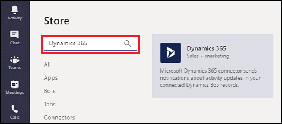
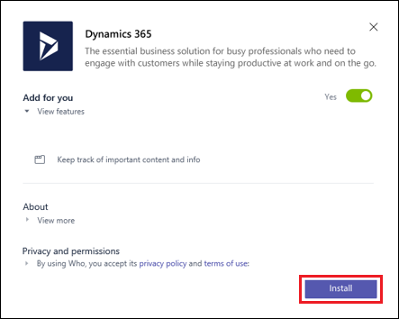
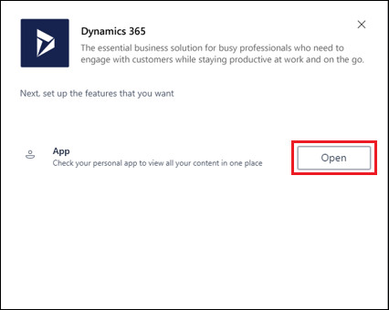
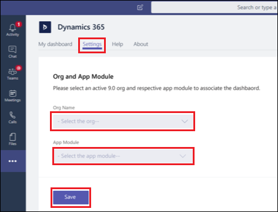
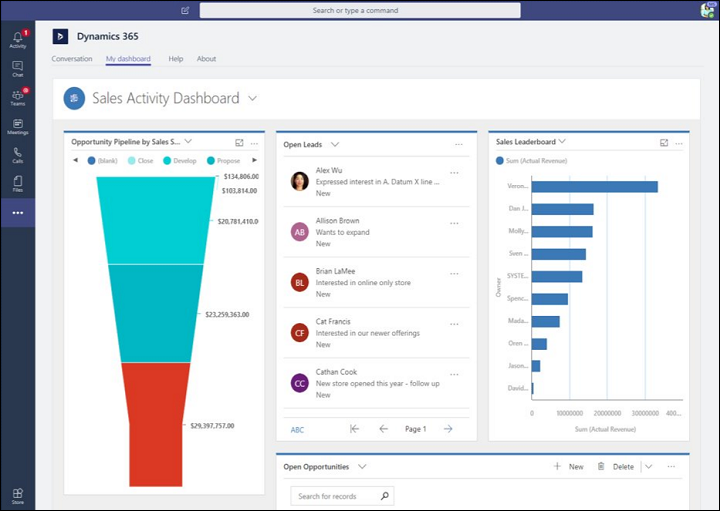

# Preview feature: Integrate Dynamics 365 Customer Engagement with Microsoft Teams 

[!INCLUDE[cc-applies-to-update-9-0-0](../includes/cc_applies_to_update_9_0_0.md)]

> [!IMPORTANT]
> - This feature currently has limited availability.
> - [!INCLUDE[cc_preview_features_definition](../includes/cc-preview-features-definition.md)]  
> - [!INCLUDE[cc_preview_features_expect_changes](../includes/cc-preview-features-expect-changes.md)]  
> - [!INCLUDE[cc_preview_features_no_MS_support](../includes/cc-preview-features-no-ms-support.md)]  

If you're familiar with [Microsoft Teams](https://products.office.com/microsoft-teams/group-chat-software), you know it's the place to manage all your conversations, files, and tools in one team workspace. Create and edit documents right in the app and enjoy instant access to SharePoint, OneNote, PowerBI, and now, [!INCLUDE [pn-crm-online](../includes/pn-crm-online.md)].

Follow these steps to add Dynamics 365 to your Microsoft Teams app.

1. In Microsoft Teams, select **Store**.

   

2. Search for **Dynamics 365** and select the **Dynamics 365** tile.

    

4. Select **Install**.

    

5. Select **Open**.

    

6. Select **Login** and sign in with your **Dynamics 365** credentials.
7. Select the **Settings** tab.​
8. Under **Org Name**, select an organization. ​
    Note: only Dynamics 365 version 9.x or later organizations appear in the list. Also, only active organizations (those that are not disabled or provisioning) are displayed.​
9. Under **App Module**, select the app module from which to build a dashboard. ​
    Note: only app modules licensed for the selected organization are listed.​
10. Select **Save**.​



The Microsoft Dynamics 365 default dashboard appears for the app module selected.



## Delete user data
Your privacy is important to us! You can remove Dynamics 365 app personal data from Microsoft Teams.

The following data is stored with Dynamics 365 integration with Microsoft Teams.

|Data  |Description | |Data classification   |Example |
|---------|---------|---------|
|User ID     |The user's Azure Active Directory object ID |EndUsePseudonymousIdentifiers<br/>(EUPI) An identifier created by Microsoft tied to the user of a Microsoft service. When EUPI is combined with other information, such as a mapping table, it identifies the end user. EUPI does not contain information uploaded or created by the customer.|<ul><li>User GUIDs, PUIDs, or SIDs</li><br/><li>Session IDs</li><ul> |
|Tenant ID     |The Azure Active Directory ID of user's tenant| OrganizationIdentifiableInformation<br/>(OII) Data that can be used to identify a tenant, generally config or usage data. This data is not linkable to a user and does not contain Customer content.         |<ul><li>Tenant ID (non-GUID)</li><br/><li>Domain name in e-mail address (xxx@contoso.com) or other tenant-specific domain information</li><ul> |
|Org URL     |The URL of the Dynamics 365 org |OrganizationIdentifiableInformation<br />(OII) Data that can be used to identify a tenant, generally config or usage data. This data is not linkable to a user and does not contain Customer content.         |<ul><li>Tenant ID (non-GUID)</li><br/><li>Domain name in e-mail address (xxx@contoso.com) or other tenant-specific domain information</li><ul> |
|App module ID     |The ID of app module selected to show in the dashboard|EndUsePseudonymousIdentifiers         <br/>(EUPI) An identifier created by Microsoft tied to the user of a Microsoft service. When EUPI is combined with other information, such as a mapping table, it identifies the end user. EUPI does not contain information uploaded or created by the customer.        |<ul><li>User GUIDs, PUIDs, or SIDs</li><br/><li>Session IDs</li><ul> |

You can [contact support](contact-technical-support.md) to request data deletion. Run the following Windows PowerShell commands to gather the information needed by Dynamics 365 support.

|Command  |Comment  |
|---------|---------|
|```powershell Connect-MsolService  ```      |Enter your credentials in the popup window         |
|```powershell (Get-MsolUser -UserPrincipalName "<user email>").ObjectId  ```       |Replace <user email> with the user’s email         |
|```powershell (Get-MsolCompanyInformation).ObjectId ```        |         |

Record this information to provide Dynamics 365 support.

### See also
 [Download and install Microsoft Teams](https://support.office.com/article/download-and-install-microsoft-teams-422bf3aa-9ae8-46f1-83a2-e65720e1a34d)