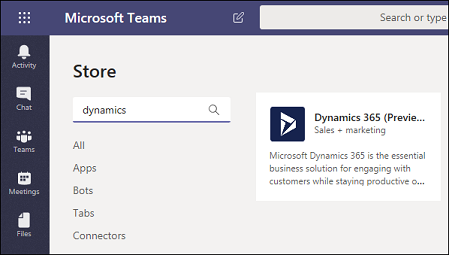
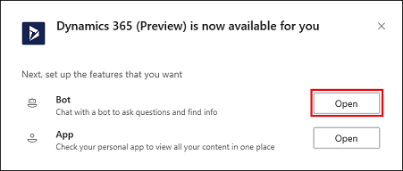
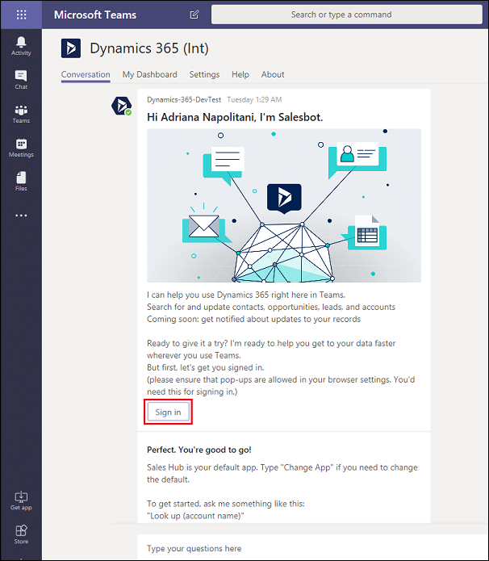
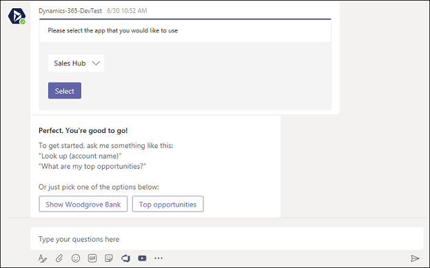
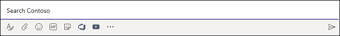
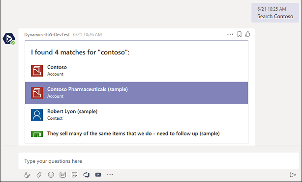

# Preview feature: Integrate Dynamics 365 Customer Engagement with Microsoft Teams 

[!INCLUDE[cc-applies-to-update-9-0-0](../includes/cc_applies_to_update_9_0_0.md)]

> [!IMPORTANT]
> - This feature currently has limited availability.
> - [!INCLUDE[cc_preview_features_definition](../includes/cc-preview-features-definition.md)]  
> - [!INCLUDE[cc_preview_features_expect_changes](../includes/cc-preview-features-expect-changes.md)]  
> - [!INCLUDE[cc_preview_features_no_MS_support](../includes/cc-preview-features-no-ms-support.md)]  

If you're familiar with [Microsoft Teams](https://products.office.com/microsoft-teams/group-chat-software), you know it's the place to manage all your conversations, files, and tools in one team workspace. Create and edit documents right in the app and enjoy instant access to SharePoint, OneNote, PowerBI, and now, [!INCLUDE [pn-crm-online](../includes/pn-crm-online.md)].

Begin by finding the app in the app Store.

## Select the app in the app Store.

1. In Microsoft Teams, select **Store**.

   

2. Search for **dynamics**, and then select the **Dynamics 365 (Preview)** tile.

   

## Install the personal app

You have a choice when adding Dynamics 365 to Microsoft Teams. You can install the personal app which integrates Dynamics 365 and Teams for your own use, or you can install the Team app to use with your team members. These steps are for installing the personal app - the settings under **App for you**.

Once you've selected the Dynamics 365 app (see steps above), the settings page opens. 

Verify **Yes** is enabled, and then select **Install** to install the personal app.

   

## Install the personal app bot

There are two personal app features: the personal app bot and the personal app dashboard. The bot allows you to interact with Dynamics 365 to find and display records within Microsoft Teams. You configure the dashboard to show a Dynamics 365 dashboard view in Microsoft Teams.

Use these steps to install the personal app bot.

1. With the personal app installed, in the bot section, select **Open**. 

   

2. A Welcome message appears in the **Conversation** tab page. Select **Sign in**.

   

3. Select your organization, and then select **Next**.

   Your bot is set up and ready for input.

   

4. You can search to find records of interest. For example, enter "search contoso" in **Search** to see Contoso records.

   

5. Search returns a list of related Dynamics 365 records. Select a record to see details.

   

6. The details of the selected record are displayed in the personal app bot. You can select an activity to view and edit related record details. For example, by selecting **Opportunity**, you'll see a related opportunity for the account.

   


.
.
.
.
5. Select **Open**.

    

6. Select **Login** and sign in with your **Dynamics 365** credentials.
7. Select the **Settings** tab.​
8. Under **Org Name**, select an organization. ​
    Note: only Dynamics 365 version 9.x or later organizations appear in the list. Also, only active organizations (those that are not disabled or provisioning) are displayed.​
9. Under **App Module**, select the app module from which to build a dashboard. ​
    Note: only app modules licensed for the selected organization are listed.​
10. Select **Save**.​

## Add Dynamics 365 to Microsoft Teams

Follow these steps to add Dynamics 365 to your Microsoft Teams app.


The Microsoft Dynamics 365 default dashboard appears for the app module selected.


## Configure and use the personal bot

## Configure and use the personal dashboard

## Delete user data
Your privacy is important to us! You can remove Dynamics 365 app personal data from Microsoft Teams.

The following data is stored with Dynamics 365 integration with Microsoft Teams.

|Data  |Description | Data classification   |Example |
|---------|---------|---------|-------|
|User ID     |The user's Azure Active Directory object ID |EndUsePseudonymousIdentifiers<br/>(EUPI) An identifier created by Microsoft tied to the user of a Microsoft service. When EUPI is combined with other information, such as a mapping table, it identifies the end user. EUPI does not contain information uploaded or created by the customer.|<ul><li>User GUIDs, PUIDs, or SIDs</li><br/><li>Session IDs</li><ul> |
|Tenant ID     |The Azure Active Directory ID of user's tenant| OrganizationIdentifiableInformation<br/>(OII) Data that can be used to identify a tenant, generally config or usage data. This data is not linkable to a user and does not contain Customer content.         |<ul><li>Tenant ID (non-GUID)</li><br/><li>Domain name in e-mail address (xxx@contoso.com) or other tenant-specific domain information</li><ul> |
|Org URL     |The URL of the Dynamics 365 org |OrganizationIdentifiableInformation<br />(OII) Data that can be used to identify a tenant, generally config or usage data. This data is not linkable to a user and does not contain Customer content.         |<ul><li>Tenant ID (non-GUID)</li><br/><li>Domain name in e-mail address (xxx@contoso.com) or other tenant-specific domain information</li><ul> |
|App module ID     |The ID of app module selected to show in the dashboard|EndUsePseudonymousIdentifiers         <br/>(EUPI) An identifier created by Microsoft tied to the user of a Microsoft service. When EUPI is combined with other information, such as a mapping table, it identifies the end user. EUPI does not contain information uploaded or created by the customer.        |<ul><li>User GUIDs, PUIDs, or SIDs</li><br/><li>Session IDs</li><ul> |

You can [contact support](contact-technical-support.md) to request data deletion. Run the following Windows PowerShell commands to gather the information needed by Dynamics 365 support.

|Command  |Comment  |
|---------|---------|
|``` Connect-MsolService  ```      |Enter your credentials in the popup window         |
|``` (Get-MsolUser -UserPrincipalName "<user email>").ObjectId  ```       |Replace <user email> with the user’s email         |
|``` (Get-MsolCompanyInformation).ObjectId ```        |         |

Record this information to provide to Dynamics 365 support.

### See also
 [Download and install Microsoft Teams](https://support.office.com/article/download-and-install-microsoft-teams-422bf3aa-9ae8-46f1-83a2-e65720e1a34d)