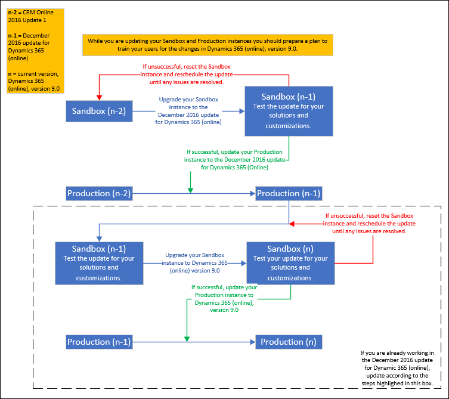

# Manage updates

[!INCLUDE[cc-applies-to-update-9-0-0](../includes/cc_applies_to_update_9_0_0.md)]

[!INCLUDE[cc-customer-engagement-apps-note](../includes/cc-customer-engagement-apps-note.md)]

On July 6, 2018, we announced some optimizations to how we deliver Dynamics 365 for Customer Engagement apps updates: [Modernizing the way we update Dynamics 365 for Customer Engagement](https://aka.ms/dynamics365updatesblog). Microsoft will continue to support older versions of Dynamics within the timeframe of the details in our [Update policy](../admin/manage-updates.md#BKMK_Policy). 

> [!TIP]
> Many update questions are answered here: [FAQ for Dynamics 365 for Customer Engagement apps Update Policies](https://docs.microsoft.com/dynamics365/get-started/faq-update-policy).
>
> Check out the following blog: [Previewing April 2019 release functionalities and updates for Dynamics 365 for Customer Engagement](https://blogs.msdn.microsoft.com/crm/2018/12/12/previewing-april-2019-release-functionalities-and-updates-for-dynamics-365-for-customer-engagement/).

You have options for when you update your Dynamics 365 for Customer Engagement apps (online) organization to Dynamics 365 for Customer Engagement apps (online), version 9.x. To prepare for a smooth process, use the information in this topic.

 You, as a [!INCLUDE [pn-crm-shortest](../includes/pn-crm-shortest.md)] apps system administrator, decide when to install Customer Engagement apps major updates for your organization. To update to the latest release of Customer Engagement apps, complete these two steps:  

1. Review the information in the Updates page in the Customer Engagement apps Administration Center ([https://admin.microsoft.com](https://admin.microsoft.com) > **Admin centers** > **Dynamics 365** > **Updates** tab) to find out what instances are ready to update, and the schedule.  

2. Approve the update.  

   > [!IMPORTANT]
   > An update in this document refers to a major version release, such as upgrading from Dynamics 365 for Customer Engagement apps version 8.2 to version 9.x. [Service updates](https://support.microsoft.com/help/2925359/microsoft-dynamics-crm-online-releases) do not require approval and are applied automatically to your instance.
   > 
   > For major version updates, your instance will not be updated unless you approve it. This means your organization will go without the latest features and functionality until you explicitly give approval for the update to happen. Keep in mind, we do have an update policy that will make some updates mandatory, with no approval required. Please see [Update policy](../admin/manage-updates.md#BKMK_Policy) below for further details. 

   You’ll receive an email before the update is available with a scheduled update date. This email will also include instructions about how to reschedule the update, if you choose. You’ll receive reminders 90, 30, 15, and 7 days before the update begins. The update will happen during a 12-hour window, and during that time your organization might be unavailable for several hours. Most updates typically take 2-4 hours. We’ll let you know when your organization is updated and ready to use. For more information, see the [Schedule for update communications](../admin/manage-updates.md#BKMK_CommSchedule) later in this topic.  

 

## Continuous updates for Dynamics 365 for Customer Engagement apps (online) 

We are transforming how we do service updates for Dynamics 365 for Customer Engagement apps (online). We will deliver two major releases per year - April and October - offering new capabilities and functionality. These updates will be backward compatible, so your apps and customizations will continue to work post update. New features with major, disruptive changes to the user experience are off by default. This means administrators will be able to first test then enable these features for their organization.   

In addition to the two major updates, we will continue to deploy regular performance and reliability improvement updates throughout the year. We are phasing deployments over several weeks following safe deployment practices and monitoring updates closely for any issues. 

If you're running Microsoft Dynamics CRM Online, please review the following:  

-   [Important information for CRM Online customers](../admin/important-information-customers.md)  

-   [Switch from Dynamics CRM Online to Dynamics 365 for Customer Engagement apps (online)](../admin/switch-dynamics-crm-online-dynamics-365.md)  

-   [Quickly navigate with the Office 365 app launcher and the Dynamics 365 for Customer Engagement apps home page](../admin/quickly-navigate-office-365-app-launcher.md)  

   

## Update policy  

Since every customer will be updated on the continuous delivery schedule, your organization needs to update to the latest version.  

For customers who are currently running older versions of Dynamics 365 for Customer Engagement, we will continue to provide you with the ability to schedule an update to the latest version and want to make sure this effort is as seamless as possible through continuous improvements in our update engine. We will send reminders to schedule your update to Dynamics 365 for Customer Engagement administrators.  

- For Dynamics 365 for Customer Engagement apps (online) customer engagement applications, we sent update communications in May to all customers running version 8.1 and have scheduled updates.
- Dynamics 365 for Customer Engagement apps (Online) **version 8.2 will be fully supported until January 31, 2019**. Customers running version 8.2 should plan to update to the latest version prior to this date. 
- From February 1, 2019, onwards, we will only support the latest generally available version.

Here are the recent versions.

|  |Version  |Name  |
|---------|---------|---------|
|n     |9.x         |Dynamics 365 for Customer Engagement, version 9.x         |
|n-1     |8.2         |Dynamics 365 for Customer Engagement, version 8.2         |
|n-2     |8.1         |Microsoft Dynamics CRM Online 2016 Update 1          |

   

## Update scenarios  

 Your Customer Engagement apps update process depends on what version you have and how you’d like to update. Consider the following scenarios.  

> [!NOTE]
> For information on Customer Engagement instances, see [Manage Dynamics 365 for Customer Engagement apps (online) instances](../admin/manage-online-instances.md).  

### CRM Online 2016 Update 1 – Approach One (recommended)  
 This scenario applies to those who have Production and Sandbox instances of [!INCLUDE[pn_crm_8_1_0_online_subsequent](../includes/pn-crm-8-1-0-online-subsequent.md)] (n-2).  

 For version information, see: [Dynamics 365 for Customer Engagement apps (online) releases](https://support.microsoft.com/help/2925359/microsoft-dynamics-crm-online-releases)

|Version||Update to|  
|-------------|-|---------------|  
|Sandbox (n-2)| in Dynamics 365 for Customer Engagement")|Sandbox (n-1)|  
|Sandbox (n-1)| in Dynamics 365 for Customer Engagement")|Sandbox (n)|  
|Production (n-2)| in Dynamics 365 for Customer Engagement")|Production (n)|  

n = current version,  Dynamics 365 for Customer Engagement apps (online), version 9.x

#### Recommended update approach  
<!--
1. Update your [!INCLUDE[pn_crm_8_1_0_online_subsequent](../includes/pn-crm-8-1-0-online-subsequent.md)] **Sandbox** instance to [!INCLUDE[pn_crm_8_2_0_online_subsequent](../includes/pn-crm-8-2-0-online-subsequent.md)].  

   1. Select your [!INCLUDE[pn_crm_8_1_0_online_subsequent](../includes/pn-crm-8-1-0-online-subsequent.md)] Sandbox instance and approve the update to target version [!INCLUDE[pn_crm_8_2_0_online_subsequent](../includes/pn-crm-8-2-0-online-subsequent.md)].  

   2. Once your Sandbox instance has been updated to [!INCLUDE[pn_crm_8_2_0_online_subsequent](../includes/pn-crm-8-2-0-online-subsequent.md)], test the update for your solutions and customizations.  

       If the update is unsuccessful, reset the Sandbox instance and reschedule the update until any issues are resolved.  

2. Update your [!INCLUDE[pn_crm_8_2_0_online_subsequent](../includes/pn-crm-8-2-0-online-subsequent.md)]  **Sandbox** instance to [!INCLUDE [pn-crm-9-0-0-online](../includes/pn-crm-9-0-0-online.md)].  

   1. When the [!INCLUDE [pn-crm-9-0-0-online](../includes/pn-crm-9-0-0-online.md)] update becomes available, select your [!INCLUDE[pn_crm_8_2_0_online_subsequent](../includes/pn-crm-8-2-0-online-subsequent.md)] Sandbox instance and approve the update to target version [!INCLUDE [pn-crm-9-0-0-online](../includes/pn-crm-9-0-0-online.md)].  

   2. Once your Sandbox instance has been updated to [!INCLUDE [pn-crm-9-0-0-online](../includes/pn-crm-9-0-0-online.md)], test the update for your solutions and customizations.  

       If the update is unsuccessful, reset the Sandbox instance and reschedule the update until any issues are resolved.  

   3. Prepare a plan to train your users for the changes in [!INCLUDE [pn-crm-9-0-0-online](../includes/pn-crm-9-0-0-online.md)].  

3. Update your [!INCLUDE[pn_crm_8_1_0_online_subsequent](../includes/pn-crm-8-1-0-online-subsequent.md)] **Production** instance to [!INCLUDE [pn-crm-9-0-0-online](../includes/pn-crm-9-0-0-online.md)], skipping [!INCLUDE[pn_crm_8_2_0_online_subsequent](../includes/pn-crm-8-2-0-online-subsequent.md)].  

   1. Do not approve the [!INCLUDE[pn_crm_8_2_0_online_subsequent](../includes/pn-crm-8-2-0-online-subsequent.md)] update.  

      > [!NOTE]
      >  If you have already approved the update, you can change the scheduled date to coincide with the availability of [!INCLUDE [pn-crm-9-0-0-online](../includes/pn-crm-9-0-0-online.md)].  

   2. When the [!INCLUDE [pn-crm-9-0-0-online](../includes/pn-crm-9-0-0-online.md)] update becomes available, select your [!INCLUDE[pn_crm_8_1_0_online_subsequent](../includes/pn-crm-8-1-0-online-subsequent.md)] Production instance and approve the update to target version [!INCLUDE [pn-crm-9-0-0-online](../includes/pn-crm-9-0-0-online.md)].  

   3. Once your Production instance has been updated to [!INCLUDE [pn-crm-9-0-0-online](../includes/pn-crm-9-0-0-online.md)], confirm the update for your solutions and customizations.  

       If the update is unsuccessful, reset the Sandbox instance and reschedule the update until any issues are resolved.  

   4. Train your users for the changes in [!INCLUDE [pn-crm-9-0-0-online](../includes/pn-crm-9-0-0-online.md)].  
-->
")

### CRM Online 2016 Update 1 – Approach Two  
 This scenario applies to those who have Production and Sandbox instances of [!INCLUDE[pn_crm_8_1_0_online_subsequent](../includes/pn-crm-8-1-0-online-subsequent.md)] (n-2).  

For version information, see: [Dynamics 365 for Customer Engagement apps (online) releases](https://support.microsoft.com/help/2925359/microsoft-dynamics-crm-online-releases)

|Version||Update to|  
|-------------|-|---------------|  
|Sandbox (n-2)| in Dynamics 365 for Customer Engagement")|Sandbox (n-1)|  
|Production (n-2)| in Dynamics 365 for Customer Engagement")|Production (n-1)|  
|Sandbox (n-1)| in Dynamics 365 for Customer Engagement")|Sandbox (n)|  
|Production (n-1)| in Dynamics 365 for Customer Engagement")|Production (n)|  

n = current version, Dynamics 365 for Customer Engagement apps (online), version 9.x

#### Recommended update approach  
<!--
1. Update your [!INCLUDE[pn_crm_8_1_0_online_subsequent](../includes/pn-crm-8-1-0-online-subsequent.md)] **Sandbox** instance to [!INCLUDE[pn_crm_8_2_0_online_subsequent](../includes/pn-crm-8-2-0-online-subsequent.md)].  

   1. Select your [!INCLUDE[pn_crm_8_1_0_online_subsequent](../includes/pn-crm-8-1-0-online-subsequent.md)] Sandbox instance and approve the update to target version [!INCLUDE[pn_crm_8_2_0_online_subsequent](../includes/pn-crm-8-2-0-online-subsequent.md)].  

   2. Once your Sandbox instance has been updated to [!INCLUDE[pn_crm_8_2_0_online_subsequent](../includes/pn-crm-8-2-0-online-subsequent.md)], test the update for your solutions and customizations.  

       If the update is unsuccessful, reset the Sandbox instance and reschedule the update until any issues are resolved.  

2. Update your [!INCLUDE[pn_crm_8_1_0_online_subsequent](../includes/pn-crm-8-1-0-online-subsequent.md)] **Production** instance to [!INCLUDE[pn_crm_8_2_0_online_subsequent](../includes/pn-crm-8-2-0-online-subsequent.md)].  

   1. Select your [!INCLUDE[pn_crm_8_1_0_online_subsequent](../includes/pn-crm-8-1-0-online-subsequent.md)] Production instance and approve the update to target version [!INCLUDE[pn_crm_8_2_0_online_subsequent](../includes/pn-crm-8-2-0-online-subsequent.md)].  

   2. Once your Production instance has been updated to [!INCLUDE[pn_crm_8_2_0_online_subsequent](../includes/pn-crm-8-2-0-online-subsequent.md)], apply what you learned from the Sandbox instance update and confirm your Production instance update.  

3. Update your [!INCLUDE[pn_crm_8_2_0_online_subsequent](../includes/pn-crm-8-2-0-online-subsequent.md)] **Sandbox** instance to [!INCLUDE [pn-crm-9-0-0-online](../includes/pn-crm-9-0-0-online.md)].  

   1. When the [!INCLUDE [pn-crm-9-0-0-online](../includes/pn-crm-9-0-0-online.md)] update becomes available, select your [!INCLUDE[pn_crm_8_2_0_online_subsequent](../includes/pn-crm-8-2-0-online-subsequent.md)] Sandbox instance and approve the update to target version [!INCLUDE [pn-crm-9-0-0-online](../includes/pn-crm-9-0-0-online.md)].  

   2. Once your Sandbox instance has been updated to [!INCLUDE [pn-crm-9-0-0-online](../includes/pn-crm-9-0-0-online.md)], test the update for your solutions and customizations.  

       If the update is unsuccessful, reset the Sandbox instance and reschedule the update until any issues are resolved.  

   3. Prepare a plan to train your users for the changes in [!INCLUDE [pn-crm-9-0-0-online](../includes/pn-crm-9-0-0-online.md)].  

4. Update your [!INCLUDE[pn_crm_8_2_0_online_subsequent](../includes/pn-crm-8-2-0-online-subsequent.md)] **Production** instance to [!INCLUDE [pn-crm-9-0-0-online](../includes/pn-crm-9-0-0-online.md)].  

   1. When the [!INCLUDE [pn-crm-9-0-0-online](../includes/pn-crm-9-0-0-online.md)] update becomes available, select your [!INCLUDE[pn_crm_8_2_0_online_subsequent](../includes/pn-crm-8-2-0-online-subsequent.md)] Production instance and approve the update to target version [!INCLUDE [pn-crm-9-0-0-online](../includes/pn-crm-9-0-0-online.md)].  

   2. Once your Production instance has been updated to [!INCLUDE [pn-crm-9-0-0-online](../includes/pn-crm-9-0-0-online.md)], apply what you learned from the Sandbox instance update and confirm your Production instance update.  

   3. Train your users for the changes in [!INCLUDE [pn-crm-9-0-0-online](../includes/pn-crm-9-0-0-online.md)].  
-->

### December 2016 update for Dynamics 365 for Customer Engagement apps (online) 
 This scenario applies to those who have Production and Sandbox instances of [!INCLUDE[pn_crm_8_2_0_online_subsequent](../includes/pn-crm-8-2-0-online-subsequent.md)] (n-1).  

 For version information, see: [Dynamics 365 for Customer Engagement apps (online) releases](https://support.microsoft.com/help/2925359/microsoft-dynamics-crm-online-releases)

|Version||Update to|  
|-------------|-|---------------|  
|Sandbox (n-1)| in Dynamics 365 for Customer Engagement")|Sandbox (n)|  
|Production (n-1)| in Dynamics 365 for Customer Engagement")|Production (n)|  

n = current version, Dynamics 365 for Customer Engagement apps (online), version 9.x

#### Recommended update approach  
Follow the process in the dashed box in the flowchart above. 

<!--
1. Update your [!INCLUDE[pn_crm_8_2_0_online_subsequent](../includes/pn-crm-8-2-0-online-subsequent.md)] **Sandbox** instance to [!INCLUDE [pn-crm-9-0-0-online](../includes/pn-crm-9-0-0-online.md)].  

   1. When the [!INCLUDE [pn-crm-9-0-0-online](../includes/pn-crm-9-0-0-online.md)] update becomes available, select your [!INCLUDE[pn_crm_8_2_0_online_subsequent](../includes/pn-crm-8-2-0-online-subsequent.md)] Sandbox instance and approve the update to target version [!INCLUDE [pn-crm-9-0-0-online](../includes/pn-crm-9-0-0-online.md)].  

   2. Once your Sandbox instance has been updated to [!INCLUDE [pn-crm-9-0-0-online](../includes/pn-crm-9-0-0-online.md)], test the update for your solutions and customizations.  

       If the update is unsuccessful, reset the Sandbox instance and reschedule the update until any issues are resolved.  

   3. Prepare a plan to train your users for the changes in [!INCLUDE [pn-crm-9-0-0-online](../includes/pn-crm-9-0-0-online.md)].  

2. Update your [!INCLUDE[pn_crm_8_2_0_online_subsequent](../includes/pn-crm-8-2-0-online-subsequent.md)] **Production** instance to [!INCLUDE [pn-crm-9-0-0-online](../includes/pn-crm-9-0-0-online.md)].  

   1. When the [!INCLUDE [pn-crm-9-0-0-online](../includes/pn-crm-9-0-0-online.md)] update becomes available, select your [!INCLUDE[pn_crm_8_2_0_online_subsequent](../includes/pn-crm-8-2-0-online-subsequent.md)] Production instance and approve the update to target version [!INCLUDE [pn-crm-9-0-0-online](../includes/pn-crm-9-0-0-online.md)].  

   2. Once your Production instance has been updated to [!INCLUDE [pn-crm-9-0-0-online](../includes/pn-crm-9-0-0-online.md)], apply what you learned from the Sandbox instance update and confirm your Production instance update.  

   3. Train your users for the changes in [!INCLUDE [pn-crm-9-0-0-online](../includes/pn-crm-9-0-0-online.md)].  
-->

   

## Recent versions of Customer Engagement apps  
 To determine your version, sign in to [!INCLUDE [pn-crm-shortest](../includes/pn-crm-shortest.md)] apps, and in the upper-right side of the screen, click the **Settings** button  > **About**.  

For recent versions, see [Dynamics 365 for Customer Engagement apps (online) releases](https://support.microsoft.com/help/2925359/microsoft-dynamics-crm-online-releases)

 

## How will I know my organization is ready to update?  
 [!INCLUDE [pn-crm-shortest](../includes/pn-crm-shortest.md)] apps system administrators will be informed of updates to Customer Engagement apps in multiple ways.  

### Check your instances in the [!INCLUDE[pn_dyn_365](../includes/pn-crm-shortest.md)] Administration Center  

1. Sign in to [https://admin.microsoft.com](https://admin.microsoft.com).  

2. In the [!INCLUDE[pn_Office_365](../includes/pn-office-365.md)] admin center, click **Admin** > **Dynamics 365**.  

     

3. On the Instances page, click **Updates**, and then review the update status for your Customer Engagement instances.  

    Note the following:  

   -   Instances that are eligible to update will see **Update is Available**.  

   -   Clicking **Schedule your update** lets the admin select a target release and then do the scheduling.  

     

<!-- This banner appears to not happen anymore - May 1 2018  
### A notification appears in your Customer Engagement apps web application  

1.  Sign in to your Customer Engagement instance.  

2.  If an update is available, admins will see a yellow [!INCLUDE [pn-crm-shortest](../includes/pn-crm-shortest.md)] apps message bar notifying them of an available update.  

   
 -->

### Update notification emails are sent to admins  
 [!INCLUDE[pn_dyn_365](../includes/pn-crm-shortest.md)] system administrators will receive an email from the Customer Engagement apps Team. You can use the links in the email to learn more about your update or reschedule it.  

   
## Deciphering the update information  
 The “Manage your [!INCLUDE[pn_dyn_365](../includes/pn-crm-shortest.md)] updates” page is your source for useful information and actions to take regarding your update.  

   

> [!NOTE]
>  If you are eligible to update to multiple versions of Customer Engagement apps, you’ll see an option **Change target version**. Large companies with extensive and complex customizations to their [!INCLUDE [pn-crm-shortest](../includes/pn-crm-shortest.md)] apps may choose to upgrade to a later release instead of the first available. So you get the most up-to-date features and fixes, we highly recommend you upgrade to the latest version when available.  

   
## Approve an update  
 You must be a [!INCLUDE [pn-crm-shortest](../includes/pn-crm-shortest.md)] apps system administrator to approve updates.  

1. Sign in to [https://admin.microsoft.com](https://admin.microsoft.com).  

2. In the [!INCLUDE[pn_Office_365](../includes/pn-office-365.md)] admin center, click **Admin** > **Dynamics 365**, and then on the Instances page click **Updates**.  

3. Choose the instance to approve.  

4. Click **Approve Update** to approve and proceed with the update.  

> [!NOTE]
>  Once you approve an update, you can still reschedule it as long as the update has not started.  

   
## Reschedule an update  
 You must be a [!INCLUDE [pn-crm-shortest](../includes/pn-crm-shortest.md)] apps system administrator to reschedule updates.  

1. Sign in to [https://admin.microsoft.com](https://admin.microsoft.com).  

2. In the [!INCLUDE[pn_Office_365](../includes/pn-office-365.md)] admin center, click **Admin** > **Dynamics 365**, and then on the Instances page click **Updates**.  

3. Choose the instance update to reschedule, and then click **Reschedule update**.  

     

4. If you are eligible to update to multiple versions of Customer Engagement apps, you’ll see a page to select a target version. Select a version, and then click **Next**.  

   > [!NOTE]
   >  Large companies with extensive and complex customizations to their [!INCLUDE [pn-crm-shortest](../includes/pn-crm-shortest.md)] apps may choose to upgrade to a later release instead of the first available. So you get the most up-to-date features and fixes, we highly recommend you upgrade to the latest version when available. Keep in mind, if you are two versions behind the current version you will have a mandatory update. See [Update policy](../admin/manage-updates.md#BKMK_Policy) for more information.  

5. Select new preferred and alternate dates and times for the update, and then click **Next**.  

     

6. Review the new dates and times, and then click **Approve Update**.  

     

7. The Status column will indicate your update is approved.  

   

## Update status  
 To better track and manage your Customer Engagement apps updates, we added more granular update status to the Updates page.  At the date and time of your update, the status for your instance will show **Updating instance**.  

   

 There are **four** stages of an update:  

| Status        |     Description     |
|---------|----------------|
| Queued (Not Started) |   The update is queued and will start at the scheduled time.    |
| Backup        | The Customer Engagement instance is being backed up.  A copy of the instance is backed up before the update for recovery purposes. |
| Restore        | The Customer Engagement instance is being restored. |
| Database Upgrade   |  The Customer Engagement instance is being updated.   |

> [!NOTE]
> **Storage Utilization Calculation**  
>
> When an instance enters the **Queued (Not Started)** state, that instance’s storage is temporarily omitted from the **Total Storage Used** calculation. Once the database update is complete, **Total Storage Used** calculation will be refreshed to re-include that instance's storage size. 

   
## Send email notifications to multiple recipients  
 By default, [!INCLUDE[pn_dyn_365](../includes/pn-crm-shortest.md)] admins will receive update notifications. You can add others to receive update notifications.  

1. Sign in to [https://admin.microsoft.com](https://admin.microsoft.com).  

2. In the [!INCLUDE[pn_Office_365](../includes/pn-office-365.md)] admin center, click **Admin** > **Dynamics 365**, and then click **Instances**.  

3. Choose an instance that has notifications you want to change, and then click **Notifications**.  

     

4. Enter the email addresses of people to receive update notifications for the selected instance, and then click **Save**.  

     

   
## What happens after an update is approved?  
 When your update has started, you’ll see **Update in progress** under **Status**. The **Reschedule** option will no longer be available.  

   

 When your update is done, you’ll see **Updated successfully**.  

  update")  

   

## Prepare your [!INCLUDE[pn_dyn_365](../includes/pn-crm-shortest.md)] organization for the update  
 Dynamics 365 for Customer Engagement, version 9.x contains a number of exciting changes. To take advantage of new features, you need to ensure any customizations are compatible with this update.  

### Prepare your users  
 To prepare your users for the changes to Customer Engagement apps, visit [What's new in Dynamics 365 for Customer Engagement apps (online), version 9](https://docs.microsoft.com/dynamics365/get-started/whats-new/customer-engagement/new-in-version-9).  

   

## Checklist for the Customer Engagement apps update  
 Most of the update process is handled by [!INCLUDE[cc_Microsoft](../includes/cc-microsoft.md)]. However, there are a few things that you must do to prepare.  

1. **Know when your update is scheduled.**  

     You will be informed of a pending update in multiple ways. See [How will I know my organization is ready to update?](../admin/manage-updates.md#BKMK_howtoknow) in this topic.  

2. **Involve your [!INCLUDE[pn_microsoftcrm](../includes/pn-dynamics-crm.md)] apps partner.**  

     If you have a [!INCLUDE[pn_microsoftcrm](../includes/pn-dynamics-crm.md)] apps partner of record, we strongly recommend that you contact them for guidance and assistance. If you do not have a partner, you may consult the [!INCLUDE[sdk_Dynamics_Marketplace](../includes/sdk-dynamics-marketplace.md)] to identify a partner. Please note that there may be charges from partners for their services.  

3. **Watch for communications from [!INCLUDE[cc_Microsoft](../includes/cc-microsoft.md)].**  

     We will send you several communications about this subject to keep you informed about the update. In addition, we send email communications to users who have the System Administrator role in [!INCLUDE [pn-crm-shortest](../includes/pn-crm-shortest.md)] apps. Please make sure the email accounts associated with those user accounts are valid and being monitored. Communications will come from crmoln@microsoft.com, or for partners, you will also receive communications from the [!INCLUDE[pn_microsoftcrm](../includes/pn-dynamics-crm.md)] apps Partner Team: crmteam@microsoft.com.  

4. **Verify your customizations are compatible.**  

     You should take the time before your update to verify that customizations are compatible. You should do this early enough that you have time to fix any identified issues. Additionally, Microsoft will run a number of automated tests, and if any of those tests fail in your instance, we will email the administrator a list of potential issues we have identified.  

5. **Create a non-Production (Sandbox) instance in which you can test your customizations.**  

     Ideally, you should test your customizations prior to update. This will also give you the opportunity to verify compatibility of any third-party customizations. If you identify any potential issues, please work with the solution provider to correct any issues that arise. [!INCLUDE[proc_more_information](../includes/proc-more-information.md)] [Manage Dynamics 365 for Customer Engagement apps (online) Sandbox instances](../admin/manage-sandbox-instances.md)  

6. **Notify your users prior to the update of [!INCLUDE[pn_dyn_365](../includes/pn-crm-shortest.md)].**  

     It is a best practice to notify your users that the system will be unavailable during the update. To get more resources to prepare users for the update, please visit [Onboard your organization and users](onboard-your-organization-and-users-to-dynamics-365-online.md).

7. **Watch for Update Completion or Reschedule emails from Microsoft.**  

   Once your organization is updated, you’ll receive a notification from Customer Engagement apps indicating that your organization is ready to use.  

   
## Schedule for update communications  

|When|Recipient|In-product alert|Email|Admin Center|  
|----------|---------------|-----------------------|-----------|------------------|  
|Update scheduled|All Admins|Yes|Yes|Yes|  
|90 days before update|All Admins|No|Yes|Yes|  
|30 days before update|All Admins|No|Yes|Yes|  
|15 days before update|All Admins|No|Yes|Yes|  
|7 days before update|All Admins|Yes|Yes|Yes|  
|Schedule confirmed by Admin|All Admins|No|No|Yes|  
|Update in progress|All Admins and Users|No|No|Yes|  
|Update successful|All Admins and Users|No|Yes|Yes|  
|Fallback to secondary update|All Admins|No|Yes|Yes|  
|Update rescheduled|All Admins|No|Yes|Yes|  

> [!NOTE]
>  “All Admins” includes [!INCLUDE [pn-crm-shortest](../includes/pn-crm-shortest.md)] apps system administrators and [!INCLUDE[pn_Office_365](../includes/pn-office-365.md)] Global administrators.  

## Notice about Online Policies
Please review [Notice About Online Policies and Similar Documents](https://www.microsoft.com/legal/intellectualproperty/onlinedisclaimer.aspx).

### See also  
 [FAQ for Dynamics 365 for Customer Engagement apps Update Policies](https://docs.microsoft.com/dynamics365/get-started/faq-update-policy) 
 [Policies and Communications for Dynamics 365 for Customer Engagement apps (online)](../admin/policies-communications.md)     
 [Manage email notifications](../admin/manage-email-notifications.md)
