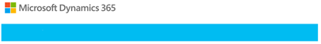
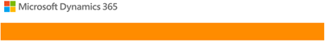
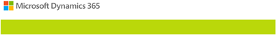

# Policies and Communications for service incidents

[!INCLUDE[cc-applies-to-update-9-0-0](../includes/cc_applies_to_update_9_0_0.md)]

> [!IMPORTANT]
> Starting October 15, 2018, we will be sending our service notifications from a new email address. The new email addresses may cause the notifications to bypass existing rules, or arrive in your Junk email folder. Please be sure to check your settings so you do not miss any important announcements or service communications. 
>
> New email addresses:
> - Microsoft Dynamics 365 for Customer Engagement apps - msdynamics365@microsoft.com
> - Microsoft Dynamics 365 for Customer Engagement apps for Finance and Operations - msdyn365finops@microsoft.com

## Introduction
Microsoft regularly maintains and updates [!INCLUDE[pn_CRM_Online](../includes/pn-crm-online.md)] apps to ensure security, performance, and availability, and to provide new features and functionality. From time to time, Microsoft also responds to service incidents. For each of these activities, the [!INCLUDE [pn-crm-shortest](../includes/pn-crm-shortest.md)] apps admin for your organization,  or recipients added to the notification list by the [!INCLUDE [pn-crm-shortest](../includes/pn-crm-shortest.md)] apps admin, receives email notifications. During a service incident, a Customer Engagement apps customer service representative may also call and follow up with an email.  
  
 If you’re not sure who your [!INCLUDE [pn-crm-shortest](../includes/pn-crm-shortest.md)] apps admin is, see [Find your Dynamics 365 for Customer Engagement administrator or support person](../basics/find-administrator-support.md).  
  
 If you want to change who receives email communications, see [Manage email notifications](../admin/manage-email-notifications.md).  
  
 If you’re a [!INCLUDE [pn-crm-shortest](../includes/pn-crm-shortest.md)] apps admin, you can also see the latest status of updates and incidents in the [!INCLUDE[pn_MS_Office_365](../includes/pn-ms-office-365.md)] service health page. To learn how to get to the [!INCLUDE[pn_Office_365](../includes/pn-office-365.md)] service health page, see [View the status of your services](https://support.office.com/article/View-the-status-of-your-services-932ad3ad-533c-418a-b938-6e44e8bc33b0).  
  
## System updates

 The Dynamics 365 for Customer Engagement apps (online) team regularly performs security updates, and major and minor service updates.
 
   

### Security updates  
 The Customer Engagement apps team regularly performs the following to ensure the security of the system:  
  
-   Scans of the service to identify possible security vulnerabilities  
  
-   Assessments of the service to ensure that key security controls are operating effectively  
  
-   Evaluations of the service to determine exposure to any vulnerabilities identified by the Microsoft Security Response Center (MSRC), which regularly monitors external vulnerability awareness sites  
  
The Customer Engagement apps team identifies and tracks any identified issues, and takes swift action to mitigate risks when necessary.  
  
**How do I find out about security updates?**  
  
 Because the Customer Engagement apps team strives to apply risk mitigations in a way that doesn’t require service downtime, [!INCLUDE [pn-crm-shortest](../includes/pn-crm-shortest.md)] administrators usually don’t receive emails for security updates. If a security update does require service downtime, it is considered planned maintenance.  
  
 For more information about Customer Engagement apps security, see [Dynamics 365 for Customer Engagement apps (online) Trust Center](https://www.microsoft.com/TrustCenter/CloudServices/Dynamics365).
 
    

### Major service updates  
 Dynamics 365 for Customer Engagement apps (online) typically releases two major service updates per year. Major service updates provide new features and functionality to Customer Engagement apps.  

> [!NOTE]
> For information about minor service updates, see [Service updates](https://support.microsoft.com/help/2925359/microsoft-dynamics-crm-online-releases).
  
 Improvements in the update process put the power in your hands for scheduling your organization’s service updates. You can choose from a list of available dates. Service updates are only applied after they are approved by the Customer Engagement apps admin - please review the important note below outlining the Dynamics 365 for Customer Engagement apps online update policy. This helps you to plan well in advance for your upgrade path, while using your Sandbox organization to properly test and evaluate the service updates with your existing production code.  
  
> [!IMPORTANT]
>  Be sure to check out [Update policy](../admin/manage-updates.md#BKMK_Policy) for important information about updating to the latest version.  
  
 **How do I find out about major service updates?**  
  
 The Customer Engagement apps team preschedules customers for the service update and emails Customer Engagement apps admins 90 days before the scheduled update. Customer Engagement apps admins receive additional emails at 90 days, 30 days, 15 days, 7 days, 0 or day of, and post update.  
  
 In the email, you have the opportunity to either approve the scheduled date or reschedule the update from a list of dates. All customers are updated during the defined service update release period, usually over a three-month window.  
  
 To find out more about rescheduling service updates, see [Manage Dynamics 365 for Customer Engagement apps (online) updates](../admin/manage-updates.md).  
  
 To find out what’s new and how to prepare for the next release, check out the following resources:  
  
-   [Important changes coming in Dynamics 365 for Customer Engagement](https://docs.microsoft.com/dynamics365/get-started/whats-new/customer-engagement/important-changes-coming)  
  
Emails regarding the scheduling or rescheduling of your update will be sent with a light-blue banner.  
  
  
 
 ### Minor service updates
 
  Minor service updates contain customization changes to support new features, product improvements, and bug fixes.
  
  A list of minor service updates can be found on our [Releases page](https://support.microsoft.com/help/2925359/microsoft-dynamics-crm-online-releases).
  
## System maintenance

### Planned maintenance  
 Planned maintenance includes updates and changes to the Customer Engagement apps service to provide increased stability, reliability, and performance. These changes can include:  
  
- Hardware or infrastructure updates  
  
- Integrated services, such as a new version of [!INCLUDE[pn_Office_365](../includes/pn-office-365.md)] or [!INCLUDE[pn_Windows_Azure](../includes/pn-windows-azure.md)]  
  
- Customer Engagement apps service changes and software updates  
  
- Minor service updates to Customer Engagement apps that occur several times per year. See [Service updates](https://support.microsoft.com/help/2925359/microsoft-dynamics-crm-online-releases).  
 
 ### Maintenance timeline
 
 To limit the impact on users, the maintenance window is planned according to the region where environments are deployed. The following list shows the maintenance window for each region. The times are shown in Coordinated Universal Time (UTC, which is also known as Greenwich Mean Time).
 
- OCE: 11 AM to 9 PM
- JPN: 10 AM to 7 PM
- APJ: 3 PM to 9 PM
- IND: 7:30 PM to 1 AM
- EUR: 6 PM to 3 AM
- GBR: 6 PM to 3 AM
- SAM: 12 AM to 10 AM
- CAN: 1 AM to 10 AM
- NAM: 2 AM to 11 AM
- GCC: 2 AM to 11 AM
- DEU: 5 PM to 2 AM

**Prior notification**  
  
- Your organization will receive a Maintenance notification through the [Office 365 Message Center](https://support.office.com/article/Message-center-in-Office-365-38fb3333-bfcc-4340-a37b-deda509c2093). Additionally, for maintenance activities that impact your ability to use the service, [!INCLUDE[pn_dyn_365_online](../includes/pn-crm-online.md)] System Administrators will receive an email notification.  

- You can also view notifications in the [Office 365 Admin mobile app](https://products.office.com/business/manage-office-365-admin-app) on your mobile device.  

- In addition, you can  see the schedule and status of planned maintenance activities on the [!INCLUDE[pn_Office_365](../includes/pn-office-365.md)] service health page. To learn how to get to the [!INCLUDE[pn_Office_365](../includes/pn-office-365.md)] service health page, see [View the status of your services](https://support.office.com/article/View-the-status-of-your-services-932ad3ad-533c-418a-b938-6e44e8bc33b0).

 The following stakeholders will be notified about the upcoming maintenance:

- Project owners

- Organization admins

- Environment admins

- Other people who are specified on the list during deployment or through the **Notify** button on the Environment Details pane
  
### During the update

 To report an issue that is identified during update validation, file a support ticket with Microsoft and append the title with ‘Planned Maintenance Window’.
 
 If the patching of a platform update fails or takes longer than the specified maintenance window, a notification will be posted on the Service health dashboard. This issue is considered the highest priority, and the product team becomes involved to address it. However, if there is no quick fix, Microsoft will roll back the update so that the environment can be brought back to a healthy state as soon as possible.
 
 If the patching fails during an operating system–level update, the specific patch is skipped and will be applied in the next update cycle.

### Post-update notification

 If your update is completed within the defined maintenance window, you won’t receive any notification when the update is completed. 

 You can verify that the update was completed successfully by checking the version number on the About page. 

 We are planning to add the ability to notify customers when the downtime window is completed.

### How to sign up for notifications

 If partners, independent software vendors (ISVs), and other interested parties want to be notified about upcoming updates, they have two options:

- Check the Service health.

- Ask to be added to the project as a relevant stakeholder (project owner, environment admin, or additional stakeholder).

  

### Unplanned maintenance  
 From time to time, Customer Engagement apps inevitably encounters unplanned issues that require changes to ensure availability. Microsoft strives to provide as much notification as possible during these events. Because these events can’t be predicted, they are not considered planned maintenance.  
  
 When this happens, your organization receives an “Unplanned Maintenance” email. These emails go out to all Customer Engagement apps System Administrators in every Customer Engagement instance that is affected by the unplanned maintenance.  
  
 You can also see the status of current unplanned maintenance activities on the [!INCLUDE[pn_Office_365](../includes/pn-office-365.md)] service health page. To learn how to get to the [!INCLUDE[pn_Office_365](../includes/pn-office-365.md)] service health page, see [View the status of your services](https://support.office.com/article/View-the-status-of-your-services-932ad3ad-533c-418a-b938-6e44e8bc33b0).  
  Planned and unplanned maintenance emails can be identified by the light-orange banner.  
  
   
  
   

## Service incidents  
 A service incident occurs when your organization is inaccessible or you’re unable to use the service or one of its components. Examples include:  
  
- Your users get a “page not found” or 404 error when they try to access Customer Engagement apps.  
  
- Your users cannot sign in to your organization.  
  
- Your users can sign in, but cannot save their changes.  
  
- Your users can sign in, but see a blank screen.  
  
**How do I find out about service incidents?**  
  
 If you open a case to report a service incident, a [!INCLUDE[cc_Microsoft](../includes/cc-microsoft.md)] customer support representative will call your [!INCLUDE [pn-crm-shortest](../includes/pn-crm-shortest.md)] apps admin and follow up with an email when the service incident is resolved.  
  
  

### Major service incidents  
 A major service incident occurs when multiple organizations can’t access the service.  
  
 **How do I find out about major service incidents?**  
  
 The [!INCLUDE[cc_Microsoft](../includes/cc-microsoft.md)] policy is to send email updates to the [!INCLUDE [pn-crm-shortest](../includes/pn-crm-shortest.md)] apps admins of affected customers as soon as we are aware of a major service incident, and a final email once the issue is considered resolved.  
  
 You can also see the status of major service incidents in your [!INCLUDE[pn_Office_365](../includes/pn-office-365.md)] service health page. To learn how to get to the [!INCLUDE[pn_Office_365](../includes/pn-office-365.md)] service health page, see [View the status of your services](https://support.office.com/article/View-the-status-of-your-services-932ad3ad-533c-418a-b938-6e44e8bc33b0).  
  
  
If the service incident breaches your [Service Level Agreement](https://aka.ms/csla), you can claim a billing credit according to the conditions of your [Service Agreement](http://go.microsoft.com/fwlink/p/?LinkID=101174). If you need help with this, see [Billing FAQs for Dynamics 365 for Customer Engagement apps (online)](billing-faqs-dynamics-365-online.md).
  
Major service incident emails can easily be identified by the red banner.
  
   
  
  
 
### Service restored  
 [!INCLUDE[cc_Microsoft](../includes/cc-microsoft.md)] will send you an email when normal system services have been restored. You can easily identify these emails by the light-green banner.  
  
   
  

**Post-Incident Report**

 In addition, five business days after the incident resolution, the Customer Engagement apps team publishes a post-incident report (PIR) to the [!INCLUDE[pn_Office_365](../includes/pn-office-365.md)] service health page. This report summarizes the following details about the incident:  
  
-   Description  
  
-   Root cause  
  
-   Customer impact  
  
-   Start date and time  
  
-   Resolution date and time  
  
-   Next steps  

### Communications for releases, package deployments, and awareness
Communications emails are specific to managing the Dynamics 365 for Customer Engagement apps Service, including changes with the service, releases or feature offerings. They can be informational in nature, drive specific actions, or both. The target audience for these communications are Dynamics 365 for Customer Engagement apps System Administrators or individuals designated to running the service. You can easily identify these by the light-blue banner.
  
  
 
    

### Post-purchase customer lifecycle communications  
 Once a customer has purchased Customer Engagement apps, we send a series of helpful email communications to [!INCLUDE [pn-crm-shortest](../includes/pn-crm-shortest.md)] administrators during the first year. These communications direct customers to a number of resources that will assist both administrators and users to successfully adopt and expand their use of [!INCLUDE[pn_CRM_Online](../includes/pn-crm-online.md)] apps.  
  
 You can easily identify these communications by the dark-blue banner.  
  
   

  
### Notice about Online Policies
Please review [Notice About Online Policies and Similar Documents](https://www.microsoft.com/legal/intellectualproperty/onlinedisclaimer.aspx).
