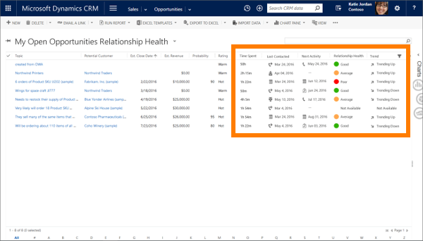
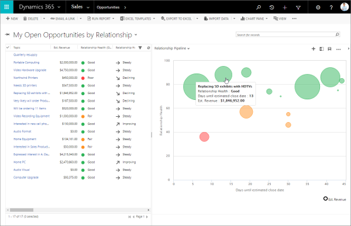
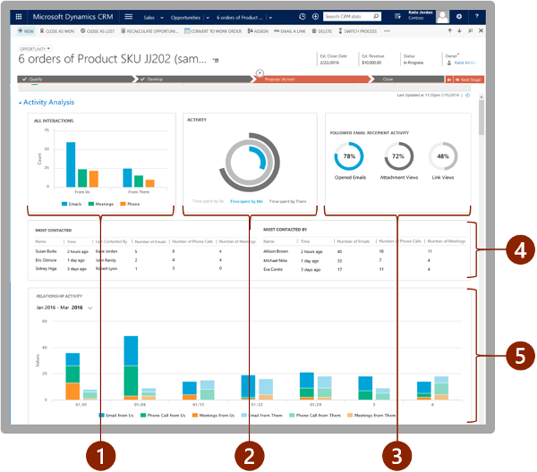

# Preview feature: Use Relationship analytics to gather KPIs 

<!--[!INCLUDE[cc-applies-to-update-9-0-0](../includes/cc_applies_to_update_9_0_0.md)]-->
Applies to Dynamics 365 (online), version 9.0.2.x

We're introducing a feature called *Relationship analytics*. It enables [!INCLUDE[pn_microsoftcrm](../includes/pn-microsoftcrm.md)] to assemble relevant information from throughout its database to create a graphical display of key performance indicators (KPIs) and  activity histories related to any contact, opportunity, lead or account. The feature also calculates the overall health and trend of each of your business relationships.  
  
 Relationship analytics help sales professionals and managers answer questions such as:  
  
-   Which opportunities should I spend my time on?  
  
-   Do we have a good relationship with the customer?  
  
-   How much time have we spent with our customer?  
  
-   When was the last time we contacted them?  
  
-   When is the next time we will contact them?  
  
-   How many emails and meetings have we exchanged?  
  
-   What is the customer's response rate?  
  
-   How many activities were initiated by the customer?  
  
-   How long does it take our team to respond?  
  
Relationship analytics is provided as a preview feature in the [!INCLUDE[pn_crm_9_0_2-online](../includes/pn-crm-9-0-2-online.md)]. Additional restrictions apply depending on which versions of [!INCLUDE[pn_dynamics_crm](../includes/pn-dynamics-crm.md)] and [!INCLUDE[pn_Microsoft_Exchange](../includes/pn-microsoft-exchange.md)] you are running. For complete details about how to install and enable this feature, see [Configure and enable embedded intelligence](../admin/configure-enable-embedded-intelligence.md).  
  
 Relationship analytics is part of the new *Sales insights add-on* suite of features, all of which are currently in preview. [!INCLUDE[proc_more_information](../includes/proc-more-information.md)] [Embedded intelligence](../admin/embedded-intelligence.md)  
  

## Send us feedback  
 
 We are making this preview available so that you can try it and let us know what you think. Your feedback will help us prioritize work to include the capabilities you need most. We ask that you give us your suggestions and report problems by using our publicly available feedback site: [Microsoft Ideas](https://go.microsoft.com/fwlink/p/?LinkId=825778)  
  
   

## Get the big picture with relationship analytics in list views  

Relationship analytics provides an activity history, KPIs, health score, and health trend for contact, opportunity, lead, and account records. The most important KPIs (including your team's previous and next activity related to each record) are shown in the list view for each of these record types, so you can get an overview and sort the list by them.  
  
  
  
   

## Identify critical opportunities with the relationship pipeline view  

The relationship pipeline view provides a bubble chart that gives you a quick overview of the health, close date, and estimated revenue for your upcoming opportunities. To view it:  
  
1.  Go to **Sales** > **Opportunities**.  
  
2.  Select **My Open Opportunities by Relationship** view from the view drop down. 
     

3.  Select **Show Chart** from the command bar. 
      
  
4.  Open the drop-down list at the top of the charts pane and choose **Relationship Pipeline**.   
      
    The relationship pipeline chart is displayed as show below. 
     

  
Each upcoming opportunity is plotted as a bubble on the chart. The size of each bubble indicates the estimated revenue of its opportunity. Health is plotted on the y-axis, so the higher up the bubble appears on the chart, the higher its health.  Estimated close date is plotted on the x-axis, so opportunities on the left side of the chart may expire soon. Therefore, the most critical opportunities are those with the largest bubbles located near the bottom-left corner, while the most promising opportunities are probably those near the top of the chart.  Hover your mouse cursor over a bubble to see the name of the opportunity and few other details. Click on a bubble to open its associated opportunity record. Relationship health is also indicated by the color of each bubble, with green for good, yellow for fair, red for poor, and gray for zero (which probably indicates that the results have not yet been calculated, or that there is not yet enough data for the calculation).  
  
  
  
The relationship pipeline chart relies on several values being available for each of your opportunity records, but in some cases, these values may be missing for some or all opportunities—this might be due to a worker oversight, or it could also be because you don't make use of these fields at your organization. The chart represents missing values as follows:  
  
-   Opportunities that don't have a relationship health value are shown in gray with a value of zero. They are therefore plotted at the bottom of the chart.  
  
-   Opportunities with an estimated close date in the past are not shown.  
  
-   Opportunities without an estimated close date are not shown.  
  
-   Opportunities without an estimated revenue value show a value of zero. They are therefore plotted as a very small bubble.  
  
   

## Analyze the health and activity history of a customer or opportunity  
 Complete relationship analytics are provided when you view an individual record, including graphs, KPIs, email interaction history, full activity history, and relationship health. These details are provided in two expandable sections when you are viewing an individual record (such as a specific opportunity).   
 
  
   
**Relationship health and trend:** Shows your overall relationship health with the customer associated with the current record, and includes the recent trend.   
- **Next interaction:** Shows the date and time for next activity that is scheduled for the current record. If you have access to that activity, then you'll also see it's name or subject. The next and last interactions are only shown for opportunity and lead entities.   
- **Last interaction:** Shows the date and time for the last activity that you completed for the current record.  If you have access to that activity, then you'll also see it's name or subject. The next and last interactions are only shown for opportunity and lead entities.   
  
**All interactions:**  Shows the total number of activities initiated by members of your team and by the customer. The activities are broken down by general type such as emails, meetings, and phone calls.   
  
**Time spent:** Shows the relative amount of time spent on activities related to the current record, including <!--time spent by you,--> your team and the customer. For each activity where more than one team member was involved, the time spent on that activity is multiplied by the number of your team members that were present. But time spent by your customer is counted just once, even if more than one member of the customer's team was present.   
  
**Email engagement:** Provides a summary of how your customer has interacted with the followed emails your team has sent to them. Unfollowed emails are not included, so you must enable and use the email-engagement feature to see any information here. [!INCLUDE[proc_more_information](../includes/proc-more-information.md)] [Email engagement](../admin/email-engagement.md)   
  
**Most contacted:** Provides statistics about the external contacts who most contacted by internal contacts. These contacts may include  [!INCLUDE[pn_dynamics_crm](../includes/pn-dynamics-crm.md)] users who are heavily involved with the external contacts even if they are not part of the record’s users.  

**Most contacted by:** Provides statistics about the internal contacts who most contacted external contacts. These contacts may include external users who are heavily involved with the internal contacts even if they are not part of the record’s users.  
  
**Relationship activities**: Provides a more detailed look of activities over time, broken down by date and activity type such as emails sent, email received, meetings sent, meetings received, phone calls made, and phone calls received.  
  
   

## How relationship analytics values are calculated  

 Relationship analytics values are derived from a careful analysis of the many related people, activities, companies, appointments, and emails stored on your [!INCLUDE[pn_dynamics_crm](../includes/pn-dynamics-crm.md)] and [!INCLUDE[pn_Microsoft_Exchange](../includes/pn-microsoft-exchange.md)] servers. The process for finding and calculating the scores  is summarized in the following figure.  
  
   
  
 See the following subsections for details about each block in the flowchart.  
  
   

### Step 1: Find contacts of interest for the record  

 Relationship analytics is concerned with activities performed by the *people* associated with a given record. The first step in finding the relevant activities is to find out which contacts to include in the analysis. Relationship analytics also provides time-spent values for you, your team, and your customer's team, so the identify of who did what remains important throughout the process.  
  
 The following table shows how the system finds contacts that have an interest in each type of record. Later, the system will look for activities associated with each  identified contact and decide which of those activities should be included in KPI calculations for that record.  
  
||Internal contacts|External contacts|  
|-|-----------------------|-----------------------|  
|Account|-   Any [!INCLUDE[pn_dynamics_crm](../includes/pn-dynamics-crm.md)] user|-   The **Primary Contact** for the account -   All contacts in the account's **Contacts** list.|  
|Opportunity|-   The **Owner** of the opportunity record -   All users in the opportunity's **Sales Team** list.|-   The customer **Contact** listed for the opportunity -   All contacts in the opportunity's **Stakeholders** list. -   The primary contact for the related **Account** record.|  
|Lead|-   The **Owner** of the lead record|-   Contact information in the lead's **Contact** section. -   All contacts in the lead's **Stakeholders** list.|  
|Contact|-   Any [!INCLUDE[pn_dynamics_crm](../includes/pn-dynamics-crm.md)] user|-   Contact information in the contact's **Contact** section.|  
  
   

### Step 2: Link activities to the record  

 Once the system has identified contacts of interest (as described in the previous section), it looks for activities associated with each of those contacts, and then identifies which of these activities to include in the relationship analytics for the record you are looking at. It identifies relevant activities as follows:  
  
- **Regarding records**: Any activity that has its **Regarding** value set to the current record is explicitly assigned to it, and will always be included in its relationship analytics, even if that activity isn't also associated with a contact of interest.  
  
- **Email messages**: include all messages where the email address (or a reference to the contact record) for a contact of interest is shown in the **To**, **Cc**, or **From** field.  
  
- **Appointments**: include all appointments where a contact of interest is shown in the **Required** or **Optional** fields.  
  
- **Phone calls**: include all calls where  a contact of interest is shown in the **From** or **To** fields.  

   

### Examples of how relevant activities are identified  

 Here are a few examples of how the rules outlined in the previous sections might be applied:  
  
-   If you are assigned to a lead and register a phone-call activity with one of the stakeholders for that lead, then that phone call will be counted among the KPIs for that lead. Other users who call that same stakeholder, but who are not assigned to the lead, will not have their calls counted among the KPIs for that lead.  
  
-   If you are on the sales team for an opportunity and send an email set as regarding that opportunity to one of its stakeholders, then that email will be counted among the KPIs for that account. An email from another user, who isn't on the team for that account, to that same external contact will not be counted for that opportunity.  
  
-   If you attend a meeting with the primary contact for an account, then that appointment will be counted among the KPIs for that account *and* for that contact. If that account is also associated with an opportunity, the appointment will only count for that opportunity if you are also **Assigned** to that opportunity (or are on its **Sales Team**) *and* if the appointment is set as **Regarding** that opportunity.  
  
   

### Step 3: Compute relationship analytics KPIs  

 After the system has found all of the relevant activities, it's ready to calculate the KPIs  and other analytics for each record. The following table summarizes the KPIs that are available.  
  
||Initiated or completed by your team|Initiated or completed by the customer's team|  
|-|-----------------------------------------|---------------------------------------------------|  
|Emails|Total number   Total time spent   Time line (number per week)   Number of replies|Total number   Total time spent   Time line (number per week)   Number of replies   Interaction results for followed emails (opens, attachment views, and link views)|  
|Appointments|Total number   Total time spent by your team (if several team members were present at an appointment, then the duration is multiplied by the number of  team members  present)  <!-- Total time spent by you (not multiplied by the number of team members) -->  Time line (number per week)|Total number   Total time spent (not multiplied by the number of customer contacts that were present)   Time line (number per week)|  
|Phone calls|Total number   Total time spent   Time line (number per week)|Total number   Total time spent   Time line (number per week)|  
|Overall (all activities)|Total time spent|Total time spent|  
  
> [!NOTE]
> Email interaction statistics are only provided for *followed emails*, which requires you to use the *email engagement* feature. For more information about how to create and send followed emails, see [Email engagement](../admin/email-engagement.md)  
  
 For KPIs that report <!--time spent by you,--> your team and your customer, the system finds durations by applying the rules outlined in the following table:  
  
|Activity type|Source of duration value|  
|-------------------|------------------------------|  
|Appointments|**Duration** field for the appointment record|  
|Calls|**Duration** field for the phone call record|  
|Emails|Estimated (2.5 minutes to read, 5 minutes to write)|  
|Other|**Duration** field for each record|  
  
> [!TIP]
> The time calculations for appointments are bit special. The details are given in the previous tables, but here's an extra example to illustrate it.  
>   
> If you hold an appointment where three members of your team (including you) meet with two members of your customer's team, and the appointment lasts for 30 minutes, then that appointment contributes to your time KPIs as follows:  
>   
<!-->> - **Time spent by me**: *30 minutes* (the appointment was 30 minutes) --> 
> - **Time spent by my team**: *90 minutes* (30 min. × 3 team members present)  
> - **Time spent by the customer**: *30 minutes* (time isn't multiplied by customer participants)  
  
   

### Step 4: Compute the relationship health and health trend  

The overall relationship health score is calculated by collecting the relevant activities, applying weightings by activity type (which enable your admin to set some types of activities to count more than others). The result is normalized to produce a health score between 0 and 100, and the health characterized as *good* (for a score of 60-100), *fair* (40-59) or *poor* (0-39).  

Note the following:

- Health scores are computed for leads if they are in an active state. This stops once they reach a qualified or disqualified state.
- Health scores are computed for opportunities if the opportunity is open and ignored if it’s won or lost.
- Health scores are computed for contacts and accounts irrespective of their state.  
 
Your administrator can choose which types of activities are most relevant for your business. By default, all types of activities count the same, but your admin can increase or decrease the contribution of each type by up to 50%. In addition, your admin can choose how often salespeople should contact a customer (such as once a week); this setting also affects the health score.  
  
  
  
In addition to the absolute health score, the system also reports the general trend (up, down, or neutral) based on the number and value of recent activities. The trend direction updates relatively slowly, so it might take a little while to indicate a recent increase or decrease  in activity.  

  
  
### See also  
 [What are Preview features?](what-are-preview-features-how-do-i-enable-them.md)   