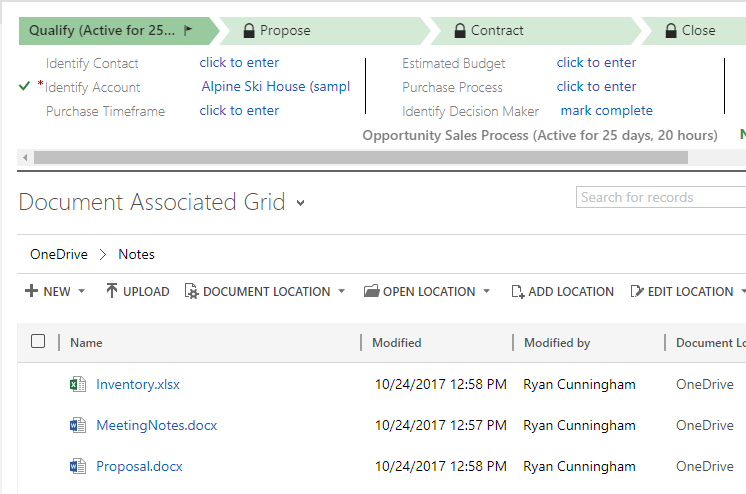

# Troubleshoot SharePoint Online integration

[!INCLUDE[cc-applies-to-update-9-0-0](../includes/cc_applies_to_update_9_0_0.md)]<br/>[!INCLUDE[cc_applies_to_on-prem-9_0_0](../includes/cc_applies_to_on-prem-9_0_0.md)]

If you experience any of following situations, use the steps below to correct.

## Missing Documents button - validate and fix 

If **Documents** is missing from entities such as account, use the following to restore.


Start by understanding the requirements listed in [Important considerations for server-based SharePoint integration](important-considerations-server-based-sharepoint-integration.md).

1. Make sure you have the System Administrator security role or equivalent permissions in Dynamics 365 for Customer Engagement.
    Check your security role:
    1. Follow the steps in [View your user profile](../basics/view-your-user-profile.md).
    2. Don’t have the correct permissions? Contact your system administrator.

2. Fix the missing **Documents** button. Follow these steps:

   1. Identity the entity for which the documents link should be visible (e.g. account, contact, opportunity...etc.).
   2. Go to **Settings** > **Document Management Settings**.
   3. Make sure the entity you wished to have documents link (selected in Step 1) are selected and a valid SharePoint URL is specified. 
   4. Complete the wizard.
   5. Verify the **Documents** button appears.

For more information, see [Enable SharePoint document management for specific entities](enable-sharepoint-document-management-specific-entities.md).

##  Missing Document associated grid - validate and fix

If the Documents associated grid is missing, use the following to restore.



Start by understanding the requirements listed in [Important considerations for server-based SharePoint integration](important-considerations-server-based-sharepoint-integration.md).

The most common cause for the Documents associated grid not loading is the corrupted FetchXML and LayoutXML. These sections could be corrupted due to many reasons. The most common of them is through customizing the entity/grid view, adding/removing columns, and other similar customizations.

1. Make sure you have the System Administrator security role or equivalent permissions in Dynamics 365 for Customer Engagement.
    Check your security role:
    1. Follow the steps in [View your user profile](../basics/view-your-user-profile.md).
    2. Don’t have the correct permissions? Contact your system administrator.
2. Go to **Settings** > **Customizations** > **Solutions**. 
3. Create a solution (named SharePointDocumentSolution). For more information, see [Create a solution](../customize/create-solution.md).
4. Add **SharePoint Document** entity (select all fields , forms, views). 
5. Select **Save** and **Close**.
6. Publish all customizations.
7. Select the created (SharePointDocumentSolution) solution.
8. Export the solution. (SharePointDocumentSolution.zip will be downloaded) 
9. Extract the zip file (downloaded file from Step 7).
10. Browse the folder, locate and open customization.xml.
11. Search LayoutXml of Document associated grid (search for *Document Associated*).
    
    > [!div class="mx-imgBorder"] 
    > 

12. Make the changes as below for the LayoutXML section:

    ```  
    <layoutxml>
      <grid name="sharepointdocument" jump="fullname" select="1" icon="0" preview="1">
        <row name="sharepointdocument" id="sharepointdocumentid">
          <cell name="fullname" width="300" imageproviderfunctionname="DocumentManagement.FileTypeIcon.loadSharePointFileTypeIcon" imageproviderwebresource="$webresource:SharePoint_main_system_library.js" />
          <cell name="relativelocation" width="200" />
          <cell name="modified" width="150" />
          <cell name="sharepointmodifiedby" width="150" />
          <cell name="sharepointcreatedon" width="300" />
          <cell name="title" ishidden="1" />
          <cell name="readurl" ishidden="1" />
          <cell name="editurl" ishidden="1" />
          <cell name="author" ishidden="1" />
          <cell name="absoluteurl" ishidden="1" />
          <cell name="filetype" ishidden="1" />
          <cell name="ischeckedout" ishidden="1" />
          <cell name="locationid" ishidden="1" />
          <cell name="iconclassname" ishidden="1" />
        </row>
      </grid>
    </layoutxml>
    ```  

13. Make the changes as below for the FetchXml section:

    ```  
    <fetch distinct="false" mapping="logical">
      <entity name="sharepointdocument">
        <attribute name="documentid" />
        <attribute name="fullname" />
        <attribute name="relativelocation" />
        <attribute name="sharepointcreatedon" />
        <attribute name="ischeckedout" />
        <attribute name="filetype" />
        <attribute name="modified" />
        <attribute name="sharepointmodifiedby" />
        <attribute name="servicetype" />
        <attribute name="absoluteurl" />
        <attribute name="title" />
        <attribute name="author" />
        <attribute name="sharepointdocumentid" />
        <attribute name="readurl" />
        <attribute name="editurl" />
        <attribute name="locationid" />
        <attribute name="iconclassname" />
        <order attribute="relativelocation" descending="false" />
        <filter>
          <condition attribute="isrecursivefetch" operator="eq" value="0" />
        </filter>
      </entity>
    </fetch>
     ```  

14. Save the file.
15. Zip the folder.
16. Open Dynamics 365 for Customer Engagement.
17. Navigate to **Settings** > **Solutions**
18. Import the solution (zipped file in Step 8).
19. Publish all customizations.
20. Verify the Document associated grid is displaying in all the required SharePoint documents.


