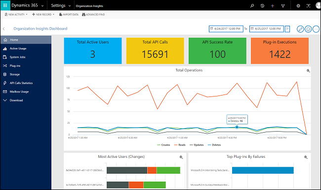
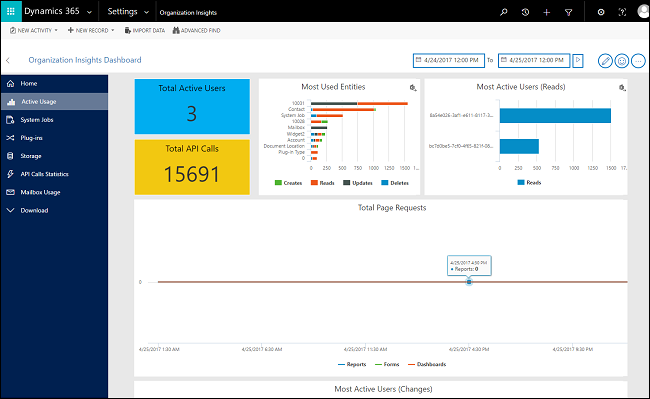
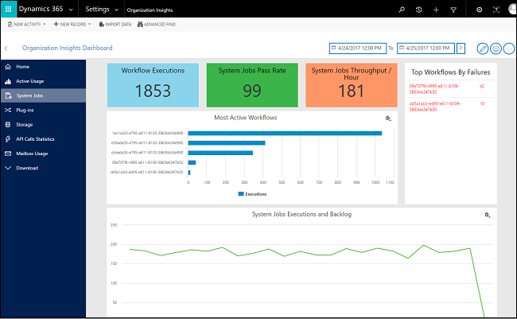
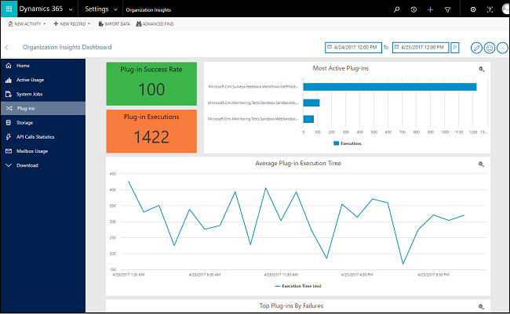
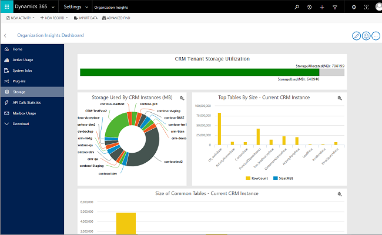
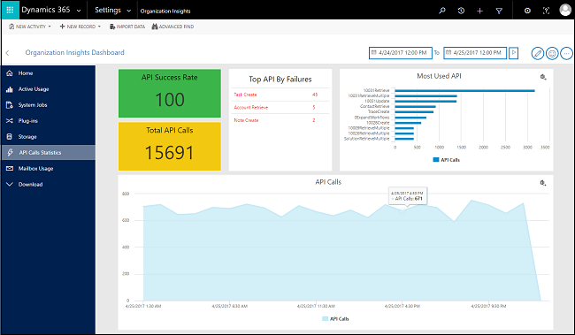
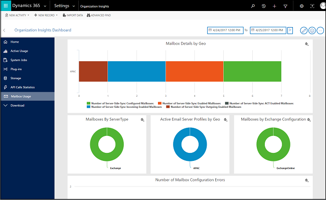
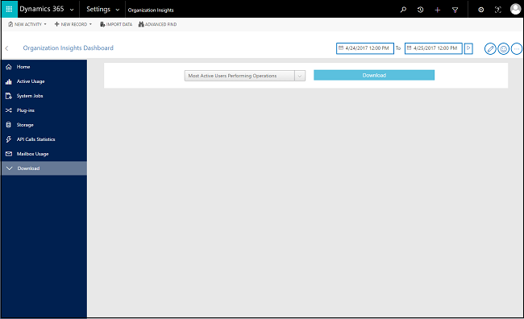

# Use the Organization Insights solution to view metrics about your instance
Organization Insights for [!INCLUDE[pn_dyn_365_online](../includes/pn-dyn-365-online.md)] provides important adoption and use metrics for your [!INCLUDE[pn_dyn_365](../includes/pn-dyn-365.md)] organization, and tools to help you stay ahead of performance and support issues.  
  
> [!IMPORTANT]
>  Check your version of the Organization Insights solution. In [!INCLUDE[pn_dyn_365_online](../includes/pn-dyn-365-online.md)], go to **Settings** > **Solutions**, and determine the version of OrganizationInsightsSolution.  
>   
>  Organization Insights solution version 1.2.0.0 is the officially supported version.  
>   
>  If you have installed version 1.0.0.0, this is a preview feature in [!INCLUDE[pn_crm_8_2_0_online](../includes/pn-crm-8-2-0-online.md)]. You can download the latest version from [AppSource](https://appsource.microsoft.com/product/dynamics-365/mscrm.04931187-431c-415d-8777-f7f482ba8095?tab=Overview). A preview feature is a feature that is not complete, but is made available before it’s officially in a release so customers can get early access and provide feedback. Preview features aren’t meant for production use and may have limited or restricted functionality.  
>   
>  To provide feedback for this feature, use the Feedback button.   
>   
> [!INCLUDE[cc_preview_features_no_MS_support](../includes/cc-preview-features-no-ms-support.md)]  
  
 **Key highlights**  
  
- **Available as a solution**: Organization Insights is available as a preferred solution from [AppSource](https://appsource.microsoft.com/product/dynamics-365/mscrm.04931187-431c-415d-8777-f7f482ba8095?tab=Overview) and is compatible with [!INCLUDE[pn_crm_8_1_1_online_subsequent](../includes/pn-crm-8-1-1-online-subsequent.md)] (8.1.1) or later.  
  
- **Customizable dashboards**: Set up your organization’s dashboard to provide a rich user experience and snapshots of your organization’s most important data.  
  
- **Monitor adoption and use**: Identify your most active users, the number and types of operations they’re performing, number of pages requests, most-used entities, workflows, plug-ins, and more, over a period of time as you work toward your adoption goals.  
  
- **Manage storage and performance**: Monitor storage quotas, storage use, and top tables by size to optimize performance.  
  
- **Troubleshoot effectively**: Drill down into the details of your top failing workflows and API calls to quickly diagnose and troubleshoot errors.  
  
- **OData support**: Expose Organization Insights entities through OData for extension by independent software vendors.  
  
- **Original Organization Insights dashboard**: You can also view metrics using the Organization Insights dashboard released with [!INCLUDE[pn_crm_8_1_0_online](../includes/pn-crm-8-1-0-online.md)]. See [Preview feature: Use the Organization Insights dashboard to view metrics about your instance](../admin/use-organization-insights-dashboard-view-instance-metrics.md). This dashboard does not have all the metrics available with the solution version.  
  
> [!TIP]
>  Check out the following video: [Monitor your Dynamics 365 (online) instance with Organization Insights](https://go.microsoft.com/fwlink/p/?linkid=835917).  
  
   
## Install and view the Organization Insights solution  
 The new Organization Insights is a preferred solution that you can install from the Dynamics Marketplace.  
  
> [!NOTE]
>  If you are using a trial version of [!INCLUDE[pn_crm_online_shortest](../includes/pn-crm-online-shortest.md)], you can install the new Organization Insights from [AppSource](https://appsource.microsoft.com/marketplace?page=1&product=dynamics-crm).  
  
1.  In [!INCLUDE[pn_crm_shortest](../includes/pn-crm-shortest.md)], from the main menu, click **Settings** > **Dynamics Marketplace**.  
  
2.  In the search box, type "organization insights".  
  
3.  When you see the **Organization Insights** app, click **Try**, and then **Continue**.  
  
4.  In the **Add the application to Dynamics 365** dialog box, choose your organization.  
  
5.  Proceed through the terms of service and click **Agree**.  
  
6.  To verify that the solution is installed, go to **Settings** > **Solutions**. You will see Organization Insights in the list of solutions.  
  
    > [!NOTE]
    >  While the solution is installing, the status of the solution changes to "Installation pending". When it's installed and ready to use, the status will change to "Installed".  
  
7.  To view the new Organization Insights dashboard, go to **Settings** > **Organization Insights**.  
  
   
## Home (default)  
   
  
### About this dashboard  
 This is the default dashboard that provides information on the number of active [!INCLUDE[pn_dyn_365](../includes/pn-dyn-365.md)] users, storage usage, the most active workflows, and more.  
  
### What's included in this dashboard  
  
|Chart element|Description|  
|-------------------|-----------------|  
|Total Active Users|Total number of active users (unique users) who performed an operation that caused one of these SDK calls: `Retrieve`, `Retrieve Multiple`, `Delete`, `Create`, and `Update`.|  
|Total API Calls|Total number of API calls that were made by the [!INCLUDE[pn_dyn_365](../includes/pn-dyn-365.md)] instance for the selected time period.|  
|API Success Rate|This chart shows the API success rate as percentage of total API calls that were made in the [!INCLUDE[pn_dyn_365](../includes/pn-dyn-365.md)] instance over the specified time.|  
|Plug-in Executions|This chart shows how many plug-ins have been executed in the [!INCLUDE[pn_dyn_365](../includes/pn-dyn-365.md)] instance over the specified time.|  
|Total Operations|This chart shows how many operations (create, update, deletes, reads) have occurred in the [!INCLUDE[pn_dyn_365](../includes/pn-dyn-365.md)] instance over the specified time.|  
|Most Active Users (Changes)|List of most active users who performed an operation that caused a `Create`, `Update`, or `Delete` SDK call in the [!INCLUDE[pn_crm_shortest](../includes/pn-crm-shortest.md)] instance over the selected time period.|  
|Top Plug-ins By Failures|This chart shows top 10 most failing plug-in in the [!INCLUDE[pn_dyn_365](../includes/pn-dyn-365.md)] instance over the specified time.|  
  
   
## Active Usage  
   
  
### About this dashboard  
 Use this dashboard to find out how many [!INCLUDE[pn_dyn_365](../includes/pn-dyn-365.md)] users there are, how many licenses are in use, what custom entities are used most frequently, and more.  
  
### What's included in this dashboard  
  
|Chart element|Description|  
|-------------------|-----------------|  
|Total Active Users|Total number of active users (unique users) who performed an operation that caused one of these SDK calls: `Retrieve`, `Retrieve Multiple`, `Delete`, `Create`, and `Update`.|  
|Total API Calls|Total number of API calls that were made by the [!INCLUDE[pn_dyn_365](../includes/pn-dyn-365.md)] instance for the selected time period.|  
|Most Used  Entities|Ten Entities which had the most `Retrieve`, `Retrieve Multiple`, `Delete`, `Create`, and `Update SDK Calls`.|  
|Most Active Users (Reads)|List of most active users who performed reads (**Retrieve** and **RetrieveMultiple** SDK calls) in the [!INCLUDE[pn_dyn_365](../includes/pn-dyn-365.md)] instance over the specified time.|  
|Total Page Requests|The number of page load requests for forms, dashboards, and reports. This is the count of requests received by the [!INCLUDE[pn_dyn_365](../includes/pn-dyn-365.md)] server. Pages that are cached while browsing won't be counted.|  
|Most Active Users (Changes)|The top ten users who performed the most change operations (creates, updates, deletes) in your [!INCLUDE[pn_dyn_365](../includes/pn-dyn-365.md)] instance.|  
|Total Operations|This chart shows how many operations (create, update, deletes, reads) have occurred in the [!INCLUDE[pn_dyn_365](../includes/pn-dyn-365.md)] instance for the selected time period.|  
|Active Users Performing Specific Operations|Total number of active users (unique users) over time who performed an operation that caused one of these SDK calls: `Retrieve`, `Retrieve Multiple`, `Delete`, `Create`, and `Update`.|  
|Active Users|Number of active users (unique users) in your instance who performed an operation that caused one of these SDK calls: `Retrieve`, `Retrieve Multiple`, `Delete`, `Create`, and `Update` over time.|  
|Most Active Users Performing Operations|List of  most active users (unique users) over time who performed an operation that caused one of these SDK calls: `Retrieve`, `Retrieve Multiple`, `Delete`, `Create`, and `Update`.|  
|Most Used Custom Entities|List of custom entities which had the most `Retrieve`, `Retrieve Multiple`, `Delete`, `Create`, and `Update SDK Calls`.|  
|Most Used OOB Entities|List of out-of-box entities which had the most `Retrieve`, `Retrieve Multiple`, `Delete`, `Create`, and `Update SDK Calls`.|  
  
> [!NOTE]
> **Retrieve** and **RetrieveMultiple** SDK calls are reported as **Reads**.  
  
### Update frequency  
 Active usage chart data is updated as follows.  
  
|Chart|Update frequency|  
|-----------|----------------------|  
|Total Active Users|1 hour|  
|Most Used Entities|1 hour|  
|Most Active Users (Reads)|1 hour|  
|Total API Calls|1 hour|  
|Total Page Requests|1 hour|  
|Most Active Users (Changes)|1 hour|  
|Total Operations|1 hour|  
|Active Users Performing Specific Operations|1 hour|  
|Active Users|1 hour|  
|Most Active Users Performing Operations|1 hour|  
|Most Used Custom Entities|1 hour|  
|Most Used OOB Entities|1 hour|  
  
   
## System Jobs  
   
  
### About this dashboard  
 Use this dashboard to monitor and troubleshoot workflows.  
  
### What's included in this dashboard  
  
|Chart element|Description|  
|-------------------|-----------------|  
|Workflow Executions|This chart shows how many workflows have been executed in the [!INCLUDE[pn_dyn_365](../includes/pn-dyn-365.md)] instance over the specified time.|  
|System Jobs Pass Rate|This chart shows the system job’s pass rate as percentage of system jobs that were executed in the [!INCLUDE[pn_dyn_365](../includes/pn-dyn-365.md)] instance over the specified time.|  
|System Jobs Throughput/Minute|This chart shows the average system jobs that have been executed per hour in the [!INCLUDE[pn_dyn_365](../includes/pn-dyn-365.md)] instance over the specified time.|  
|Executions and Backlog|This chart shows the number of executions and the backlog for system jobs in the [!INCLUDE[pn_dyn_365](../includes/pn-dyn-365.md)] instance over the specified time.|  
|Most Active Workflows|This chart shows top 10 most executed workflows in the [!INCLUDE[pn_dyn_365](../includes/pn-dyn-365.md)] instance over the specified time.|  
|Top Workflows By Failures|This chart shows top 10 most failing workflows in the [!INCLUDE[pn_dyn_365](../includes/pn-dyn-365.md)] instance over the specified time. Click on a workflow to see the failures and their number of occurrences.|  
  
### Update frequency  
 System jobs chart data is updated as follows.  
  
|Chart|Update frequency|  
|-----------|----------------------|  
|Workflow Executions|1 hour|  
|System Jobs Pass Rate|1 hour|  
|System Jobs Throughput / Hour|1 hour|  
|Most Active Workflows|1 hour|  
|System Jobs Executions and Backlog|1 hour|  
|Top Workflows By Failures|1 hour|  
  
   
## Plug-ins  
   
  
### About this dashboard  
 Use this dashboard to monitor and troubleshoot plug-ins.  
  
### What's included in this dashboard  
  
|Chart element|Description|  
|-------------------|-----------------|  
|Plug-in Success Rate|This chart shows the plug-in pass rate as percentage of total plug-in executions that were executed in the [!INCLUDE[pn_dyn_365](../includes/pn-dyn-365.md)] instance over the specified time.|  
|Plug-in Executions|This chart shows how many plug-ins have been executed in the [!INCLUDE[pn_dyn_365](../includes/pn-dyn-365.md)] instance over the specified time.|  
|Average Plug-in Execution Time|This chart shows average time taken to successfully execute a plug-in in the [!INCLUDE[pn_dyn_365](../includes/pn-dyn-365.md)] instance over the specified time.|  
|Most Active plug-ins|This chart shows top 10 most executed plug-ins in the [!INCLUDE[pn_dyn_365](../includes/pn-dyn-365.md)] instance over the specified time.|  
|Top Plug-ins By Failures|This chart shows top 10 most failing plug-ins in the [!INCLUDE[pn_dyn_365](../includes/pn-dyn-365.md)] instance over the specified time.|  
  
### Update frequency  
 Plug-ins chart data is updated as follows.  
  
|Chart|Update frequency|  
|-----------|----------------------|  
|Plug-in Success Rate|1 hour|  
|Most Active Plug-ins|1 hour|  
|Plug-in Executions|1 hour|  
|Average Plug-in Execution Time|1 hour|  
|Top Plug-ins By Failures|1 hour|  
  
   
## Storage  
   
  
### About this dashboard  
 This dashboard provides a look at storage used by your tenant and instances.
  
### What's included in this dashboard  
  
|Chart element|Description|  
|-------------------|-----------------|  
|[!INCLUDE[pn_dyn_365](../includes/pn-dyn-365.md)] Tenant Storage Utilization|This chart shows the storage used by all the [!INCLUDE[pn_dyn_365](../includes/pn-dyn-365.md)] instances of your tenant out of the total storage allocated to the tenant.|  
|Storage By [!INCLUDE[pn_dyn_365](../includes/pn-dyn-365.md)] Instances (MB)|This chart shows the breakdown of the storage used by the [!INCLUDE[pn_dyn_365](../includes/pn-dyn-365.md)] instances of your tenant.|  
|Top Tables By Size - Current [!INCLUDE[pn_dyn_365](../includes/pn-dyn-365.md)] Instance|This chart shows top 10 largest tables by size and their row count in the [!INCLUDE[pn_dyn_365](../includes/pn-dyn-365.md)] instance database.|  
|Common Tables By Size - Current [!INCLUDE[pn_dyn_365](../includes/pn-dyn-365.md)] Instance|This chart shows the size and number of rows of some common tasks of tables in the [!INCLUDE[pn_dyn_365](../includes/pn-dyn-365.md)] instance database.|  
  
### Update frequency  
 Storage chart data is updated as follows.  
  
|Chart|Update frequency|  
|-----------|----------------------|  
|[!INCLUDE[pn_dyn_365](../includes/pn-dyn-365.md)] Tenant Storage Utilization|1 day|  
|Storage Used By [!INCLUDE[pn_dyn_365](../includes/pn-dyn-365.md)] Instances (MB)|1 day|  
|Top Tables By Size - Current [!INCLUDE[pn_dyn_365](../includes/pn-dyn-365.md)] Instance|1 day|  
|Size of Common Tables - Current [!INCLUDE[pn_dyn_365](../includes/pn-dyn-365.md)] Instance|1 day|  
  
   
## API Call Statistics  
   
  
### About this dashboard  
 Use this dashboard to monitor and troubleshoot API calls.  
  
### What's included in this dashboard  
  
|Chart element|Description|  
|-------------------|-----------------|  
|API Success Rate|This chart shows the API success rate as percentage of total API calls that were made in the [!INCLUDE[pn_dyn_365](../includes/pn-dyn-365.md)] instance over the specified time.|  
|Total API Calls|This chart shows how many API calls have been made in total in the [!INCLUDE[pn_dyn_365](../includes/pn-dyn-365.md)] instance over the specified time.|  
|Most Used API|This chart shows top 10 most executed API calls in the [!INCLUDE[pn_dyn_365](../includes/pn-dyn-365.md)] instance database.|  
|API Calls|This chart shows how many API calls have been made over time in the [!INCLUDE[pn_dyn_365](../includes/pn-dyn-365.md)] instance over the specified time.|  
  
### Update frequency  
 API Call Statistics chart data is updated as follows.  
  
|Chart|Update frequency|  
|-----------|----------------------|  
|API Success Rate|1 hour|  
|Top API By Failures|1 hour|  
|Most Used API|1 hour|  
|Total API Calls|1 hour|  
|API Calls|1 hour|  
  
   
## Mailbox Usage  
   
  
### About this dashboard  
 Use this dashboard to monitor email mailbox usage.  
  
### What's included in this dashboard  
  
|Chart element|Description|  
|-------------------|-----------------|  
|Mailbox Details by GEO|This chart shows mailbox details like:   -   the number of server-side synch configured mailboxes -   the number of server-side synch enabled mailboxes -   the number of server-side synch Appointments, Contacts, and Tasks enabled mailboxes -   the number of server-side synch incoming enabled mailboxes -   the number of server-side synch outgoing enabled mailboxes categorized by the geo location the mailbox is hosted in|  
|Mailboxes By Server Type|This chart shows the mailbox distribution by server type.|  
|Active Email Server Profiles by Geo|This chart shows active server-side synch enabled mailboxes distributed over the geo location they are hosted in.|  
|Mailboxes by Exchange Configuration|This chart shows the number of mailboxes categorized by their [!INCLUDE[pn_Exchange](../includes/pn-exchange.md)] configuration.|  
|Number of Mailbox Configuration Errors|This chart shows the number of mailboxes configuration errors which occurred over the user-selected time frame.|  
|Mailbox Usage|This chart shows the number of server-side synch mailboxes over the time range selected by the user.|  
|Number of Outlook Mailboxes|This chart shows the number of [!INCLUDE[pn_Outlook_short](../includes/pn-outlook-short.md)] mailboxes configured for the organization.|  
|Number of Active Email Server Profiles|This chart shows the number of active email server profiles for the time range configured by the user.|  
  
### Update frequency  
 Mailbox Usage chart data is updated as follows.  
  
|Chart|Update frequency|  
|-----------|----------------------|  
|Mailbox Details by Geo|30 minutes average|  
|Active Email Server Profiles by Geo|5 minutes average|  
|Mailboxes By Server Type|5 minutes average|  
|Mailbox Usage|5 minutes average|  
|Number of Mailbox Configuration Errors|30 minutes average|  
|Number Of Active Email Server Profiles|5 minutes average|  
|Number Of Outlook Mailboxes|15 minutes average|  
|Mailboxes by Exchange Configuration|5 minutes average|  
  
   
## Download  
   
  
### About this dashboard  
 Use this dashboard to download the data selected for the date range selected as an Excel spreadsheet.  
  
### What's included in this dashboard  
  
|Chart element|Description|  
|-------------------|-----------------|  
|Most Active Users Performing Operations|List of  most active users (unique users) over time who performed an operation that caused one of these SDK calls: `Retrieve`, `Retrieve Multiple`, `Delete`, `Create`, and `Update`.|  
|Most Used Custom Entities|List of custom entities which had the most `Retrieve`, `Retrieve Multiple`, `Delete`, `Create`, and `Update SDK Calls`.|  
|Most Used OOB Entities|List of out-of-box entities which had the most `Retrieve`, `Retrieve Multiple`, `Delete`, `Create`, and `Update SDK Calls`.|  
  
### Update frequency  
 Download chart data is updated as follows.  
  
|Chart|Update frequency|  
|-----------|----------------------|  
|Most Active Users Performing Operations|1 hour|  
|Most Used Custom Entities|1 hour|  
|Most Used OOB Entities|1 hour|  
  
   
## Customize your Customer Insights dashboard  
 You can easily customize Organization Insights dashboards to meet your information requirements.  Look for these buttons in the upper-right corner of the [!INCLUDE[pn_dyn_365](../includes/pn-dyn-365.md)] screen.  
  
|Control|Description|  
|-------------|-----------------|  
|Edit   |Click to edit the dashboard. Once in edit mode, you can add, remove, resize, and reposition charts in the Home dashboard.   In other dashboards, you can reposition and resize charts. You cannot add or remove charts.|  
|Save   |Click **Save** to record all your dashboard changes.|  
|Add   |Click for a list of charts you can add to the dashboard. You cannot add multiple copies of the same chart in the Home dashboard.|  
|Chart menu   |Charts you can add to a dashboard.|  
|Close   |Click to close the Chart menu.|  
|Feedback   |We want your feedback! Click **Feedback** to let us know how we're doing.|  
|More options   |Click **More options** > **Reset to default dashboard**  to revert all your dashboard changes.  This will reset all changes you've made to any dashboard to default values.|  
|Remove and Resize   |When you click **Edit**, you can remove, resize, and move charts in the Home dashboard. In other dashboards, you can resize and move the charts but not remove them.|  
|Export   |Click to export chart data to Excel. Not all charts can be exported.|  
  
   
## Granting access to the Organization Insights dashboard  
 By default, the dashboard is  available to System Administrator and System Customizer security roles. Access can be granted to other security roles, by providing **Read** privilege to **Saved Organization Insights Configuration**.  
  
1.  Click **Settings** > **Security** > **Security Roles**.  
  
2.  Select a security role, and then click the **Core Records** tab.  
  
3.  Scroll down to **Saved Organization Insights Configuration** and click the **Read** privilege.  
  
4.  Click **Save and Close**.  
  
   
  
 To let other users make modifications to their dashboard layout, grant **Create**, **Read**, **Write**, and **Delete** privileges for the **OrgInsights User Dashboard Definition** custom entity.  
  
1.  Click **Settings** > **Security** > **Security Roles**.  
  
2.  Select a security role, and then click the **Custom Entities** tab.  
  
3.  For **OrgInsights User Dashboard Definition**, and click the **Create**, **Read**, **Write**, and **Delete** privileges .  
  
4.  Click **Save and Close**.  
  
   
  
   
## View data for different time ranges  
 You can adjust the time range for the data presented in the dashboards charts. After selecting the From and To range, click the **Play** button () to refresh your data.  
  
   
  
 Consider the following about the Organization Insights calendar:  
  
-   The Calendar control is not available for the  Storage dashboard and not applicable to any storage related chart as only the latest information is shown for those charts.  
  
-   Default time range is shown for the past 48 hours.  
  
-   Data is only shown for the applied time range.  
  
-   Data is available from the time of release of the solution in AppSource, and will be retained for 90 days.  
  
-   Data is shown for time series at an hourly aggregation interval.  
  
-   The data shown for a hourly aggregation interval represents the whole hour. For example, if the number of active users at 2:00 PM is 5, there were 5 active users between 1:00 and 2:00 PM.  
  
   
  
### See also  
 [Preview feature: Use the Organization Insights dashboard to view metrics about your instance](../admin/use-organization-insights-dashboard-view-instance-metrics.md)   
 [Software Development Kit for Microsoft Dynamics  365  (online) and Dynamics 365 (on-premises)](../developer/software-development-kit.md)