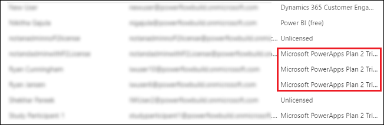

# What's new for user account management

[!INCLUDE[cc-applies-to-update-9-0-0](../includes/cc_applies_to_update_9_0_0.md)] [!INCLUDE[cc-applies-to-update-8-2-0](../includes/cc_applies_to_update_8_2_0.md)]

You might have noticed some changes to the [!INCLUDE [pn-dyn-365-admin-center](../includes/pn-dyn-365-admin-center.md)]. On March 21, 2018, we introduced PowerApp integration with Dynamics 365 for Customer Engagement. See the blog [What’s new in the Dynamics 365 admin center](https://blogs.msdn.microsoft.com/crm/2018/03/21/whats-new-in-the-dynamics-365-admin-center/) and [What's new for instance management](new-instance-management.md).

In addition to instance management, you'll see some differences with user account management.

Users in your tenant who have started a PowerApps trial or purchased a PowerApps license will now appear in the list of users in the Office 365 admin center. You can manage these users as you would Dynamics 365 users.

### See also
[What's new for instance management](new-instance-management.md)

