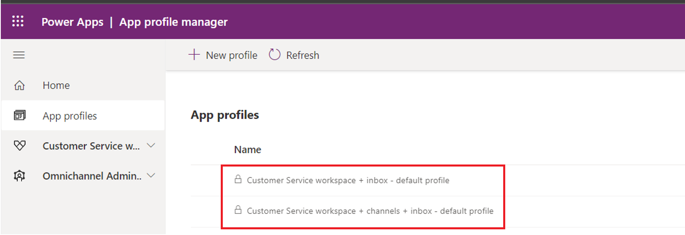

# Create and use agent experience profiles

## Introduction

By default, the following app profiles are available out of the box for Customer Service workspace and Omnichannel for Customer Service. These profiles can't be deleted or modified. When no app profile is assigned to an agent, the default profile is assigned.

- Omnichannel for Customer Service - default profile
- Customer Service workspace - default profile
- Customer Service workspace + channels - default profile

The app profile manager is available in Power Apps where you'll create the app profiles.

## Prerequisites

Make sure you have the App Profile Manager Administrator role. More information: [Security roles](security-roles.md)

To create agent experience profiles in Customer Service admin center, the Basic User role is also required.

## Create agent experience profiles in Customer Service admin center (preview)

> [!IMPORTANT]
> The Customer Service admin center app is in preview. [!INCLUDE[cc-preview-features-definition](../includes/cc-preview-features-definition.md)]

By using profiles, you can create targeted app experiences for agents and supervisors. Profiles help access the features that your agents and supervisors can use in their daily tasks to resolve customer issues.

**To create the agent experience profile**

1. In the site map of Customer Service admin center, in **Agent experience**, select **Workspaces**.

2. Select **Manage** for **Agent experience profiles**.

3. Select New, and enter the following details on the **Create a new agent experience profile** dialog.

   - **Name:** The app profile name.
   - **Unique name:** A unique identifier in the <*prefix*>_<*name*> format.
   - **Description:** A description for the profile.

4. Select **Create**.

### Assign users to the profile

**To assign users to the profile**

1. Go to the profile that you created.
2. On the page that appears, select **Add users**.
3. On the **Add users** dialog, select the users in the **Available users** list, and then select **Add**. Alternatively, you can search for the users using the **Search** box. The assigned users are listed on the profile page. 

### Assign templates, configure productivity pane, channels

Use the options on the profile page to configure the templates that'll define the session behavior. You can turn on the productivity pane and the productivity tools that the agents can access when they work on their assigned tasks. You can also turn on the inbox view so that agents can view all their work items on one screen, that help in prioritizing tasks and working on multiple items more efficient. You can also enable the channels and select third-party voice channel providers.

**To assign templates and configure productivity pane and channels**

1. Select the profile that you need to update.

2. On the page that appears, select **Add entity session template**.

   1. On the **Entity session templates** dialog, use the **Search** box to search for the session template.

   2. Select the required template from the search results, and select **Save and close**.

3. On the profile page, in **Productivity pane**, select **Turn On**. The options for productivity pane appear.

   1. On the Productivity pane dialog, for **Productivity pane**, turn on the toggle. The additional settings are enabled.

   2. Turn on the toggle for the following settings:

      - Default mode
      - Smart assist
      - Agent scripts
      - Microsoft Teams
      - Knowledge search

   3. Select **Save and close**.

4. On the profile page, select **Edit** for **Inbox**. By default the **Inbox** view is turned off.
   1. On the **Inbox** dialog, turn on the toggle.
   2. Select **Save and close**.

5. On the profile page, for **Channel providers**, select **Edit**.
   1. On the **Channel providers** dialog, turn on the **All active channels** toggle.
   2. Optionally, select a channel provider in the **Third party voice channel providers** section.
   3. Select **Save and close**.

:::image type="content" source="../customer-service/media/agent-experience-profile.png" alt-text="The agent experience profile with configured settings in Customer Service admin center.":::

## Create an app profile in Power Apps

1. Sign in to [Power Apps](https://go.microsoft.com/fwlink/p/?linkid=2142083).
2. Select the environment in which you want to create the app profiles.
3. Do one of the following:
   - On the **Home** page, go to **Your apps** section.
   - In the left pane, select **Apps**.
4. Select **More commands** beside **Omnichannel for Customer Service** or **Customer Service workspace**, and then select **App profile manager** on the menu that appears.
5. In the left pane, select **App profiles**.
6. On the **App profile manager** page, select **New profile**.
7. On the **New profile** pane, specify the following:
   - **Name:** The app profile name.
   - **Unique name:** A unique identifier in the <*prefix*>_<*name*> format.

     > [!IMPORTANT]
     > The following are required for the unique name:
     > - The prefix can only be alphanumeric and its length must be between 3 to 8 characters.
     > - An underscore must be used between the prefix and name.

   - **Description:** A description for the profile.
  
### Assign templates and enable productivity pane and channels

For an app profile, you can add only one session template for each entity type. Typically, you will add one session template for each entity type, such as one each session template for accounts, contacts, and cases.

The settings that you enable for the app profile will be available for agents and supervisor only when you configure the corresponding templates and settings in the Customer Service Hub app or Omnichannel Administration app. For example, channels must be provisioned in Omnichannel for Customer Service and channel instances must be configured.

1. In the **App profiles** section, select the app profile to which you want to assign templates.
2. On the **Session templates**, select **Add entity session template**.
3. Search for the template you want to add and select it. Make sure that the selected template is based on **Entity** type. More information: [Manage session templates](session-templates.md)
   > [!div class=mx-imgBorder]
   > 

4. Do the following on the **Productivity pane** tab:
   1. If you want to enable productivity tools, set the toggle to on for **Turn on productivity pane**.
   2. Select the default mode as collapsed or expanded.
   3. In the **Productivity tools** section, set the toggle to on for the following:
      - **Smart assist tool configuration**
      - **Knowledge search tool configuration**
      - **Agent scripts** to allow access to smart assist configuration and agent scripts.
5. On the **Channels** tab, set the toggle to on for **All active channels**. The channels configured in Omnichannel for Customer Service will be available for the user to whom the profile is assigned.

   > [!NOTE]
   > The toggle for channels will be enabled in the out-of-the-box app profile for Omnichannel for Customer Service.

6. To add a third-party channel provider, in the **Voice channels** section, select **Add channel providers**, search for the configured channel, and select it.
7. If a channel does not exist, select **Create a new channel provider in Unified Interface**. The channel configuration page opens on a new tab. More information: [Configure channel provider using app profile manager](../customer-service/channel-integration-framework/v2/configure-channel-provider-app-profile-manager.md)

   > [!NOTE]
   > - Only telephony or voice channels are supported.
   > - A number of voice channel providers can be configured at a time.
  
### Configure the inbox view

For an app profile, you can enable the inbox view in the Customer Service workspace or Omnichannel for Customer Service apps. From the inbox, users can view their conversations and cases.

1. On the **App profiles** page, select the profile for which you want to enable the inbox. 
   > [!div class=mx-imgBorder]
   > 
2. Select the **Inbox** tab, and then toggle **Turn on inbox view** to **On**.
   > [!div class=mx-imgBorder]
   > 

### Assign profiles to users

1. On the **App profiles** page, select the profile that you want to assign to a user.
2. On the ***<profile_name>*** page, select **Assign users** on the command bar, and select **OK** on the message dialog box. The profile opens on a new tab.
   > [!div class=mx-imgBorder]
   > 
3. On the **General** tab, select **Add Existing User**.
4. On the **Lookup Records** pane, search and select the user.

> [!NOTE]
> You can select **Assign users** on the ***<profile_name>*** page to view the list of users who have been assigned to the profile.

### Default profile assignment

When users are assigned roles corresponding to Customer Service workspace or Omnichannel for Customer Service, the default app profiles are assigned as follows.

- **Customer Service workspace:** The out-of-the-box app profile is assigned to users with the following roles:
  - CSR Manager
  - Customer Service Representative
- **Omnichannel for Customer Service:** The out-of-the-box app profile is assigned to users with the following roles:
  - Omnichannel administrator
  - Omnichannel supervisor
  - Omnichannel agent

More information: [Roles and privileges associated with app profile manager](security-roles.md)

### See also

[Get started with Customer Service admin center](../customer-service/cs-admin-center.md)  
[Manage session templates](session-templates.md)  
[Configure channels](../customer-service/channels.md)  
[Manage agent scripts](agent-scripts.md)  

[!INCLUDE[footer-include](../includes/footer-banner.md)]
