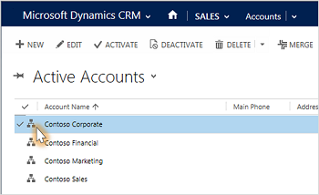

# See account relationships in a hierarchical view

[!INCLUDE[cc-applies-to-update-9-0-0](../includes/cc_applies_to_update_9_0_0.md)]

You can see how info is related or grouped by viewing accounts, products, or users in hierarchical charts. You can click a tile in the chart to get the full details and then navigate to the info you’re interested in.  
<!-- TODO: Add a screenshot here -->   
 For example, from the hierarchical charts view for **accounts**, you can:  
  
-   See how an account is doing in overall revenue  
  
-   Drill into tiles for accounts to see where the deals are coming from and how revenue is distributed across sub-accounts  
  
-   Find out who is working an account and enlist help from others by sending email or sharing the account with other salespeople right from within the chart view  
  
-   View important details about each account, such as credit limit and latest activity posts for the account  

From the hierarchical charts view for **products**, you can see all the products available to sell, and how they're related in bundles or families. Salespeople can avoid missing a potential sale, because they can see all related products in one view.  

From the hierarchical charts view for **users**, you can find out who another team member's boss is, or who else is on their team without switching to another app.  

Hierarchical views are also available on mobile.  

To see hierarchies that show the relationships between records, on the list of accounts, products, or users, choose the **Hierarchies** button. You can also choose the **View Hierarchy** command when you’re viewing the screen for an individual account, product, or user.  

  

### See also  
 [Work with accounts and contacts](../basics/accounts-contacts.md)
