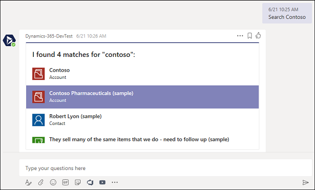
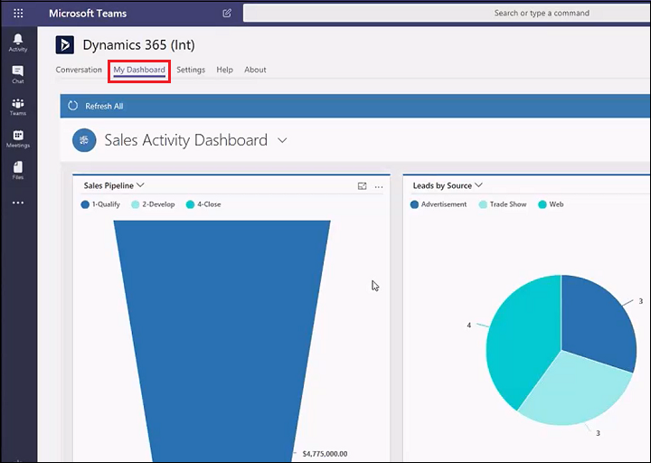
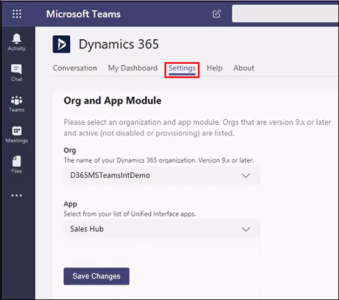

# Install the app

[!INCLUDE[cc-applies-to-update-9-0-0](../includes/cc_applies_to_update_9_0_0.md)]

[!INCLUDE [cc-beta-prerelease-disclaimer](../includes/cc-beta-prerelease-disclaimer.md)]

Begin by finding the app in the app Store.

## Select the app in the app Store

1. In Microsoft Teams, select **Store**. 

   

2. Search for **dynamics**, and then select the **Dynamics 365 (Preview)** tile.

   

## Install the personal app

You have a choice when adding Dynamics 365 to Microsoft Teams. You can install the personal app which integrates Dynamics 365 and Teams for your own use, and you can install the team app to use with your team members. We'll take the simplest approach and install both.

Once you've selected the Dynamics 365 app (see steps above), the settings page opens. 

1. For **Add to a team**, choose a team to pin content and services to, and the select **Install**. This installs the personal and team app.

   > [!div class="mx-imgBorder"] 
   > 

2. In the next page, choose the channel where you want to use the Dynamics 365 app. Then, select **Set up**.

   > [!div class="mx-imgBorder"] 
   > 

3. Recently viewed records appear, if there are any. Search for and select an entity to pin. Use **Filter by** to narrow the search to an entity type. 

   Enable **Post to the channel about this tab** to [need content].

   > [!div class="mx-imgBorder"] 
   > 

   If you have multiple organizations or app modules, select **Edit** () to specify which records to pin to the discussion channel.
 
   

   Enable **Remember this preference** to set the org and app selections to be the default personal dashboard that appears when you select **My Dashboard**.

   Use the **Settings** tab to change these settings any time.

 4. Select **Save**. 

Once you complete the above steps, the Dynamics 365 tab appears in the menu bar.

   > [!div class="mx-imgBorder"] 
   > 

You can interact with the record as if you were using the Dynamics 365 web app. Those with Write permissions can edit the record; changes will be synchronized with the Dynamics 365 web app.

   
## Install and use the personal app bot

There are two personal app features: the personal app bot and the personal app dashboard. The bot allows you to interact with Dynamics 365 to find and display records within Microsoft Teams. You configure the dashboard to show a Dynamics 365 dashboard view in Microsoft Teams.

Use these steps to install the personal app bot.

1. With the personal app installed, in the bot section, select **Open**. 

   

2. A Welcome message appears in the **Conversation** tab page. Select **Sign in**.

   

3. Select your organization, and then select **Next**.

   Your bot is set up and ready for input.

   

4. You can search to find records of interest. For example, enter "search contoso" in **Search** to see Contoso records.

   

5. Search returns a list of related Dynamics 365 records. Select a record to see details.

   

6. The details of the selected record are displayed in the personal app bot. You can select an activity to view and edit related record details. For example, select **Show Opportunities** to see opportunities for the Contoso account.

   

   You can update the details of the records in the personal bot.

## Use the personal app

### Conversation tab

Select **Conversation** to have a chat-like conversation with team members who are using Dynamics 365 (online) and those who are not.

> [!div class="mx-imgBorder"] 
> 

Choose a message, select ... and then select **Save to Dynamics** to add the message to the **Timeline** section of a record.

> [!div class="mx-imgBorder"] 
> 

### File tab

### My Dashboard tab

Use the personal dashboard

Select **My Dashboard** to view your Dynamics 365 dashboard in Microsoft Teams. The dashboard displayed is based on who is signed in and their user role.

If you have more than one organization or Unified Interface app, you can use the **Settings** tab to select a different organization or app to appear as a dashboard.

> [!NOTE]
> - Only Dynamics 365 version 9.x or later organizations appear in the list. Also, only active organizations (those that are not disabled or provisioning) are displayed. 
> - Only Unified Interface apps are listed.
> - Only app modules licensed for the selected organization are listed. 