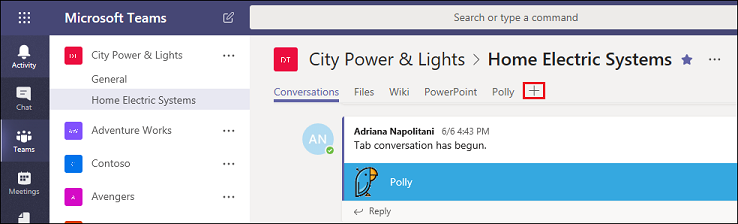
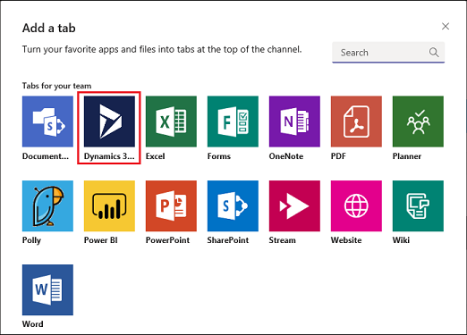
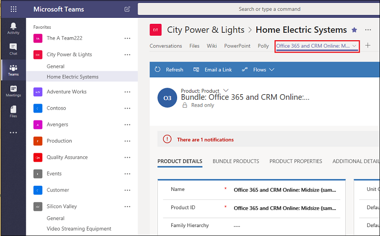

# Preview: Install and use team app

[!INCLUDE[cc-applies-to-update-9-0-0](../includes/cc_applies_to_update_9_0_0.md)]

[!INCLUDE [cc-beta-prerelease-disclaimer](../includes/cc-beta-prerelease-disclaimer.md)]

## Install the Team app

You can also install the Team app which integrates Dynamics 365 and Teams to use with your team members. These steps are for installing the Team app - the settings under **Add to a team**.

Once you've selected the Dynamics 365 app (see [Select the app in the app Store](#select-the-app-in-the-app-store)), the settings page opens. 

1. Choose a Team, verify **Yes** is enabled, and then select **Install** to install the Team app.

   

2. With the Team app installed, select the **Add** button () to add the Dynamics 365 tab to a Microsoft Team channel. 

   

3. Select the **Dynamics 365** icon to pin a Dynamics 365 record to a Microsoft Team discussion channel.

   

4. Search for an entity to pin. Use **Filter by** to narrow the search to an entity type. Select **Save**.

   

   If you have multiple organizations or app modules, select **Edit** () to specify which records to pin to the discussion channel.
 
   

   Enable **Remember this preference** to set the org and app selections to be the default personal dashboard that appears when you select **My Dashboard**.

   Use the **Settings** tab to change these settings any time.

Once you complete the above steps, the Dynamics 365 tab appears on the menu bar.

You can interact with the record as if you were using the Dynamics 365 web app. Those with Write permissions can edit the record; changes will be synchronized with the Dynamics 365 web app.
