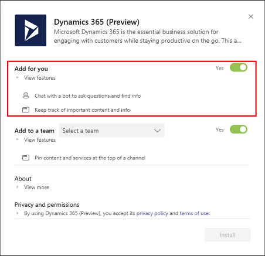
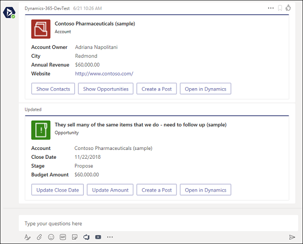
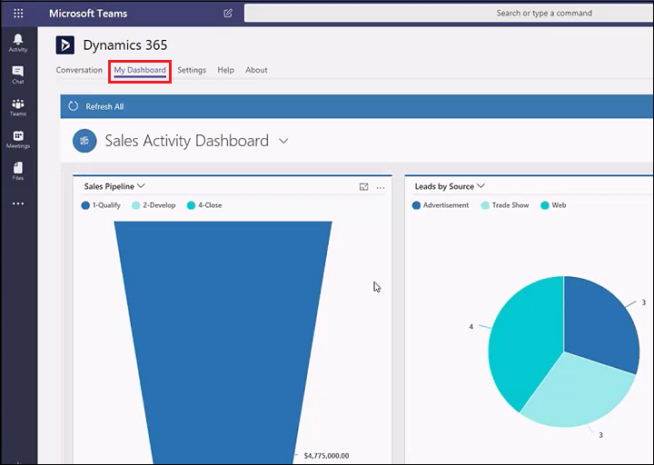
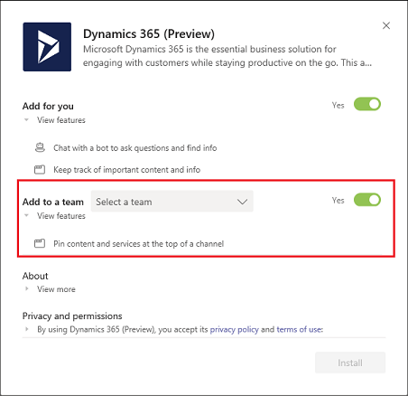
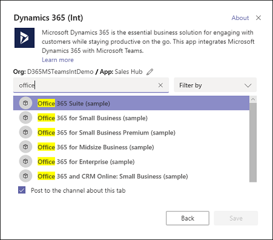
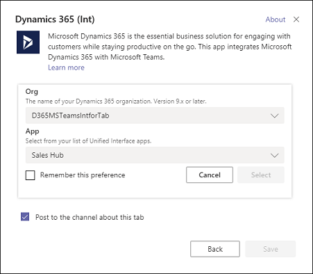

# Preview: Integrate Dynamics 365 Customer Engagement with Microsoft Teams 

[!INCLUDE[cc-applies-to-update-9-0-0](../includes/cc_applies_to_update_9_0_0.md)]

> [!IMPORTANT]
> - This feature currently has limited availability.
> - [!INCLUDE[cc_preview_features_definition](../includes/cc-preview-features-definition.md)]  
> - [!INCLUDE[cc_preview_features_expect_changes](../includes/cc-preview-features-expect-changes.md)]  
> - Microsoft doesn't provide support for this preview feature. Microsoft Dynamics 365 Technical Support won’t be able to help you with issues or questions. Preview features aren't meant for production use and are subject to a separate [supplemental terms of use](https://go.microsoft.com/fwlink/p/?linkid=870960).

If you're familiar with [Microsoft Teams](https://products.office.com/microsoft-teams/group-chat-software), you know it's the place to manage all your conversations, files, and tools in one team workspace. Create and edit documents right in the app and enjoy instant access to SharePoint, OneNote, PowerBI, and now, [!INCLUDE [pn-crm-online](../includes/pn-crm-online.md)].

Begin by finding the app in the app Store.

## Select the app in the app Store

1. In Microsoft Teams, select **Store**. 

   

2. Search for **dynamics**, and then select the **Dynamics 365 (Preview)** tile.

   

## Install the personal app

You have a choice when adding Dynamics 365 to Microsoft Teams. You can install the personal app which integrates Dynamics 365 and Teams for your own use, or you can install the Team app to use with your team members. These steps are for installing the personal app - the settings under **App for you**.

Once you've selected the Dynamics 365 app (see steps above), the settings page opens. 

Verify **Yes** is enabled, and then select **Install** to install the personal app.

   

## Install the personal app bot

There are two personal app features: the personal app bot and the personal app dashboard. The bot allows you to interact with Dynamics 365 to find and display records within Microsoft Teams. You configure the dashboard to show a Dynamics 365 dashboard view in Microsoft Teams.

Use these steps to install the personal app bot.

1. With the personal app installed, in the bot section, select **Open**. 

   

2. A Welcome message appears in the **Conversation** tab page. Select **Sign in**.

   

3. Select your organization, and then select **Next**.

   Your bot is set up and ready for input.

   

4. You can search to find records of interest. For example, enter "search contoso" in **Search** to see Contoso records.

   

5. Search returns a list of related Dynamics 365 records. Select a record to see details.

   

6. The details of the selected record are displayed in the personal app bot. You can select an activity to view and edit related record details. For example, select **Show Opportunities** to see opportunities for the Contoso account.

   

   You can update the details of the records in the personal bot.

## Use the personal dashboard

Select **My Dashboard** to view your Dynamics 365 dashboard in Microsoft Teams. The dashboard displayed is based on who is signed in and their user role.



If you have more than one organization or Unified Interface app, you can use the **Settings** tab to select a different organization or app to appear as a dashboard.


> [!NOTE]
> - Only Dynamics 365 version 9.x or later organizations appear in the list. Also, only active organizations (those that are not disabled or provisioning) are displayed. 
> - Only Unified Interface apps are listed.
> - Only app modules licensed for the selected organization are listed. 

## Install the Team app

You can also install the Team app which integrates Dynamics 365 and Teams to use with your team members. These steps are for installing the Team app - the settings under **Add to a team**.

Once you've selected the Dynamics 365 app (see [Select the app in the app Store](#select-the-app-in-the-app-store)), the settings page opens. 

1. Choose a Team, verify **Yes** is enabled, and then select **Install** to install the Team app.

   

2. With the Team app installed, select the **Add** button () to add the Dynamics 365 tab to a Microsoft Team channel. 

   

3. Select the **Dynamics 365** icon to pin a Dynamics 365 record to a Microsoft Team discussion channel.

   

4. Search for an entity to pin. Use **Filter by** to narrow the search to an entity type. Select **Save**.

   

   If you have multiple organizations or app modules, select **Edit** () to specify which records to pin to the discussion channel.
 
   

   Enable **Remember this preference** to set the org and app selections to be the default personal dashboard that appears when you select **My Dashboard**.

   Use the **Settings** tab to change these settings any time.

Once you complete the above steps, the Dynamics 365 tab appears on the menu bar.


You can interact with the record as if you were using the Dynamics 365 web app. Those with Write permissions can edit the record; changes will be synchronized with the Dynamics 365 web app.

## Delete user data
Your privacy is important to us! You can remove Dynamics 365 app personal data from Microsoft Teams.

The following data is stored with Dynamics 365 integration with Microsoft Teams.


|     Data      |                      Description                       |                                                                                                                                           Data classification                                                                                                                                           |                                                                    Example                                                                     |
|---------------|--------------------------------------------------------|---------------------------------------------------------------------------------------------------------------------------------------------------------------------------------------------------------------------------------------------------------------------------------------------------------|------------------------------------------------------------------------------------------------------------------------------------------------|
|    User ID    |      The user's Azure Active Directory object ID       |     EndUsePseudonymousIdentifiers<br/>(EUPI) An identifier created by Microsoft tied to the user of a Microsoft service. When EUPI is combined with other information, such as a mapping table, it identifies the end user. EUPI does not contain information uploaded or created by the customer.      |                                      <ul><li>User GUIDs, PUIDs, or SIDs</li><br/><li>Session IDs</li><ul>                                      |
|   Tenant ID   |     The Azure Active Directory ID of user's tenant     |                                                  OrganizationIdentifiableInformation<br/>(OII) Data that can be used to identify a tenant, generally config or usage data. This data is not linkable to a user and does not contain Customer content.                                                   | <ul><li>Tenant ID (non-GUID)</li><br/><li>Domain name in e-mail address (xxx@contoso.com) or other tenant-specific domain information</li><ul> |
|    Org URL    |            The URL of the Dynamics 365 org             |                                                  OrganizationIdentifiableInformation<br />(OII) Data that can be used to identify a tenant, generally config or usage data. This data is not linkable to a user and does not contain Customer content.                                                  | <ul><li>Tenant ID (non-GUID)</li><br/><li>Domain name in e-mail address (xxx@contoso.com) or other tenant-specific domain information</li><ul> |
| App module ID | The ID of app module selected to show in the dashboard | EndUsePseudonymousIdentifiers         <br/>(EUPI) An identifier created by Microsoft tied to the user of a Microsoft service. When EUPI is combined with other information, such as a mapping table, it identifies the end user. EUPI does not contain information uploaded or created by the customer. |                                      <ul><li>User GUIDs, PUIDs, or SIDs</li><br/><li>Session IDs</li><ul>                                      |

You can [contact support](contact-technical-support.md) to request data deletion. Run the following Windows PowerShell commands to gather the information needed by Dynamics 365 support.

|Command  |Comment  |
|---------|---------|
|``` Connect-MsolService  ```      |Enter your credentials in the popup window         |
|``` (Get-MsolUser -UserPrincipalName "<user email>").ObjectId  ```       |Replace <user email> with the user’s email         |
|``` (Get-MsolCompanyInformation).ObjectId ```        |         |

Record this information to provide to Dynamics 365 support.

## Privacy notice

While using the Dynamics 365 for Sales bot in Microsoft Teams, the user’s text inputs are analyzed for understanding the underlying query/intent. The user’s input such as “Search account Contoso” is routed to one of Microsoft’s Cognitive Service called Language Understanding Intelligent Service (LUIS). Read more about LUIS [here](https://www.luis.ai/). The LUIS service disambiguates or understands the intent of user input (in this case, the intent is to find information) and the target entity (in this case, the intended entity is an account named Contoso). This information is then passed on to Microsoft’s [Azure bot framework](https://azure.microsoft.com/services/bot-service/) which interacts with Dynamics data and retrieves the desired information for the user query.

By installing and allowing access to use of the bot, you agree to allow the LUIS service and Azure Bot framework to process the intent behind the input – which results in an enhanced conversational user experience. The LUIS service and Azure bot framework  may have varying levels of compliance compared to Dynamics 365 for Sales. While the LUIS service has access to only the user queries and is not designed to be connected to the user’s Dynamics data or account, a user of the Dynamics 365 for Sales bot could voluntarily enter a query containing Customer Data, Personal Data or other data and such query content could get sent to the LUIS service and the Azure bot framework. 

The content of user’s queries and messages is retained in LUIS system for a maximum of 30 days, encrypted at rest and is not used for training or service improvement. Read more about Cognitive Services [here](https://azure.microsoft.com/services/cognitive-services/language-understanding-intelligent-service/). 

To manage admin settings for apps in Teams, go to the Office 365 admin center and open **Settings** > **Services & add-ins**, then choose Microsoft Teams. If you're signed in as an Office 365 admin, you can access these controls [here](https://portal.office.com/adminportal/home#/Settings/ServicesAndAddIns), including the ability to uninstall.

### See also
 [Download and install Microsoft Teams](https://support.office.com/article/download-and-install-microsoft-teams-422bf3aa-9ae8-46f1-83a2-e65720e1a34d)
