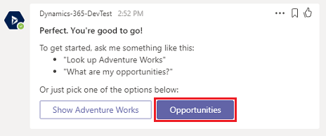
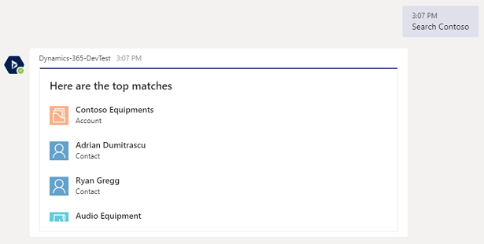
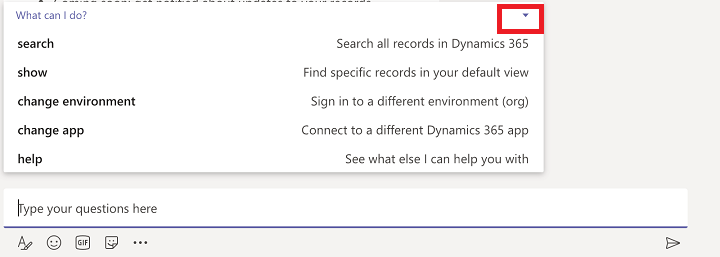

# Use the bot

[!INCLUDE[cc-applies-to-update-9-0-0](../includes/cc_applies_to_update_9_0_0.md)]

[!INCLUDE [cc-beta-prerelease-disclaimer](../includes/cc-beta-prerelease-disclaimer.md)]

The Dynamics 365 app for Teams bot feature allows you to interact with Dynamics 365 (online) to find, display, and update the records within Microsoft Teams conversations.

Find and open the Dynamics 365 bot. Open **Chat** on the left side of the Teams app, and then select **Dynamics 365**.

The **Conversation** tab opens with the welcome message sent by the bot. Select **Sign in**.

   > [!div class="mx-imgBorder"] 
   > 

You'll see some pre-loaded options. For example, select **Opportunities** to have the bot return a list view of records from your default view.

   > [!div class="mx-imgBorder"] 
   > 

   > [!div class="mx-imgBorder"] 
   > 

Here are more things you can do with the bot feature.

### Search
Enter text like "contoso" in the search field to find related records.

   > [!div class="mx-imgBorder"] 
   > 

   > [!div class="mx-imgBorder"] 
   > 

### Edit
Edit and update a record.

   > [!div class="mx-imgBorder"] 
   > 

### Post
Create a post in Dynamics 365 (online).

   > [!div class="mx-imgBorder"] 
   > 

### Other
Use the bot menu for other actions such as change the org or app module.

   > [!div class="mx-imgBorder"] 
   > 

### See also  
 [Set up the Dynamics 365 bot](teams-install-app.md#set-up-the-dynamics-365-bot)