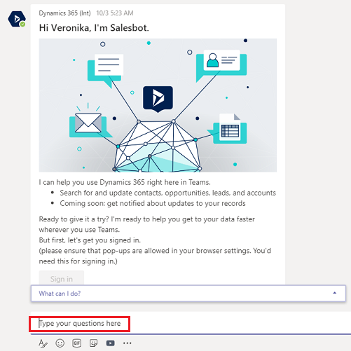

# Use the bot

[!INCLUDE[cc-applies-to-update-9-0-0](../includes/cc_applies_to_update_9_0_0.md)]

[!INCLUDE [cc-beta-prerelease-disclaimer](../includes/cc-beta-prerelease-disclaimer.md)]

The Dynamics 365 app for Teams bot allows you to interact with Dynamics 365 (online) to find and display the records within Microsoft Teams. 

1. Open the Dynamics 365 app.

> [!div class="mx-imgBorder"] 
> 

2. Select the **Conversations** tab. Type in something to search, like "adventure works", and then press the **Enter** key.

   > [!div class="mx-imgBorder"] 
   > 

     A list of records from Dynamics 365 that relate to your search text are returned.

3. You can use the bot menu to do some other app related things.

   > [!div class="mx-imgBorder"] 
   > 

..........new content to follow...........

Once you've completed installing the Dynamics 365 Teams app, you're taken to the **Conversation** tab with the bot ready for use. If at any time in Teams you want to return to the personal app, select ... from the left-side menu, and then select **Dynamics 365 (Preview)**.

A Welcome message appears in the **Conversation** tab page. Select **Sign in**.

You can search to find records of interest. For example, search for Contoso records.

> [!div class="mx-imgBorder"] 
> 

Search returns a list of related Dynamics 365 records. Select a record to see details.

The details of the selected record are displayed in the personal app bot. You can select an activity to view and edit related record details. For example, select **Show Opportunities** to see opportunities for the Contoso account.

You can update the details of the records in the personal app.
