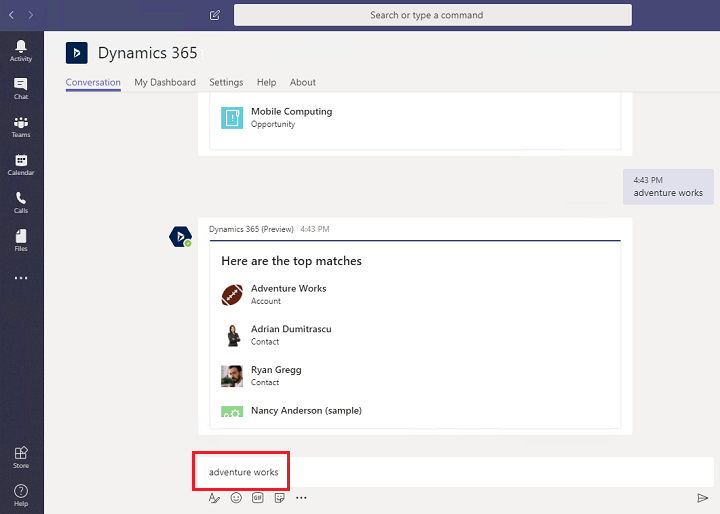

# Use the bot

[!INCLUDE[cc-applies-to-update-9-0-0](../includes/cc_applies_to_update_9_0_0.md)]

[!INCLUDE [cc-beta-prerelease-disclaimer](../includes/cc-beta-prerelease-disclaimer.md)]

The Dynamics 365 app for Teams bot feature allows you to interact with Dynamics 365 (online) to find, display, and update the records within Microsoft Teams conversations.

1. Open the Dynamics 365 app.

> [!div class="mx-imgBorder"] 
> 

2. Select the **Conversations** tab. Type in something to search, like "search opportunity smart switch", and then press **Enter**.

   > [!div class="mx-imgBorder"] 
   > 

A list of records from Dynamics 365 (online) that relate to your search text are returned. In this case, an opportunity is returned.

> [!div class="mx-imgBorder"] 
> 

The details of the selected record are displayed. You can update the details of the opportunity as if you were in the web app.

You can also use the bot menu to do some other app related things.

   > [!div class="mx-imgBorder"] 
   > 

