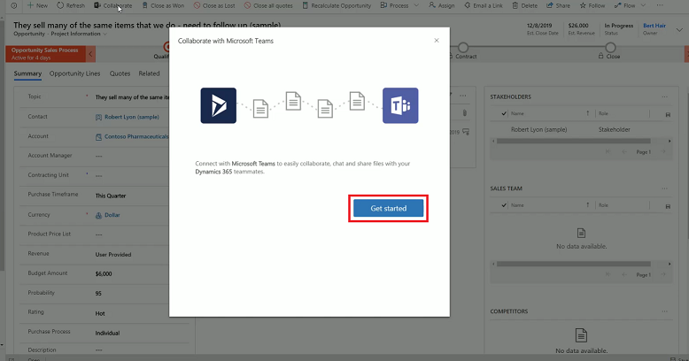
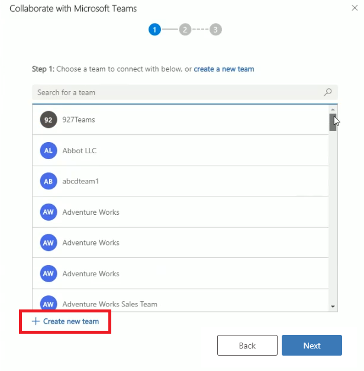

# Enhanced Collaboration Experience with Team

[!INCLUDE[cc-applies-to-update-9-0-0](../includes/cc_applies_to_update_9_0_0.md)]

[!INCLUDE [cc-beta-prerelease-disclaimer](../includes/cc-beta-prerelease-disclaimer.md)]

Easily pin a Dynamics 365 for Customer Engagement apps record or view to a Teams channel using the **Collaborate** option in the Dynamics 365 app. The step-by-step process will help you connect the selected record or view a Teams channel.

## Pin a Dynamics 365 for Customer Engagement apps record to a Teams channel

1. In Dynamics 365 for Customer Engagement app, open a record.
2. On the record, select **Collaborate**.

   > [!div class="mx-imgBorder"]
   > 

3. On the **Collaborate with Microsoft Teams** window, select **Get started**.

   > [!div class="mx-imgBorder"]
   > 
   
4. To ddd the recording to an exising team or create a new team, do one of the following:

   **Add to existing team**
   - From the teams that you belong to, choose the team that you want to pin the record to and select **Next**.
   
    > [!div class="mx-imgBorder"]
    > 
   
    **Create a new team**
    1. To create a new team select, **Create new team**. 
 
      > [!div class="mx-imgBorder"]
      > 

    2. Enter a name for the team and then select **Next**.
    
      > [!div class="mx-imgBorder"]
      > 
 

### See also  
 [Collaborate with Teams - Bacic Experience](teams-collaboration.md)
