# Collaborate with Teams 

[!INCLUDE[cc-applies-to-update-9-0-0](../includes/cc_applies_to_update_9_0_0.md)]

Once installed, the Dynamics 365 app for Teams enables collaborating with others through Dynamics 365 for Customer Engagement apps record connections made in teams and channels in Microsoft Teams.

## Connect a Dynamics 365 for Customer Engagement apps record or view to a team channel

From a team channel, you can connect a Dynamics 365 for Customer Engagement apps record or view to collaborate on customer accounts,  opportunities, and so on as follows. 

1. Open a team channel and select the **Add** button ().

   > [!div class="mx-imgBorder"]
   > 

2. Select the **Dynamics 365** icon to pin a Dynamics 365 for Customer Engagement apps record to a channel.

   > [!div class="mx-imgBorder"]
   > 

3. Select **Entity Selection** or **View Selection**.

    3.1 **Entity Selection**: Search for an entity to connect. You can pick a recently viewed record or use search to find records. You     can use **Filter by** to narrow the search to an entity type. Once you've picked a record, select **Save**.

   > [!div class="mx-imgBorder"] 
   > 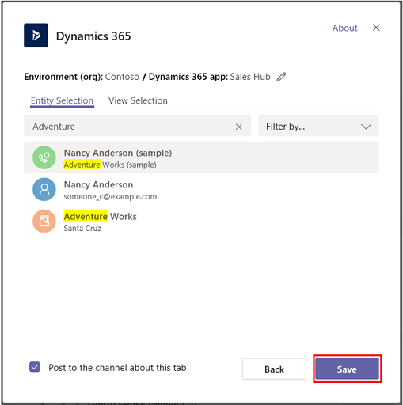

    Once you complete the above steps, you'll see a notification of a successful connection and the Dynamics 365 for Customer Engagement   apps record appears in the menu bar. You can interact with the record as if you were using the Dynamics 365 for Customer Engagement     apps. Those with Write permissions can edit the record. Changes will be synchronized with the Dynamics 365 for Customer Engagement  apps.

    > [!div class="mx-imgBorder"] 
    > 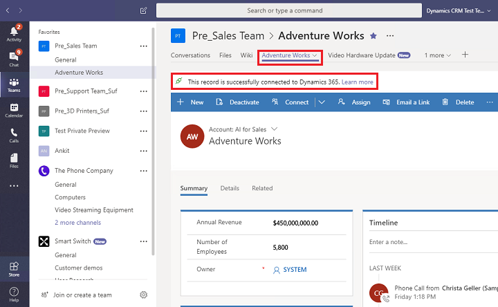
   
    
    **Two connection states** 

    There are two connection states possible when connecting Dynamics 365 for Customer Engagement apps and Microsoft Teams: successful and failed. 

    The successful connection state indicates that the connection was successfully saved in Dynamics 365 for Customer Engagement apps so that the link to the connected Microsoft Teams channel appears on the Dynamics 365 for Customer Engagement apps page and the files used on this channel also appear on the **Documents** tab in Dynamics 365 for Customer Engagement apps. 

    A failed connection means the connection was not successfully saved. When seeing this message, you should remove and connect the record again. See: [Error: This record is not connected to Dynamics 365. Repin the tab and try again.](teams-troubleshoot.md#error-this-record-is-not-connected-to-dynamics-365-repin-the-tab-and-try-again)

    **View and associate files** 

    Select the **Files** tab in the connected Teams channel to associate files with a Dynamics 365 for Customer Engagement apps record. Files added here will appear in Dynamics 365 for Customer Engagement apps under **Documents** for the linked record. Likewise, when you add a document to a record in Dynamics 365 for Customer Engagement apps, that document will appear in Teams under the **Files** tab.

    > [!div class="mx-imgBorder"] 
    > 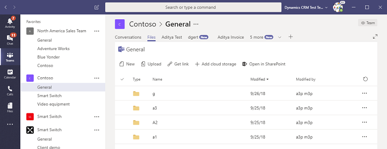

   3.2 **View Selection**: Select an entity to see the list of available views in Dynamics 365 Customer Engagement app. Once you've picked a view, select **Save**.
  
   > [!div class="mx-imgBorder"] 
   > 
   
   > [!div class="mx-imgBorder"] 
   > 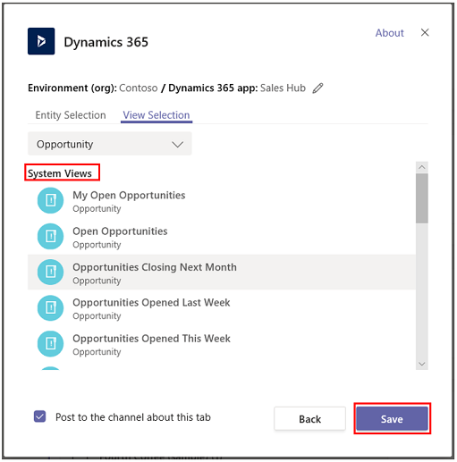
   
   Once you complete the above steps, you'll see the Dynamics 365 for Customer Engagement app entity view in the new added tab.

   > [!div class="mx-imgBorder"] 
   > 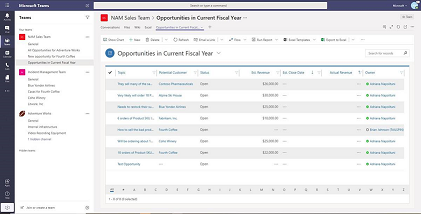
     
     
   > [!NOTE]
   > - If you select a personal view (**My Views**) instead of **System Views**, it’s recommended that you share the view with other users in Teams before you add the view to the Teams channel. Otherwise, other team members will not hae access to the view content.
   
   > [!div class="mx-imgBorder"] 
   > 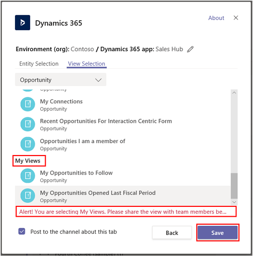

4. If you have multiple environments or app modules, you can change the environment and app module by selecting **Edit** () to specify which environment or app module to use in Teams.
 
   > [!div class="mx-imgBorder"] 
   > 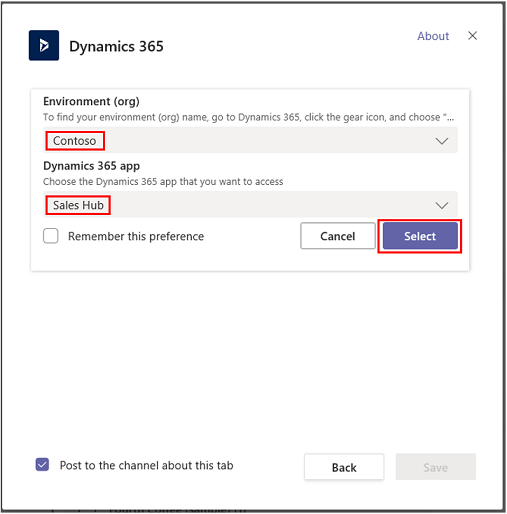

   You can enable **Remember this preference** to set the environment and app selections to be the default personal dashboard that appears when you select **My Dashboard**.

   You can return to these settings any time by selecting the **Settings** tab.

## Open a record or view in Dynamics 365 for Customer Engagement apps

It's easy to use Teams to open a record or view in Dynamics 365 for Customer Engagement apps. From the Dynamics 365 tab pinned in a Teams channel, select the **Go to website** button to open the record or view in Dynamics 365 for Customer Engagement apps.

> [!div class="mx-imgBorder"] 
> 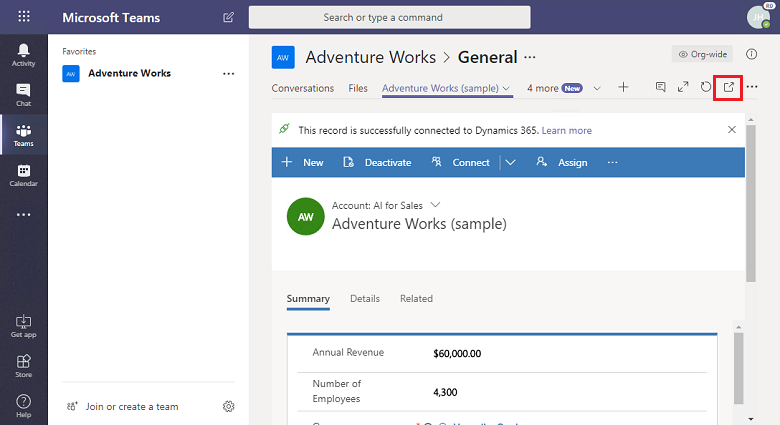

## Have a conversation
You can chat with your team members side-by-side with the Dynamics 365 tab. From the Dynamics 365 tab pinned in a Teams channel, select the **Show tab converation** button to open the conversation tab.

> [!div class="mx-imgBorder"] 
> 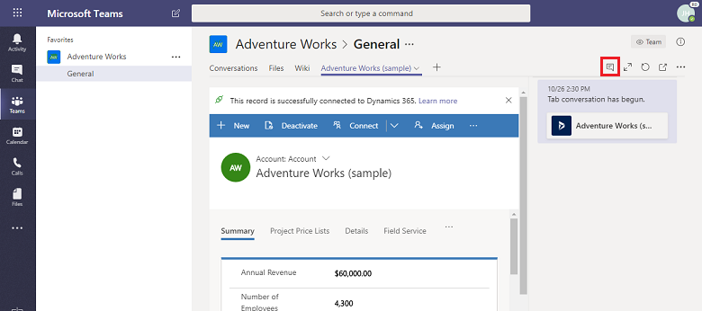

## Teams integration in Dynamics 365 for Customer Engagement apps

In Dynamics 365 for Customer Engagement apps, you can see the connected Microsoft Teams channel and files from the Microsoft Teams channel.

In Dynamics 365 for Customer Engagement apps records, select **Collaborate** to display a list of all the connected team channels. Then, select a team channel to go to the relevant channel conversation in Teams.

> [!div class="mx-imgBorder"] 
> 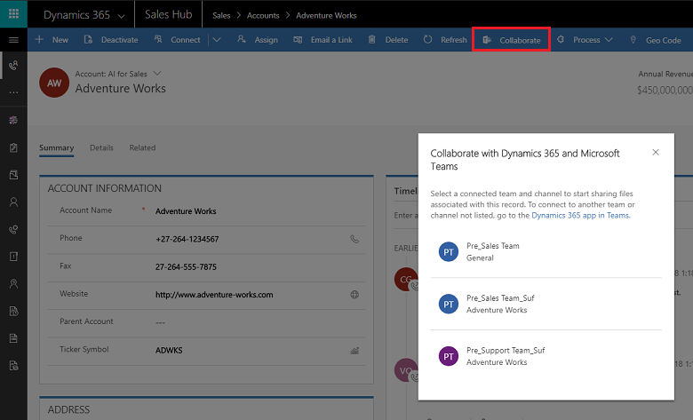

In addition, document management actions in Dynamics 365 for Customer Engagement apps are integrated with Teams. You can see the channel file library in Dynamics 365 for Customer Engagement apps and directly upload files; uploaded files will appear in the Teams channel file library under the **Files** tab. Files uploaded in the Teams app will appear in the **Documents** tab in Dynamics 365 for Customer Engagement apps.

> [!div class="mx-imgBorder"] 
> 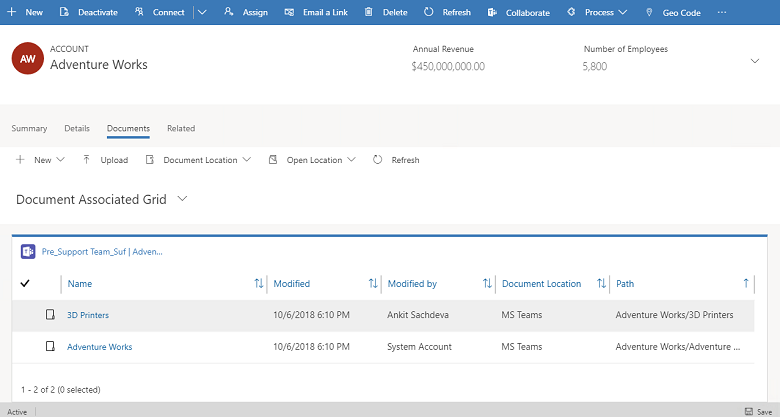

## If you see this message: Shared files exist in multiple locations. Select "Document Location" to see files in other locations.

> [!div class="mx-imgBorder"] 
> 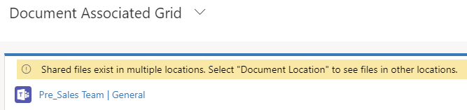

When there is more than one Microsoft Teams channel connected to a Dynamics 365 for Customer Engagement apps record, each of the channels appears as a separate document location in Dynamics. You can switch to a different location by selecting **Document Location** to specify the location of the file.

> [!div class="mx-imgBorder"] 
> 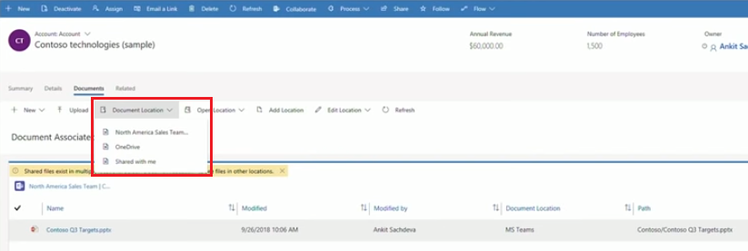

To view a consolidated file list across all document locations including all connected team channel file libraries, from **Document Location** select **All Locations**.

> [!div class="mx-imgBorder"] 
> 

> [!div class="mx-imgBorder"] 
> 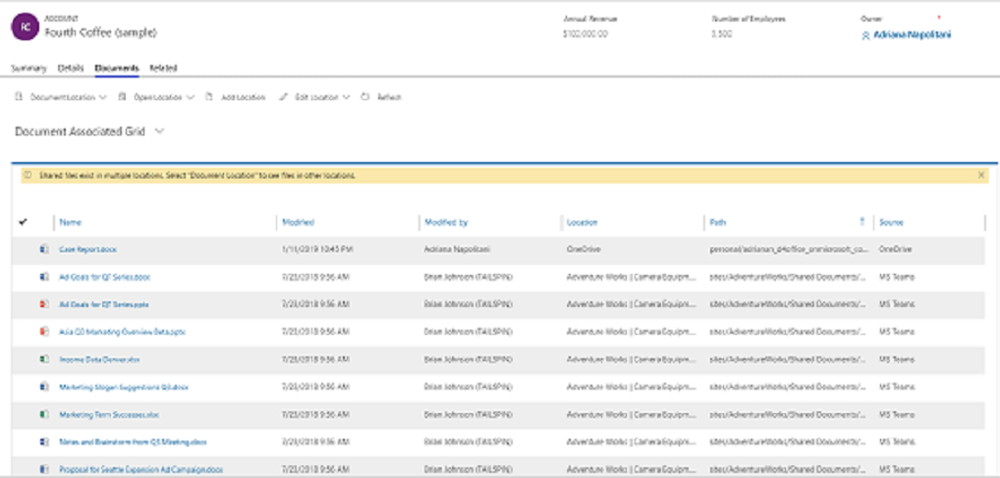

## Record types supporting Collaborate    

Currently, the following record types only support Microsoft Teams collaborate capabilities in Dynamisc 365 Customer Engagement app. The **Collaborate** button and file share feature will only work with the record types listed below in Dynamisc 365 Customer Engagement app.
 
- Account
-	Agreement
- Appointment
-	Business Unit
-	Campaign
-	Case
-	Category
-	Competitor
-	Contact
-	Email
-	Expense
-	Fulfillment Preference
- Inventory Adjustment
-	Inventory Transfer
-	Invoice
-	Article
-	Knowledge Article
-	Lead
-	Note
-	Opportunity
-	Opportunity Line
-	Order
-	Product
-	Project
-	Purchase Order
-	Purchase Order Receipt
-	Quote
-	Resource Request
-	RMA
-	RMA Receipt
-	RTV
-	Sales Literature
-	Task
-	Team
-	Work Order

### See also  
 [Install the app and set up the Teams tab](teams-install-app.md#install-the-app-and-set-up-the-teams-tab)

