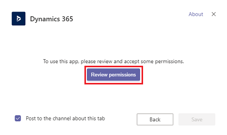
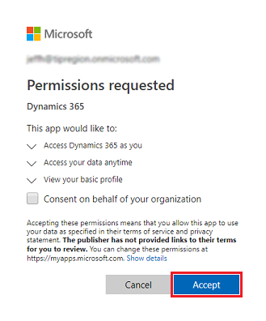

# Install and set up the Dynamics 365 app for Teams

[!INCLUDE[cc-applies-to-update-9-0-0](../includes/cc_applies_to_update_9_0_0.md)]

[!INCLUDE [cc-beta-prerelease-disclaimer](../includes/cc-beta-prerelease-disclaimer.md)]

## Install the app and set up the Teams tab

1. In Microsoft Teams, select **Store**. 

   

2. Search for **dynamics**, and then select the **Dynamics 365 (Preview)** tile.

   

3. Verify that **Add for you** and **Add to team** are both set to **Yes**.

   You have a choice when adding Dynamics 365 to Microsoft Teams. You can enable features which integrates Dynamics 365 and Teams for your own use, and you can enable features that you can use to collaborate with your team members. We'll take the simplest approach and enable both.

   > [!div class="mx-imgBorder"] 
   > 

   Note: You can do this configuration at any time by selecting ... from the left-side menu, selecting **Dynamics 365**, and then selecting **Settings**.

4. For **Add to a team**, choose a team to pin content and services to, and then select **Install**. 

   > [!div class="mx-imgBorder"] 
   > 

5. Select **Set up**.

   > [!div class="mx-imgBorder"] 
   > 

6. Select **Review permissions**.

   > [!div class="mx-imgBorder"] 
   > 

7. Read through the permissions and select **Accept**.

   > [!div class="mx-imgBorder"] 
   > 

8. Select a version 9.x org and a Unified Interface app to connect with Dynamics 365 (online), then choose **Save Changes**.

   > [!div class="mx-imgBorder"] 
   > 

   > [!NOTE]
   > - Only Dynamics 365 version 9.x or later organizations appear in the list. Also, only active organizations (those that are not disabled or provisioning) are displayed. 
   > - Only Unified Interface apps are listed.
   > - Only app modules licensed for the selected organization are listed. 

<!--
7. You'll see a list of recently viewed records, if any exist. You can also type in records to search for and use **Filter by** to narrow the search to an entity type. Once you pick a record, select **Save**.

   > [!div class="mx-imgBorder"] 
   > 

   Note: If you have multiple organizations or app modules, select **Edit** () to specify which org or app module to use in Teams.
-->

After completing the above steps, you'll see a notification of a successful connection and the Dynamics 365 (online) record appears in the menu bar.

> [!div class="mx-imgBorder"] 
> 

For troubleshooting, see [Troubleshoot Teams integration](teams-troubleshoot.md).

See [Collaborate with Teams](teams-collaboration.md) for information on how you can use the Teams tab to interact with Dynamics 365 (online).

Next, set up the Dynamics 365 app for Teams bot feature.

## Set up the Dynamics 365 app for Teams bot
Set up the bot feature to interact with Dynamics 365 (online).

1. Open the Dynamics 365 app.

   > [!div class="mx-imgBorder"] 
   > 

2. Sign in to the app.

   > [!div class="mx-imgBorder"] 
   > 

See [Use the bot](teams-bot-search.md) for information on how you can use the bot feature to interact with Dynamics 365 (online).

## Set up the personal dashboard
Set up the personal dashboard (My Dashboard) to interact with Dynamics 365 (online) without involving other team members.

1. Open the Dynamics 365 app.

   > [!div class="mx-imgBorder"] 
   > 

2. Select a version 9.x org and a Unified Interface app to connect with Dynamics 365 (online), then choose **Save Changes**.

   > [!div class="mx-imgBorder"] 
   > 

   > [!NOTE]
   > - Only Dynamics 365 version 9.x or later organizations appear in the list. Also, only active organizations (those that are not disabled or provisioning) are displayed. 
   > - Only Unified Interface apps are listed.
   > - Only app modules licensed for the selected organization are listed. 

3. Select the **My Dashboard** tab.

See [Use the personal dashboard](teams-personal-use.md) for information on how you can use **My Dashboard**.

## For Dynamics 365 (online) admins: enable Microsoft Teams integration Preview features

Because this is a preview feature, you can control whether to display certain Teams integration features. For full Teams integration, the Dynamics 365 (online) admin should enable two settings.

1. Sign in as a System administrator to Dynamics 365 (online).
2. Go to **Settings** > **Administration** > **System Settings** > **Previews** tab.
3. Enable **Microsoft Teams Integration Preview** and **Dynamics 365 bot in Microsoft Teams Preview**.

> [!div class="mx-imgBorder"] 
> 

The following table describes what happens when each feature is enabled.

|Setting  |When enabled |
|---------|---------|
|Microsoft Teams Integration Preview   | When enabled, the **Collaborate** button appears on records in Dynamics 365 (online) so you can see the connected team channel. In addition, in the **Documents** tab, files synchronized with Teams will appear.         |
|Dynamics 365 bot in Microsoft Teams Preview     | When enabled, the bot appears in Microsoft Teams in the **Conversation** tab in the Dynamics 365 app for Teams.  |

If these settings are not enabled, you can still use much of the Teams integration with Dynamics 365 (online); the above features will be absent.

### See also  
 [Troubleshoot Teams integration](teams-troubleshoot.md)

<!--
## Install the app

You have a choice when adding Dynamics 365 to Microsoft Teams. You can enable features which integrates Dynamics 365 and Teams for your own use, and you can enable features that you can use to collaborate with your team members. We'll take the simplest approach and enable both.

1. Verify that **Add for you** and **Add to team** are both set to **Yes**.

   > [!div class="mx-imgBorder"] 
   > 

2. For **Add to a team**, choose a team to pin content and services to, and then select **Install**. 

   > [!div class="mx-imgBorder"] 
   > 

3. In the next page, choose the channel where you want to use the Dynamics 365 app. Then, select **Set up**.

   > [!div class="mx-imgBorder"] 
   > 

4. Connect the app with Dynamics 365 (online). Select the Dynamics 365 app for Teams from the left-side menu.

   > [!div class="mx-imgBorder"] 
   > 

5. Select a version 9.x org and a Unified Interface app to connect with Dynamics 365 (online), then select **Save Changes**.

   > [!div class="mx-imgBorder"] 
   > 

Teams is now connected with Dynamics 365 (online).

   If you have multiple organizations or app modules, select **Edit** () to specify which org or app module to use in Teams.
 
   

   Enable **Remember this preference** to set the org and app selections to be the default personal dashboard that appears when you select **My Dashboard**.

   Use the **Settings** tab in the Teams app to change these settings any time.

 5. Select **Save**. 

Once you complete the above steps, the Dynamics 365 tab appears in the menu bar.

   > [!div class="mx-imgBorder"] 
   > 

You can interact with the record as if you were using the Dynamics 365 web app. Those with Write permissions can edit the record; changes will be synchronized with the Dynamics 365 web app.

For information on using the Dynamics 365 app, see: [Use the personal app and bot](use-personal-app.md).
-->