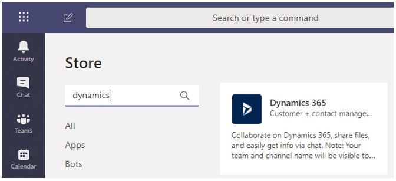
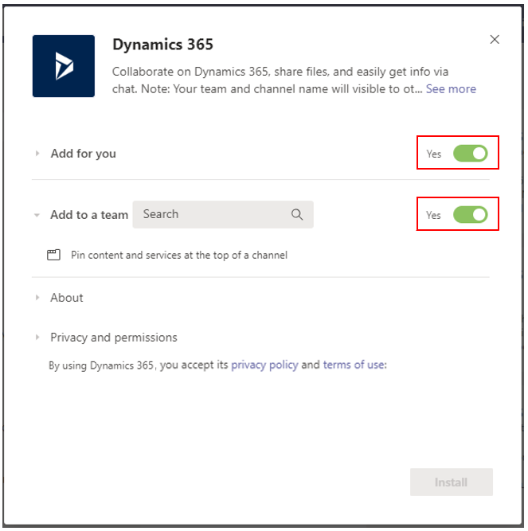
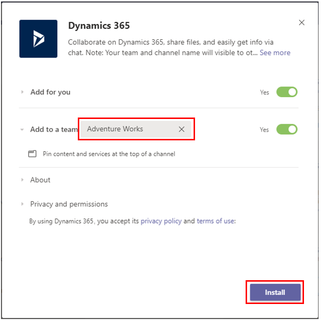
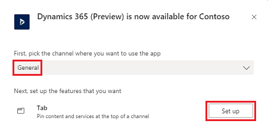
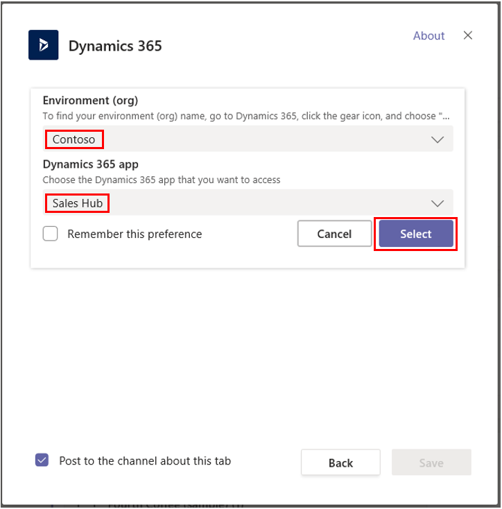
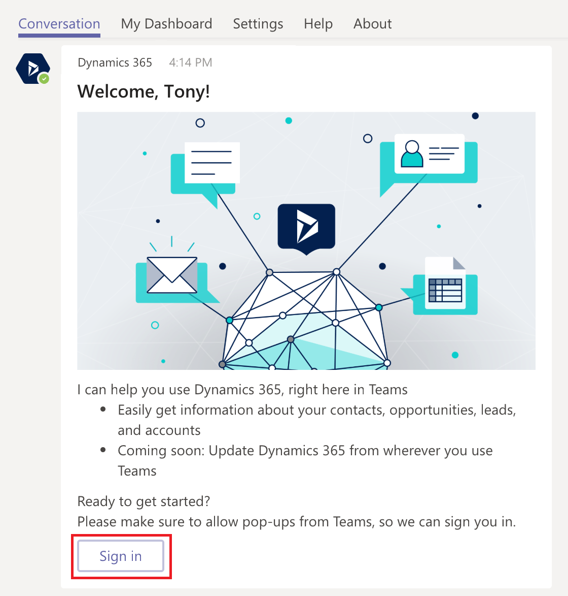
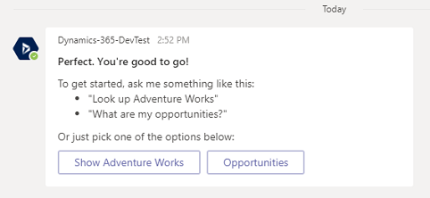
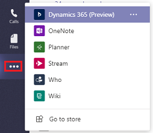
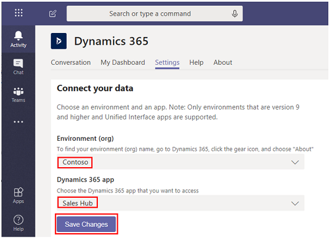
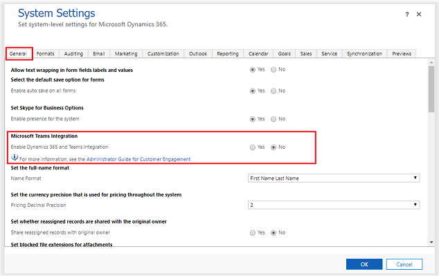

# Install and set up the Dynamics 365 app for Teams 

[!INCLUDE[cc-applies-to-update-9-0-0](../includes/cc_applies_to_update_9_0_0.md)]

## Install the app and set up the Teams tab

1. In Microsoft Teams, select **Store**. 

   > [!div class="mx-imgBorder"]
   > 

2. Search for **dynamics**, and then select the **Dynamics 365** tile.

   > [!div class="mx-imgBorder"]
   > 

3. Verify that **Add for you** and **Add to a team** are both set to **Yes**.

   You can use Dynamics 365 for Customer Engagement apps for your own use or use on a Microsoft Teams channel to collaborate with others. If you have an existing Microsoft Teams channel, select both options. Otherwise, you can start installing for your personal use and install the app for your Teams later.

   > [!div class="mx-imgBorder"] 
   > 

4. For **Add to a team**, choose a team and then select **Install**. 

   > [!div class="mx-imgBorder"] 
   > 

5. Pick a channel in Microsoft Teams to connect to a Dynamics record and then select **Set up**.

   > [!div class="mx-imgBorder"] 
   > 

6. Select a version 9.x environment and a Unified Interface app to connect, and then choose **Save**.

   > [!div class="mx-imgBorder"] 
   > 

   > [!NOTE]
   > - Only Dynamics 365 for Customer Engagement version 9.x or later environments appear in the list. Also, only active environments (those that are not disabled or provisioning) are displayed. 
   > - Only Unified Interface apps are listed.
   > - Only app modules licensed for the selected environment are listed. 

7. Select **Entity Selection** or **View Selection**.

    7.1 **Entity Selection**: Select an entity to connect. You can pick a recently viewed record or use search to find records. You can     use **Filter by** to narrow the search to an entity type. Once you've picked a record, select **Save**.

   > [!div class="mx-imgBorder"] 
   > 

    7.2 **View Selection**: Select an entity to see the list of available views. Once you've picked a view, select **Save**.
    
   > [!div class="mx-imgBorder"] 
   > 
   
      > [!NOTE]
   > If you select a personal view (**My Views**) instead of **System Views**, it’s recommended that you share the view with other users in Teams before you add the view to the Teams channel. Otherwise, other team members will not hae access to the view content.

8. After completing the above steps, you will see a new tab for Dynamics 365 for Customer Engagement apps for the selected Teams channel. 
 
 
See [Collaborate with Teams](teams-collaboration.md) for information on how you can use the tab feature to collaborate with Dynamics 365 for Customer Engagement apps.

## Set up the Dynamics 365 bot

Set up the bot feature to interact with Dynamics 365 for Customer Engagement apps.

1. Find and open the Dynamics 365 bot. Open **Chat** on the left side of the Teams app, and then select **Dynamics 365 for Customer Engagement apps**.

2. The **Conversation** tab opens with the welcome message sent by the bot that provides an overview of the bot’s abilities. Select **Sign in**.

   > [!div class="mx-imgBorder"] 
   > 

3. Select an environment, and then select **Next**.

   If the environment has multiple app modules (Sales, Marketing, Service, and so on), then you'll also select an app module.

   > [!div class="mx-imgBorder"] 
   > 

   > [!NOTE]
   > Only Dynamics 365 for Customer Engagement version 9.x or later environments appear in the list. Also, only active environments (those that are not disabled or provisioning) are displayed.

4. Enter credentials and sign in.

   The Dynamics 365 bot setup is complete and some preloaded options are available for getting started.

   > [!div class="mx-imgBorder"] 
   > 

See [Use the bot](teams-bot-search.md) for information on how you can use the bot feature to interact with Dynamics 365 for Customer Engagement apps.

## Set up the personal dashboard
Set up the personal dashboard (My Dashboard) to interact with Dynamics 365 for Customer Engagement apps without involving other team members.

1. Open the Dynamics 365 app.

   > [!div class="mx-imgBorder"] 
   > 

2. Select a version 9.x environment and a Unified Interface app to connect with Dynamics 365 for Customer Engagement apps, and then choose **Save Changes**.

   > [!div class="mx-imgBorder"] 
   > 

   > [!NOTE]
   > - Only Dynamics 365 for Customer Engagement version 9.x or later environments appear in the list. Also, only active environments (those that are not disabled or provisioning) are displayed. 
   > - Only Unified Interface apps are listed.
   > - Only app modules licensed for the selected environments are listed. 

3. Select the **My Dashboard** tab.

See [Use the personal dashboard](teams-personal-use.md) for information on how you can use **My Dashboard**.

## For Dynamics 365 for Customer Engagement admins: enable Microsoft Teams integration feature 

By default, Microsoft Teams integration is disabled. To turn this feature on, follow the steps below. 

1. Sign in as a System administrator to Dynamics 365 for Customer Engagement apps.
2. Go to **Settings** > **Administration** > **System Settings** > **General** tab.
3. Enable **Microsoft Teams Integration**.

   > [!div class="mx-imgBorder"] 
   > 

When Microsoft Teams Integration is enabled, the **Collaborate** button appears on records in Dynamics 365 for Customer Engagement apps so you can see the connected team channel. In addition, in the **Documents** tab of Dynamics 365 record page, the connected Teams Channel file library will appear.   

If not enabled, users can still connect Dynamics 365 for Customer Engagement apps records to Microsoft Teams but the connected Microsoft Teams channel and the file library do not appear in Dynamics 365 for Customer Engagement apps.  

### See also  
 [Troubleshoot Teams integration](teams-troubleshoot.md)

