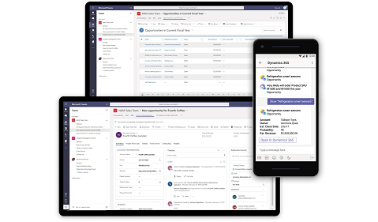

# Preview: Integrate Dynamics 365 Customer Engagement with Microsoft Teams 

[!INCLUDE[cc-applies-to-update-9-0-0](../includes/cc_applies_to_update_9_0_0.md)]

[!INCLUDE [cc-beta-prerelease-disclaimer](../includes/cc-beta-prerelease-disclaimer.md)]

> [!IMPORTANT]
> - [!INCLUDE[cc_preview_features_definition](../includes/cc-preview-features-definition.md)]  
> - [!INCLUDE[cc_preview_features_expect_changes](../includes/cc-preview-features-expect-changes.md)]  
> - Microsoft doesn't provide support for this preview feature. Microsoft Dynamics 365 Technical Support won’t be able to help you with issues or questions. Preview features aren't meant for production use and are subject to a separate [supplemental terms of use](https://go.microsoft.com/fwlink/p/?linkid=870960).

If you're familiar with [Microsoft Teams](https://products.office.com/microsoft-teams/group-chat-software), you know it's the place to manage all your conversations, files, and tools in one team workspace. Create and edit documents right in the app and enjoy instant access to SharePoint, OneNote, PowerBI, and now, [!INCLUDE [pn-crm-online](../includes/pn-crm-online.md)]. With Dynamics 365 app for Teams integration, you add the Dynamics 365 Customer Engagement  features you rely on to the Teams app you collaborate with.

Check out the following video to get a quick overview of Dynamics 365 and Teams can work together to make easy collaboration possible: [Dynamics 365 app for Microsoft Teams Demo Video](https://go.microsoft.com/fwlink/p/?linkid=2038623).
<!-- Cindy will provide new video when it's published. -->

The Dynamics 365 app in Teams provides the following:

- **Collaboration hub** – Access records together with the Office applications you need to close deals.
- **Cross-functional collaboration** – Work together with customers and any colleague across functions, even if they aren’t Dynamics 365 users.
- **File integration** – Co-author documents using Office 365 and automatically sync to Dynamics 365.
- **Teams mobile app** – Search and update records from Microsoft Teams mobile app using Dynamics 365 bot while on the go. 

> [!div class="mx-imgBorder"] 
> 

The Dynamics 365 app for Teams, when installed into a Teams channel, provides a fully functional page in which you can edit information and navigate to related records - all this without leaving Teams.

## Privacy notice

While using the Dynamics 365 for Sales bot in Microsoft Teams, the user’s text inputs are analyzed for understanding the underlying query/intent. The user’s input such as “Search account Contoso” is routed to one of Microsoft’s Cognitive Service called Language Understanding Intelligent Service (LUIS). Read more about LUIS [here](https://www.luis.ai/). The LUIS service disambiguates or understands the intent of user input (in this case, the intent is to find information) and the target entity (in this case, the intended entity is an account named Contoso). This information is then passed on to Microsoft’s [Azure bot framework](https://azure.microsoft.com/services/bot-service/) which interacts with Dynamics data and retrieves the desired information for the user query.

By installing and allowing access to use of the bot, you agree to allow the LUIS service and Azure bot framework to process the intent behind the input – which results in an enhanced conversational user experience. The LUIS service and Azure bot framework  may have varying levels of compliance compared to Dynamics 365 for Sales. While the LUIS service has access to only the user queries and is not designed to be connected to the user’s Dynamics data or account, a user of the Dynamics 365 for Sales bot could voluntarily enter a query containing Customer Data, Personal Data or other data and such query content could get sent to the LUIS service and the Azure bot framework. 

The content of user’s queries and messages is retained in LUIS system for a maximum of 30 days, encrypted at rest and is not used for training or service improvement. Read more about Cognitive Services [here](https://azure.microsoft.com/services/cognitive-services/language-understanding-intelligent-service/). 

To manage admin settings for apps in Teams, go to the Office 365 admin center and open **Settings** > **Services & add-ins**, then choose Microsoft Teams. If you're signed in as an Office 365 admin, you can access these controls [here](https://portal.office.com/adminportal/home#/Settings/ServicesAndAddIns), including the ability to uninstall.

### See also
 [Download and install Microsoft Teams](https://support.office.com/article/download-and-install-microsoft-teams-422bf3aa-9ae8-46f1-83a2-e65720e1a34d) 
 [Microsoft Teams help center](https://support.office.com/teams)