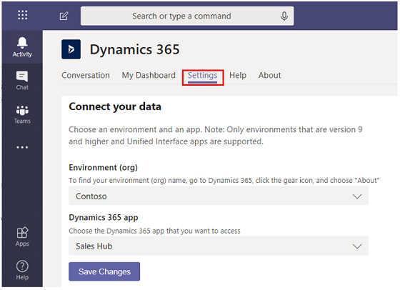

# Use the personal dashboard 

[!INCLUDE[cc-applies-to-update-9-0-0](../includes/cc_applies_to_update_9_0_0.md)]

You can use the Dynamics 365 app for Teams for your own use. If you want to work with other team members, consider the [team app](teams-collaboration.md).

## Conversation tab

Select the **Conversation** tab to access the bot as described above.

## My Dashboard tab

Select the **My Dashboard** tab to view your Dynamics 365 for Customer Engagement apps dashboard in Microsoft Teams. The dashboard displayed is based on who is signed in and their user role.

> [!div class="mx-imgBorder"]

## Settings tab

If you have more than one environment or Unified Interface app, you can use the **Settings** tab to select a different environment or app to appear as a dashboard.

> [!div class="mx-imgBorder"]

> [!NOTE]
> - Only Dynamics 365 for Customer Engagement version 9.x or later environmentss appear in the list. Also, only active environments (those that are not disabled or provisioning) are displayed. 
> - Only Unified Interface apps are listed.
> - Only app modules licensed for the selected environment are listed. 

### See also  
 [Set up the personal dashboard](teams-install-app.md#set-up-the-personal-dashboard)

