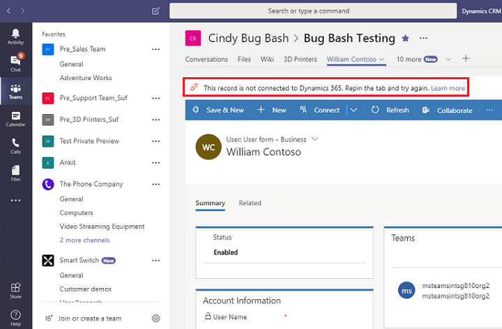
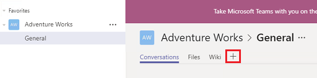
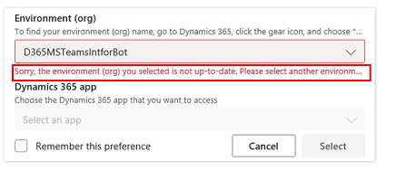
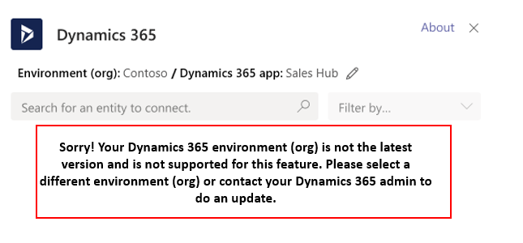
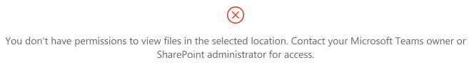
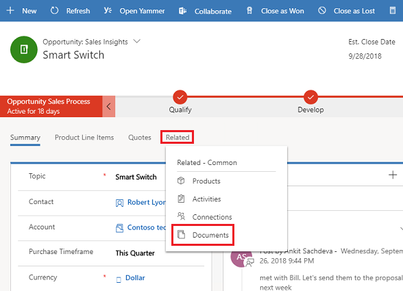
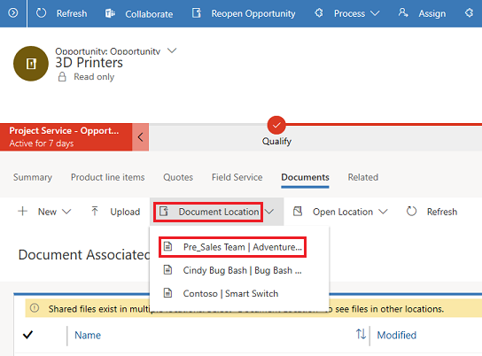

# Troubleshoot Teams integration 

[!INCLUDE[cc-applies-to-update-9-0-0](../includes/cc_applies_to_update_9_0_0.md)]

The following are error messages with possible resolutions.

## Error messages in the Teams app

### Error: I can't find the Dynamics 365 app in the Teams app store.

This happens when the external app for Microsoft Teams service is not enabled by your Office 365 admin. To fix the issue, do the following:

1. Sign in to [http://portal.office.com](http://portal.office.com).
2. From the list of apps, select **Admin**.

   > [!div class="mx-imgBorder"] 
   > 
   
3. From the menu select **Settings** > **Services & add-ins**.

   > [!div class="mx-imgBorder"] 
   > 
   
4. Find Microsoft Teams and then enable **External Apps**. 

   > [!div class="mx-imgBorder"] 
   > 
   
5.  Set **Allow external app in Microsoft Teams** to **On**.
   > [!div class="mx-imgBorder"] 
   > 
   
6. Restart Microsoft Teams and then try seaching for **Dynamics 365** again in the Teams app store.

### Error: This record is not connected to Dynamics 365. Repin the tab and try again.
A failed connection means file synchronization is not set up between Microsoft Teams and Dynamics 365 for Customer Engagement apps. However, changes made to the record in Teams will update in Dynamics 365 for Customer Engagement apps.

This is the connection error notification bar:

> [!div class="mx-imgBorder"] 
> 

> [!IMPORTANT]
> When you first create a new team and channel in Microsoft Teams, you might see this error because it takes some time to make the SharePoint file library connection. Wait a few minutes and then refresh your browser to retry the connection.

Try repinning the Dynamics 365 tab. To repin, remove the tab and then re-add, as follows:

1. In Microsoft Teams, select the channel with the error.
2. Select the Dynamics 365 tab with the error.
3. Select the down arrow next to the tab, and then select **Remove**.

   > [!div class="mx-imgBorder"] 
   > 

4. On the same channel, select the **Add** button ().

   > [!div class="mx-imgBorder"] 
   > 

5. Continue through the steps as in [Collaborate with Teams](teams-collaboration.md).

### Error: Sorry, the environment you selected is not up-to-date or is not supported. Please select another environment.

> [!div class="mx-imgBorder"] 
> 

and

### Error: Sorry! Your Dynamics 365 environment is not the latest version and is not supported for this feature. Please select a different environment or contact your Dynamics 365 admin to do an update.

> [!div class="mx-imgBorder"] 
> 

The Dynamics 365 for Customer Engagement apps environment that you are trying to connect does not support Microsoft Teams integration. You can wait for the environment to be updated or pick a different environment that has been updated to support Teams integration.

## Error messages in Dynamics 365 for Customer Engagement apps 

### Error: You cannot enable Microsoft Teams integration since the environment is integrated with SharePoint on-premises.
You are currently configured to use SharePoint on-premises for document management. You need to set up document management in Dynamics 365 for Customer Engagement apps to use SharePoint Online. See [Set up Dynamics 365 for Customer Engagement apps to use SharePoint Online](https://docs.microsoft.com/dynamics365/customer-engagement/admin/set-up-dynamics-365-online-to-use-sharepoint-online).

### Error: You don't have permissions to view files in this location. Contact your Microsoft Teams owner or SharePoint administrator for access.

> [!div class="mx-imgBorder"] 
> 

You need to be a member of the connected channel team to view files. Contact the connected channel team owner and request to be added as a member. You need to determine the document location for which to request membership.

1. In Dynamics 365 for Customer Engagement apps, open the record with the permissions error message.
2. Select **Related** > **Documents**.  
  
   > [!div class="mx-imgBorder"] 
   > 

3. Select **Document Location**. The first item in the list shows the team for which you need membership. Request access from the channel team owner.
  
   > [!div class="mx-imgBorder"] 
   > 

### Error: File sharing is not set up. Go to [URL] to connect a Microsoft Teams channel to this record.

> [!div class="mx-imgBorder"] 
> 

This record has not been connected to a Teams channel. Select the URL to go to the Dynamics 365 Teams app and pin the record to a channel as documented in [Collaborate with Teams](teams-collaboration.md).

