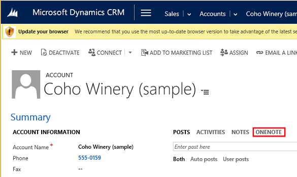
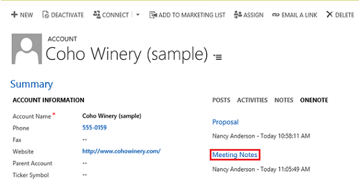
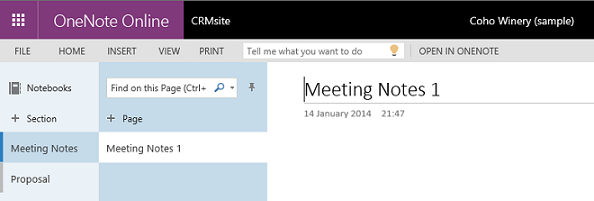

# Use OneNote in Dynamics 365 (online)

[!INCLUDE[cc-applies-to-update-9-0-0](../includes/cc_applies_to_update_9_0_0.md)]

If your administrator has set up [!INCLUDE[pn_onenote](../includes/pn-onenote.md)] integration with [!INCLUDE[pn_crm_online_shortest](../includes/pn-crm-online-shortest.md)], you can  access a [!INCLUDE[pn_onenote](../includes/pn-onenote.md)] notebook directly from the activities area in [!INCLUDE[pn_crm_online_shortest](../includes/pn-crm-online-shortest.md)]. This doesn’t replace the current Notes feature, but gives you another way to access notes stored in [!INCLUDE[pn_onenote](../includes/pn-onenote.md)]. When you add a [!INCLUDE[pn_onenote](../includes/pn-onenote.md)] section to a notebook, it’s shown individually within [!INCLUDE[pn_crm_shortest](../includes/pn-crm-shortest.md)] and in order of last modified time.  
  
 [Watch a short video (2:01) about OneNote integration](https://go.microsoft.com/fwlink/p/?linkid=837793).  
  
 For information on setting up [!INCLUDE[pn_onenote](../includes/pn-onenote.md)] integration if you're a system administrator, see [Set up OneNote integration in Dynamics 365](../admin/set-up-onenote-integration-in-dynamics-365.md).  
  
   
> [!NOTE]
>  If you aren’t signed in to [!INCLUDE[pn_Office_365](../includes/pn-office-365.md)], you’ll go to the [!INCLUDE[pn_Office_365](../includes/pn-office-365.md)] sign-in page when you select the title of the [!INCLUDE[pn_onenote](../includes/pn-onenote.md)] notebook. When you sign in, you’ll go directly to the notebook.  
  
### Get started with [!INCLUDE[pn_onenote](../includes/pn-onenote.md)]   
  
1.  In the activities area of a record, select **OneNote**.  
  
   
  
2.  Select a notebook to make entries.  
  
   
  
   
  
3.  The notebook is stored in the associated [!INCLUDE[pn_SharePoint_short](../includes/pn-sharepoint-short.md)] folder for the record. If there is more than one associated folder, the notebook is created in the first folder.  
  
   
  
> [!NOTE]
>  -   You can’t edit the [!INCLUDE[pn_onenote](../includes/pn-onenote.md)] file from within Dynamics 365. This can be done only from the [!INCLUDE[pn_onenote](../includes/pn-onenote.md)] app that opens when you choose the [!INCLUDE[pn_onenote](../includes/pn-onenote.md)] link.  
> -   Don’t delete any [!INCLUDE[pn_onenote](../includes/pn-onenote.md)]. onetoc2 or .one file types in the **OneNote** section in Dynamics 365. If you do, you won’t be able to access your Dynamics 365 OneNote notebook.  
> -   Sections groups that keep related sections together in [!INCLUDE[pn_onenote](../includes/pn-onenote.md)] aren’t supported in Dynamics 365.  
> -   You can only rename a section in the desktop version of [!INCLUDE[pn_onenote](../includes/pn-onenote.md)]. If you rename a section in [!INCLUDE[pn_onenote](../includes/pn-onenote.md)] online, you won’t see the updated section name in Dynamics 365.  
  
### See also  
 [Set up OneNote integration in Dynamics 365](../admin/set-up-onenote-integration-in-dynamics-365.md)   
 [OneNote in Dynamics 365 FAQs](../basics/onenote-dynamics-365-faqs.md)   
 [Work with activities](../basics/work-with-activities.md)
