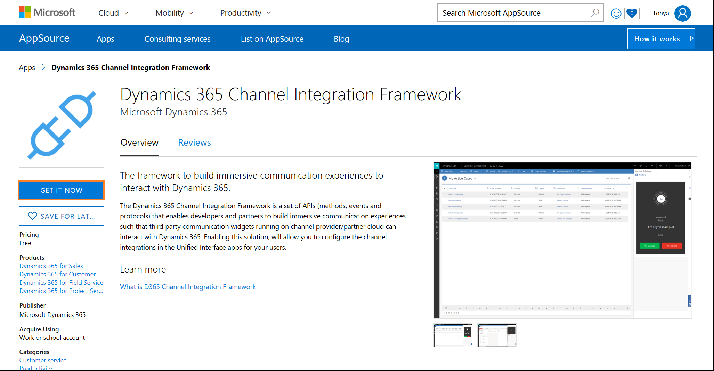
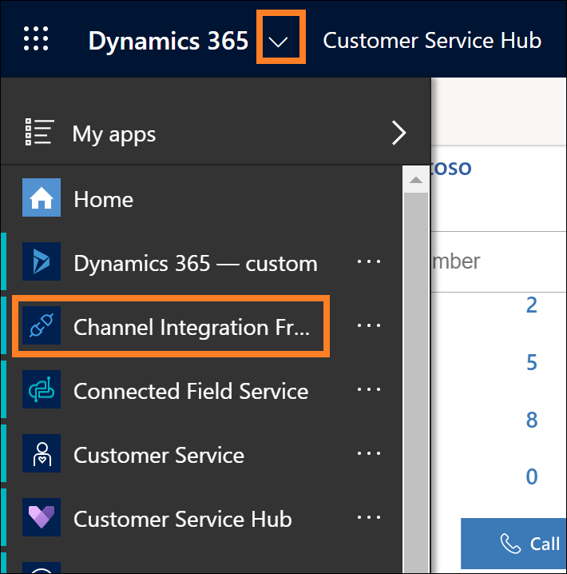

## Get Dynamics 365 Channel Integration Framework from Microsoft AppSource

There are two ways to get Dynamics 365 Channel Integration Framework from Microsoft AppSource.

### Directly from Microsoft AppSource

To get the Dynamics 365 Channel Integration Framework solution from within Dynamics 365:

1. Go to [Microsoft AppSource](https://go.microsoft.com/fwlink/p/?linkid=2050102). The Dynamics 365 Channel Integration Framework application page appears.

2. Select **GET IT NOW**. 

    

3. In the **One more thing** window, select **Continue**.

3. Read and select the check box to agree to the following:
    - Microsoft's Legal Terms and Privacy Statement.
    - Privacy Statement and Legal Terms for importing the solution into Dynamics 365.

4. Select **Agree**. The Dynamics 365 Channel Integration Framework application (solution) importing happens in the background.

    > [!NOTE]
    > The system does not display any confirmation after the successful import of the application (solution).

### From within Dynamics 365

1. Sign in to Dynamics 365.

2. Go to **Settings** > **Customization** > **Dynamics Marketplace**. The Microsoft AppSource appears.

3. In the search box, type **Channel Integration Framework**. The Dynamics 365 Channel Integration Framework application (solution) appears.

4. Select **GET IT NOW**.

5. In the **One more thing** window, select **Continue**.

6. Read and select the check box to agree to the following:
    - Microsoft's Legal Terms and Privacy Statement.
    - Privacy Statement and Legal Terms for importing the solution into Dynamics 365.

7. Select **Agree**. The Dynamics 365 Channel Integration Framework application (solution) importing happens in the background.

    > [!NOTE]
    > The system does not display any confirmation after the successful import of the application (solution).

## View Dynamics 365 Channel Integration Framework in Dynamics 365

1. Sign in to Dynamics 365.

2.  Select **Channel Integration Framework** from the Dynamics 365 list. 
    
    

> [!TIP] 
> Alternatively, you can use `https://<orgURL>.dynamics.com/apps` to navigate to the Dynamics 365 Channel Integration Framework. 

 
