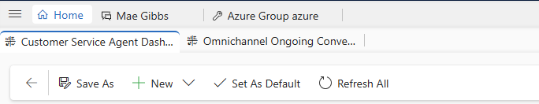

# Manage application tab templates in Dynamics 365 Channel Integration Framework 2.0

Application tab templates provide the type of applications you want to open when a session is started. Each application type has a predefined set of parameters associated with it.

The horizontal bar below the model-driven app navigation bar is called the application tab panel. Every customer session has at least one application tab that cannot be closed; it is called **Anchor Tab**. That is, when a session is started, by default the system opens an application in the application tab panel. In addition, the system might open a few other applications by default based on the configuration. 

  

With application tab templates, you can define the applications that are available for a session and then associate those applications with the session. 

For example, you can create the **Dashboard** application type and associate it with chat or SMS sessions. Now, when an agent accepts a notification from the chat or SMS channels, a session starts and by default the **Active Conversation** page loads.

As an administrator, you can create multiple application tab templates.

## Create or manage application tab templates

To create or manage an application tab template, go to the agent experience profile. For more information, see [Create application tab templates](../../../customer-service/administer/application-tab-templates.md#create-application-tab-templates).

## See also

[Agent experience profile overview](../../../customer-service/administer/overview.md)

[Manage session templates](session-templates-cif.md)

[Manage notification templates](notification-templates-cif.md)

[Use automation dictionary to pass data parameter keys](automation-dictionary-keys-cif.md)

[Associate templates with workstreams](associate-templates-cif.md)

[!INCLUDE[footer-include](../../../includes/footer-banner.md)]
