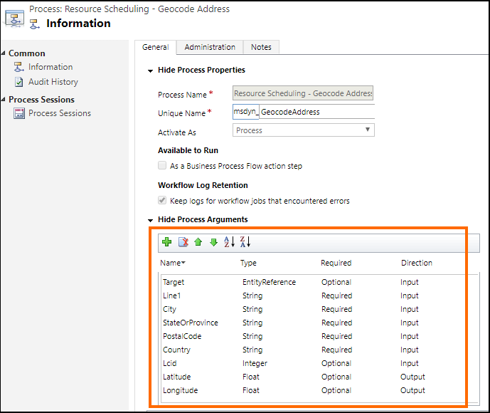

# Create custom plug-in to use your preferred geospatial data provider

This article provides information about the two geospatial actions in Universal Resource Scheduling, how to create a custom plug-in for the two geospatial actions, and provides examples from a sample custom plug-in on using Google Maps API for geospatial data.

## Input and output parameters for geospatial actions

While writing your custom plug-in, you will have to consider the input and output parameters for the geospatial actions in so that you know what data to pass in and the expected output data in your plug-in code. 

There are two ways in which you can view the input and output parameters for the two geospatial actions:

- **Web API action reference content**: View reference information about the geospatial actions in Universal Resource Scheduling.
    - <xref:Microsoft.Dynamics.CRM.msdyn_RetrieveDistanceMatrix>
- **Action definition**: You can view the action definition in Dynamics 365 for information about the input/output parameters, including information whether a parameter is required or optional.
 
    To view an action definition, select **Settings** > **Processes**. Next, search for the action name: **Resource Scheduling - Geocode Address** or **Resource Scheduling - Retrieve Distance Matrix**, and then select the action in the grid to display its definition. For example, here is the definition of the **Resource Scheduling - Geocode Address** (**msdyn_GeocodeAddress**) action where the highlighted area provides information about the input and output parameters:

    

## Write your custom plug-in

Plug-ins are custom classes that implement the <xref:Microsoft.Xrm.Sdk.IPlugin> interface. For detailed information about creating a plug-in, see [Plug-in development](../../developer/plugin-development.md)

A custom plug-in sample is provided for your reference that demonstrates how to use the Google Maps API to provide geospatial data for field operations instead of the default Bing Maps API. More information: [Sample: Custom plug-in to use Google Maps API as geospatial data provider](sample-custom-plugin-google-geospatial-data-provider.md).

The following code in each sample plug-in uses data from the Google API:

### ExecuteGeocodeAddress method in the msdyn_GeocodeAddress.cs plug-in file

```csharp
public void ExecuteGeocodeAddress(IPluginExecutionContext pluginExecutionContext, IOrganizationService organizationService, ITracingService tracingService)
{
    //Contains 5 fields (string) for individual parts of an address
    ParameterCollection InputParameters = pluginExecutionContext.InputParameters;
    // Contains 2 fields (double) for resultant geolocation
    ParameterCollection OutputParameters = pluginExecutionContext.OutputParameters;
    //Contains 1 field (int) for status of previous and this plugin
    ParameterCollection SharedVariables = pluginExecutionContext.SharedVariables;

    tracingService.Trace("ExecuteGeocodeAddress started. InputParameters = {0}, OutputParameters = {1}", InputParameters.Count().ToString(), OutputParameters.Count().ToString());


    try
    {
        // If a plugin earlier in the pipeline has already geocoded successfully, quit 
        if ((double)OutputParameters[LatitudeKey] != 0d || (double)OutputParameters[LongitudeKey] != 0d) return;

        // Get user Lcid if request did not include it
        int Lcid = (int)InputParameters[LcidKey];
        string _address = string.Empty;
        if (Lcid == 0)
        {
            var userSettingsQuery = new QueryExpression("usersettings");
            userSettingsQuery.ColumnSet.AddColumns("uilanguageid", "systemuserid");
            userSettingsQuery.Criteria.AddCondition("systemuserid", ConditionOperator.Equal, pluginExecutionContext.InitiatingUserId);
            var userSettings = organizationService.RetrieveMultiple(userSettingsQuery);
            if (userSettings.Entities.Count > 0)
                Lcid = (int)userSettings.Entities[0]["uilanguageid"];
        }

        // Arrange the address components in a single comma-separated string, according to LCID
        _address = GisUtility.FormatInternationalAddress(Lcid,
            (string)InputParameters[Address1Key],
            (string)InputParameters[PostalCodeKey],
            (string)InputParameters[CityKey],
            (string)InputParameters[StateKey],
            (string)InputParameters[CountryKey]);

        // Make Geocoding call to Google API
        WebClient client = new WebClient();
        var url = $"https://{GoogleConstants.GoogleApiServer}{GoogleConstants.GoogleGeocodePath}/json?address={_address}&key={GoogleConstants.GoogleApiKey}";
        tracingService.Trace($"Calling {url}\n");
        string response = client.DownloadString(url);   // Post ...

        tracingService.Trace("Parsing response ...\n");
        DataContractJsonSerializer jsonSerializer = new DataContractJsonSerializer(typeof(GeocodeResponse));    // Deserialize response json
        object objResponse = jsonSerializer.ReadObject(new MemoryStream(Encoding.UTF8.GetBytes(response)));     // Get response as an object
        GeocodeResponse geocodeResponse = objResponse as GeocodeResponse;       // Unbox into our data contracted class for response

        tracingService.Trace("Response Status = " + geocodeResponse.Status + "\n");
        if (geocodeResponse.Status != "OK")
            throw new ApplicationException($"Server {GoogleConstants.GoogleApiServer} application error (Status {geocodeResponse.Status}).");

        tracingService.Trace("Checking geocodeResponse.Result...\n");
        if (geocodeResponse.Results != null)
        {
            if (geocodeResponse.Results.Count() == 1)
            {
                tracingService.Trace("Checking geocodeResponse.Result.Geometry.Location...\n");
                if (geocodeResponse.Results.First()?.Geometry?.Location != null)
                {
                    tracingService.Trace("Setting Latitude, Longitude in OutputParameters...\n");

                    // update output parameters
                    OutputParameters[LatitudeKey] = geocodeResponse.Results.First().Geometry.Location.Lat;
                    OutputParameters[LongitudeKey] = geocodeResponse.Results.First().Geometry.Location.Lng;

                }
                else throw new ApplicationException($"Server {GoogleConstants.GoogleApiServer} application error (missing Results[0].Geometry.Location)");
            }
            else throw new ApplicationException($"Server {GoogleConstants.GoogleApiServer} application error (more than 1 result returned)");
        }
        else throw new ApplicationException($"Server {GoogleConstants.GoogleApiServer} application error (missing Results)");
    }
    catch (Exception ex)
    {
        // Signal to subsequent plugins in this message pipeline that geocoding failed here.
        OutputParameters[LatitudeKey] = 0d;
        OutputParameters[LongitudeKey] = 0d;

        //TODO: You may need to decide which caught exceptions will rethrow and which ones will simply signal geocoding did not complete.
        throw new InvalidPluginExecutionException(string.Format("Geocoding failed at {0} with exception -- {1}: {2}"
            , GoogleConstants.GoogleApiServer, ex.GetType().ToString(), ex.Message), ex);
    }

}
```

### ExecuteDistanceMatrix method in the msdyn_RetrieveDistanceMatrix.cs plug-in file

```csharp
public void ExecuteDistanceMatrix(IPluginExecutionContext pluginExecutionContext, IOrganizationService organizationService, ITracingService tracingService)
{
    //Contains 2 fields (EntityCollection) for sources and targets
    ParameterCollection InputParameters = pluginExecutionContext.InputParameters;
    // Contains 1 field (EntityCollection) for results
    ParameterCollection OutputParameters = pluginExecutionContext.OutputParameters;
    //Contains 1 field (int) for status of previous and this plugin
    ParameterCollection SharedVariables = pluginExecutionContext.SharedVariables;

    tracingService.Trace("ExecuteDistanceMatrix started.  InputParameters = {0},OutputParameters = {1}", InputParameters.Count().ToString(), OutputParameters.Count().ToString());

    try
    {
        // If a plugin earlier in the pipeline has already retrieved a distance matrix successfully, quit 
        if (OutputParameters[MatrixKey] != null)
            if (((EntityCollection)OutputParameters[MatrixKey]).Entities != null)
                if (((EntityCollection)OutputParameters[MatrixKey]).Entities.Count > 0) return;

        // Make Distance Matrix call to Google API
        WebClient client = new WebClient();
        var url = String.Format($"https://{GoogleConstants.GoogleApiServer}{GoogleConstants.GoogleDistanceMatrixPath}/json"
            + "?units=imperial"
            + $"&origins={string.Join("|", ((EntityCollection)InputParameters[SourcesKey]).Entities.Select(e => e.GetAttributeValue<double?>("latitude") + "," + e.GetAttributeValue<double?>("longitude")))}"
            + $"&destinations={string.Join("|", ((EntityCollection)InputParameters[TargetsKey]).Entities.Select(e => e.GetAttributeValue<double?>("latitude") + "," + e.GetAttributeValue<double?>("longitude")))}"
            + $"&key={GoogleConstants.GoogleApiKey}");
        tracingService.Trace($"Calling {url}\n");
        string response = client.DownloadString(url);   // Post ...

        tracingService.Trace("Parsing response ...\n");
        DataContractJsonSerializer jsonSerializer = new DataContractJsonSerializer(typeof(DistanceMatrixResponse));    // Deserialize response json
        object objResponse = jsonSerializer.ReadObject(new MemoryStream(Encoding.UTF8.GetBytes(response)));     // Get response as an object
        DistanceMatrixResponse distancematrixResponse = objResponse as DistanceMatrixResponse;       // Unbox as our data contracted class for response

        tracingService.Trace("Response Status = " + distancematrixResponse.Status + "\n");
        if (distancematrixResponse.Status != "OK")
            throw new ApplicationException($"Server {GoogleConstants.GoogleApiServer} application error (Status={distancematrixResponse.Status}). {distancematrixResponse.ErrorMessage}");

        tracingService.Trace("Checking distancematrixResponse.Results...\n");
        if (distancematrixResponse.Rows != null)
        {
            tracingService.Trace("Parsing distancematrixResponse.Results.Elements...\n");

            // build and update output parameter
            var result = new EntityCollection();
            result.Entities.AddRange(distancematrixResponse.Rows.Select(r => ToEntity(r.Columns.Select(c => ToEntity(c.Status, c.Duration, c.Distance)).ToArray())));
            OutputParameters[MatrixKey] = result;

        }
        else throw new ApplicationException($"Server {GoogleConstants.GoogleApiServer} application error (missing Rows)");
    }
    catch (Exception ex)
    {
        // Signal to subsequent plugins in this message pipeline that retrieval of distance matrix failed here.
        OutputParameters[MatrixKey] = null;

        //TODO: You may need to decide which caught exceptions will rethrow and which ones will simply signal geocoding did not complete.
        throw new InvalidPluginExecutionException(string.Format("Geocoding failed at {0} with exception -- {1}: {2}"
            , GoogleConstants.GoogleApiServer, ex.GetType().ToString(), ex.Message), ex);
    }

    // For debugging purposes, throw an exception to see the details of the parameters
    CreateExceptionWithDetails("Debugging...", InputParameters, OutputParameters, SharedVariables);
}
```

After you have written your custom plug-in code, build the project to generate a plug-in assembly (.dll), which will be used to register the plug-in on the Universal Resource Scheduling geospatial actions.

> [!div class="nextstepaction"]
> [Register and deploy custom plug-in to use your preferred geospatial data provider](register-deploy-custom-plugin-preferred-geospatial-data-provider.md)
    


[!INCLUDE[footer-include](../../includes/footer-banner.md)]