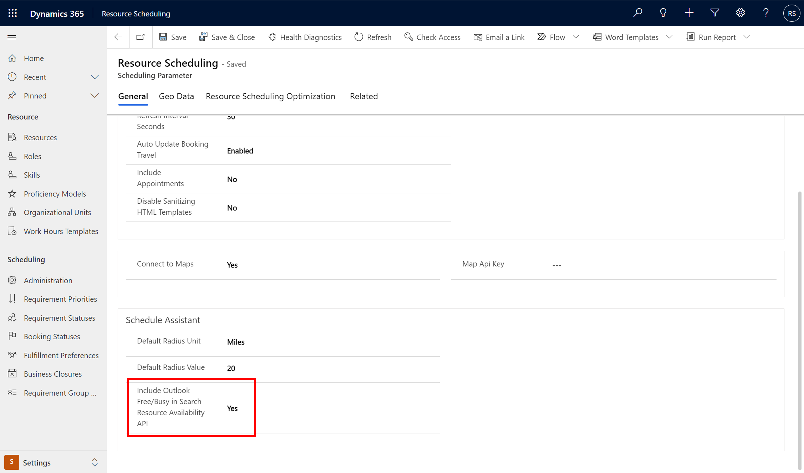
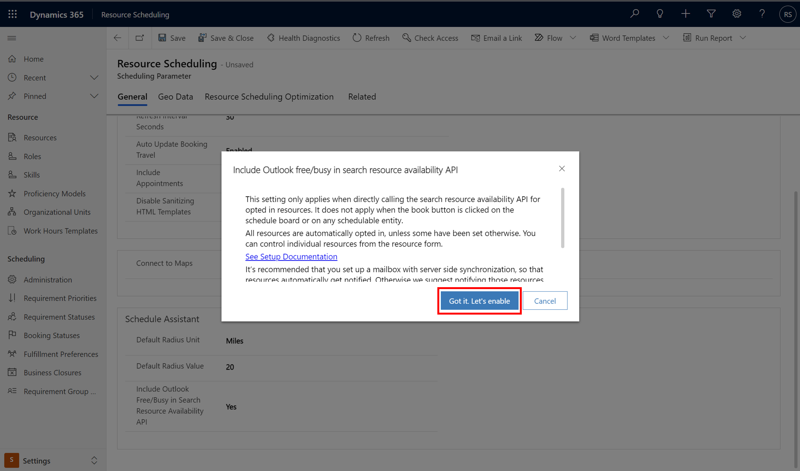
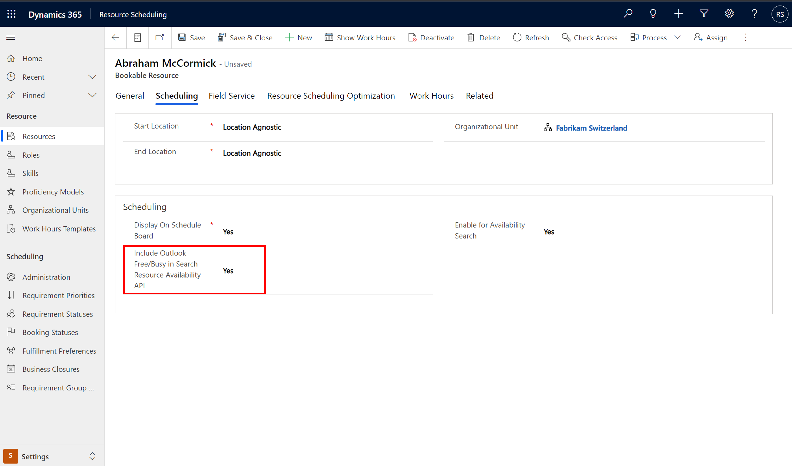

# Consider Outlook free/busy schedules in search resource availability API 

Universal Resource Scheduling's search resource availability API can now consider Outlook appointments in Exchange, in addition to availability defined in Dynamics (through Bookings and Dataverse Appointments). Now resources do not have to manually sync their Outlook appointments to Dataverse. Including a complete view of availability from both Exchange and Dynamics increases scheduler productivity and reduces avoidable scheduling errors.

Some key points:

- This extensibility feature only works when directly calling the search resource availability API with **ConsiderOutlookSchedules** as _true_. Out of the box availability searches triggered from the Schedule Board or from the Book button on any schedulable entity do not consider Outlook schedules.
- Reading schedules from Exchange will increase the time the search resource availability API takes to retrieve results, depending on the number of resources and period of time being considered. We recommend this functionality be used judiciously from custom interfaces designed to work around the retrieval time.
- The feature is available for search resource availability APIs for both requirements ([msdyn_SearchResourceAvailability](/dynamics365/field-service/search-resource-availability-api)) and requirement groups ([msdyn_SearchResourceAvailabilityForRequirementGroup](/dynamics365/field-service/search-resource-availability-api)).
- To protect privacy, only the start and end times of resources' schedule items are read, along with their free/busy status.
- Outlook 'Busy' status is considered as unavailable for scheduling.
- Outlook appointments are considered as location agnostic.

## Prerequisites

- Universal Resource Scheduling 3.12.64.x+, available in Field Service 8.8.52.x+ (2021 October Wave 2)

## Step 1: Enable setting to include Outlook free/busy in search resource availability API  

### At the organization level

1. Go to **Resource Scheduling** > **Settings** > **Administration** > **Scheduling Parameters** and set **Include Outlook Free/Busy in Search Resource Availability API** to *Yes*.

> [!div class="mx-imgBorder"]
> 

2. An informational dialog will appear. Select **Got it. Let’s enable.** Then **Save and close**. 

> [!div class="mx-imgBorder"]
> 

All resources are automatically opted-in the first time you enable the feature. You may opt out resources using the resource level setting, which is visible only if the organization level setting is set to *Yes*. 

Resources will automatically get an email notification each time they are opted in, from the user who is opting them in, if that user has a mailbox with server-side synchronization. 

### At the resource level

The resource level setting will only show if the organization level setting is enabled - that is, if **Include Outlook Free/Busy in Search Resource Availability API** in **Resource Scheduling** > **Settings** > **Administration** > **Scheduling Parameters** is set to *Yes*.

To control individual resources, go to the **Scheduling** tab on the resource form and change the **Include Outlook Free/Busy in Search Resource Availability API** field. 

> [!div class="mx-imgBorder"]
> 

## Step 2: Call the search resource availability API with ```ConsiderOutlookSchedules``` as _true_

Call the search resource availability API with **ConsiderOutlookSchedules** as _true_. The feature is available for search resource availability APIs for both requirements ([msdyn_SearchResourceAvailability](/dynamics365/field-service/search-resource-availability-api)) and requirement groups ([msdyn_SearchResourceAvailabilityForRequirementGroup](/dynamics365/field-service/search-resource-availability-api)).


[!INCLUDE[footer-include](../../includes/footer-banner.md)]
