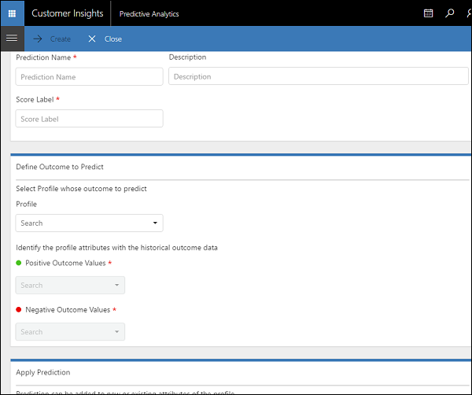
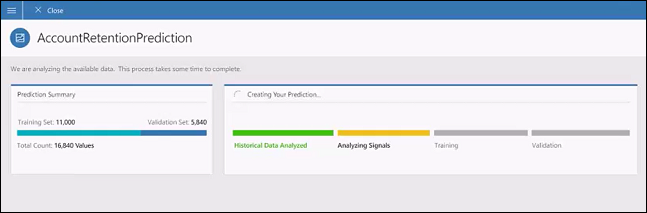
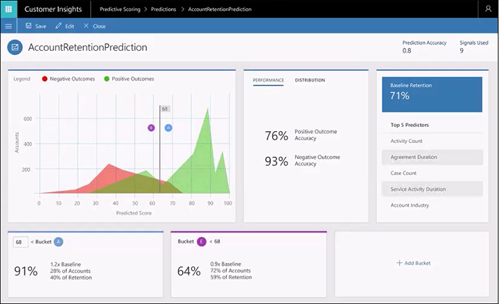
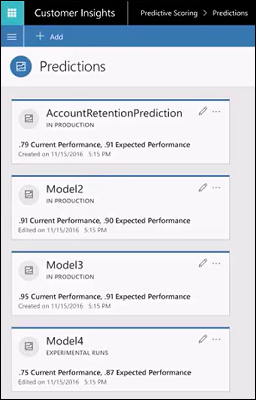
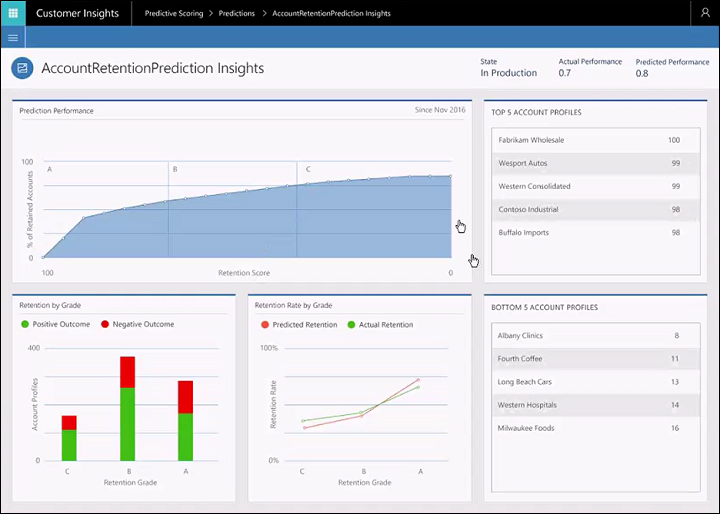
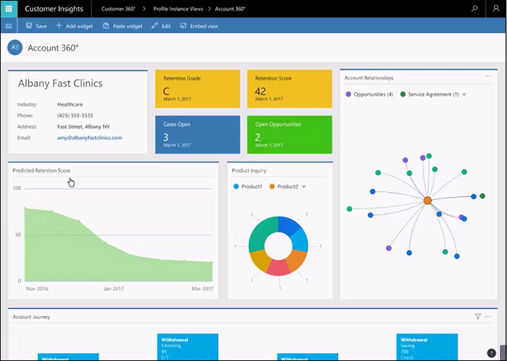

Predictive Scoring
==========================
[!include[pre release disclaimer](../../includes/cc-beta-prerelease-disclaimer.md)]

##Create a new prediction

1.  Open your Customer Insights  Customer 360 application.

2.  Select **Show Menu** . 

3.  Select **All Options** > **Predictive Analytics**.

    

4.  Select **Add** and fill in the values.

    

    **Prediction Details**
    |**Item**|**Description**|
    | ----------- | ---------- |
    | Prediction Name | The name of the prediction. |
    | Description | A description of the prediction. |
    | Score Label | Describes how the score will appear in all the result visualizations. |

    **Define Outcome to Predict**
    |**Item**|**Description**|
    | ----------- | ---------- |
    | Profile | Select a profile to whose outcome you want to predict. |
    | Positive Outcome Values | You will need to specify search criteria based on your selection. |
    | Negative Outcome Values | You will need to specify search criteria based on your selection. |

    **Apply Prediction**
    |**Item**|**Description**|
    | ----------- | ---------- |
    | Prediction can be added to new or existing attributes of the profile | Default: Add new attributes to target profile.  |
    | Score |   |
    | Reason |   |
    | Grade |  |

5.  Select **Create** to save your new prediction. Your model will be trained and validated by analyzing historical data based on the profile you've selected. The process will take a few minutes before being available for your analysis.

##Sample Predictive Scoring settings

The following values were used to create a sample prediction of account retention based on historical account activity data.

**Prediction Details**
|**Item**|**Value**|
| ----------- | ---------- |
| Prediction Name | AccountRetentionPrediction |
| Description | Accounts retention prediction |
| Score Label | Retention |

**Define Outcome to Predict**
|**Item**|**Value**|
| ----------- | ---------- |
| Profile | Account |
| Positive Outcome Values | Status Is Active - these are accounts which are still active |
| Negative Outcome Values | Status is InActive - these are accounts that have churned |

**Apply Prediction**
|**Item**|**Value**|
| ----------- | ---------- |
| Prediction can be added to new or existing attributes of the profile | Add new attributes to target profile. |
| Score | PredictionName_Score |
| Reason | PredictionName_Reason |
| Grade | PredictionName_Grade|

The new policy model builds with the above values and then validates.

Once completed, you can review the prediction results.

In this example, note the following:
- The red and green areas of the chart show the separation between the accounts successfully retained and those that have churned. The more successful the model prediction the more these areas are separated out.
- The expected model accuracy is found in the 76% and 93% outcome accuracy.
- The baseline account retention is 71%. This view also shows the top 5 predictors for the retention score.
- Grading was set so that a score of 68 or higher received an "A" for likelihood of retention and a "B" if less than 68.

Once the prediction is available you can look at the overall performance of multiple predictions.

View the overall performance of a prediction once it has been running for a while.

In this example, note the following:

- In **Prediction Performance**, you can see the retention score versus the actual percentage of retained accounts. This is the productivity gain resulting from this prediction model.
- **Retention by Grade** shows the actual retention for different grades. Green shows accounts successfully retained. Red shows accounts lost.
- **Retention Rate by Grade** shows predicted versus actual retention rates.
- **Top 5 Account Profiles** are the accounts most like to be retained.
- **Bottom 5 Account Profiles** are the accounts most like to be lost.

Prediction scoring can be added to your Customer 360 view.

### See also
[What is Predictive Scoring?](newfeatures.md#what-is-predictive-scoring)