Segment your insights
==========================
[!include[pre release disclaimer](../../includes/cc-beta-prerelease-disclaimer.md)]

##What is segmentation?

 

As customers move through the sales or service process, groups of customers can reach the same process point. You can use [!INCLUDE[pn-customer-insights](../../includes/pn-customer-insights-full.md)] to segment customers at that point so you can gather insights about them and take actions suitable for their stage.

For example, you can target communications and offers for several weeks before a shopping deadline such as Valentine's Day, and show a different set of responses a few days before the deadline: "Your gift can still get there in time for Valentine's Day!"

To segement your insights, you will:

- Design marketing segments based on the complete customer journey.
- Identify groups of customers who are at the same stage of their journey.
- Automatically update segments based on the latest customer interactions.

There are three types of segments:
- Static: A static collection of profile data not automatically refreshed.
- Dynamic: A collection of profile data automatically refreshed.
- Compound: Combines Dynamic and Static segments.

##Create a static segment

1.  Open your Customer Insights Customer 360 application.

2.  Select **Show Menu** . 

3.  Select **All Options** > **Segmentation**.

    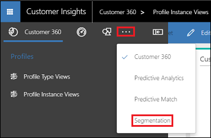

4.  Under Static select **Create**.

5.  Fill in the values and select **Save**.

 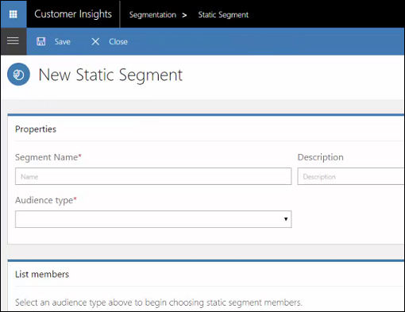

    **Properties**
    |**Item**|**Description**|
    | ----------- | ---------- |
    | Segment Name | The name of the static segment. |
    | Description | A description of the segment. |
    | Audience type | The profile to segment on.  |

    **List members**

    Choose the members to be included in the segment. For example, the customers who requested to not be contacted.

    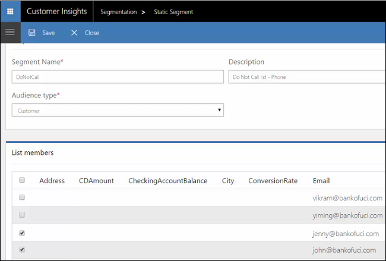

 ##Create a dynamic segment

1.  From the Segmentation Dashboard, select **Add** > **Dynamic Segment**.

    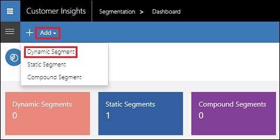. 

3.  Fill in the values and select **Save**.

 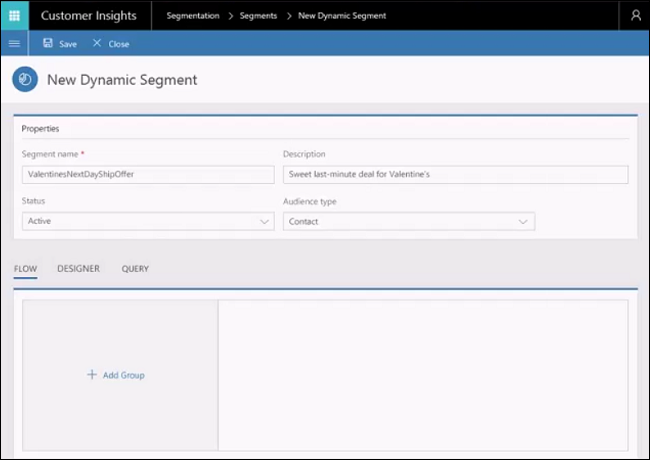

    **Properties**
    |**Item**|**Description**|
    | ----------- | ---------- |
    | Segment Name | The name of the dynamic segment. |
    | Description | A description of the segment. |
    | Audience type | The profile to segment on.  |
    | Status |  |

    **Flow**: Use this to visually build your segment.

    **Designer**: Choose this for an interactive approach more suited to advanced users.

    **Query**: Use this to manually enter a query.

###Example: Using Flow to define a dynamic segment

The following are settings for a dynamic segment to find customers using security products with low satisfaction.

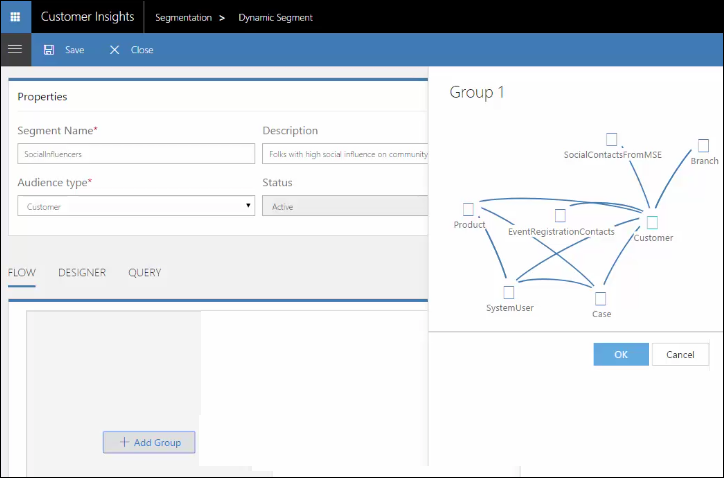

A group consists of profiles joined together by set operations such as union, intersect, and exclude. 

Note that all profiles included with the group end with the node selected in Audience type; in this case, Customer. 

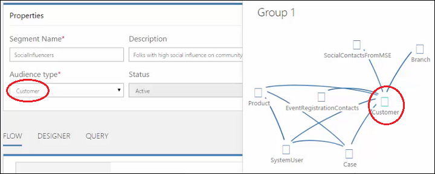

Let's say you want to segment a group that has the following attributes:
- Customers who use security products
- Security product 5567 is not included
- Customer satisfaction is < 60

Here are the steps:

1. On the Properties page for Dynamic Segment, select **+ Add Group**.

2. In the group, select **Product**, enter "Security" for Product.Category, and then click **Add** (+).

    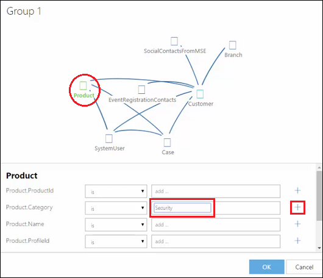

2. For Product.ProductID, enter "5567", click **Add** (+), and then click **And**.

    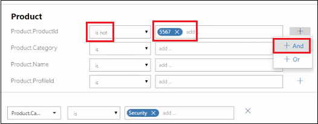

3. For Customer.CustomerSatisfaction, select **<**, enter "60", the click **Add** (+).

    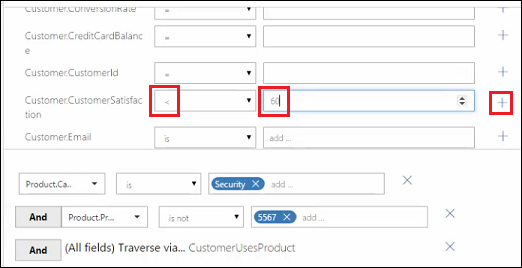

4. Select **OK** to save these group settings.

The group created from these steps consists of people using security products (excluding 5567) whose satisfaction is less than 60 out of 100.

Select the **Query** tab to see the group settings defined as a query.

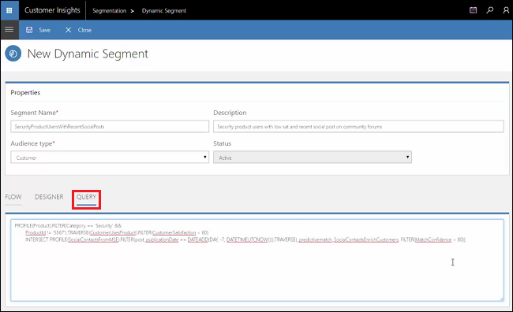

##Create a compound segment

1. From the Segmentation Dashboard, select **Add** > **Compound Segment**.

    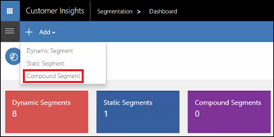. 

2. Fill in the values and select **Save**.

 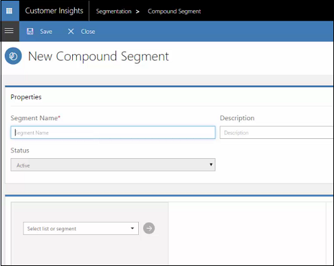

    **Properties**
    |**Item**|**Description**|
    | ----------- | ---------- |
    | Segment Name | The name of the compound segment. |
    | Description | A description of the segment. |
    | Status |  |

###Example: A compound segment for high value customers

The following steps show the creation of a compound segment of high credit card balance customers who should be sent a followup communication.

1. Select the dynamic segment of high balance customers.

    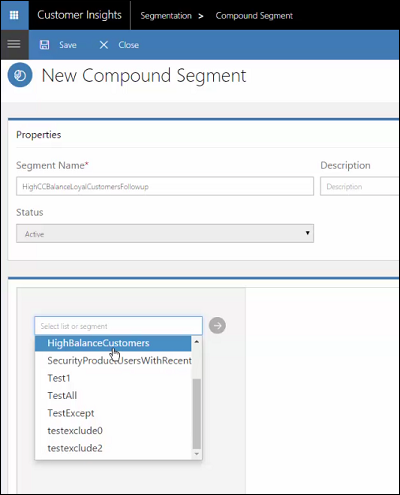 

2. Exclude the customers who do not want to be contacted.

    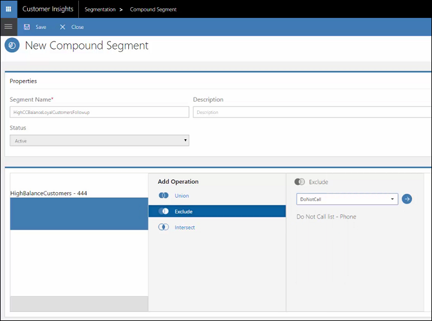

    There are four customers who will be excluded.

    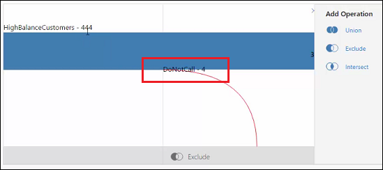

3. Select **Save** and the compound segment is added to the dashboard.

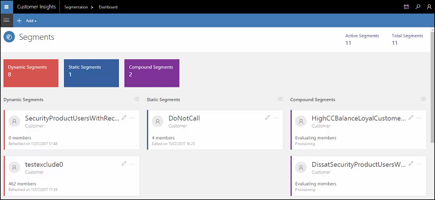

##View your segment details

Select a segment in the dashboard to see member and trendline information.

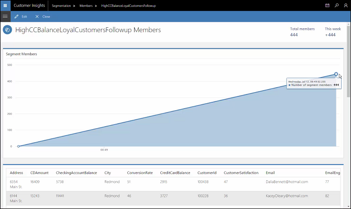