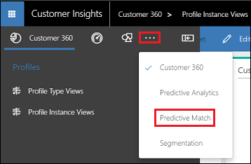
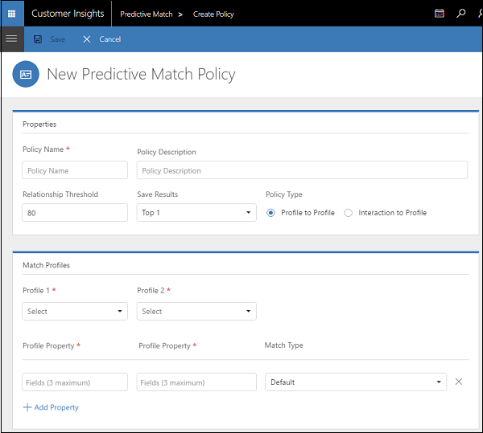
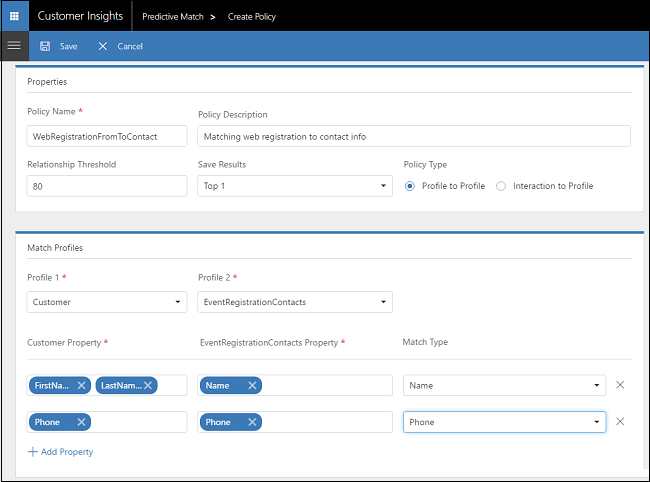
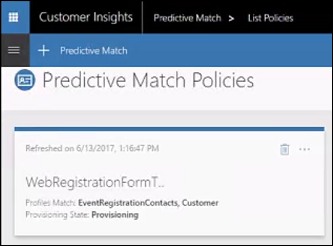
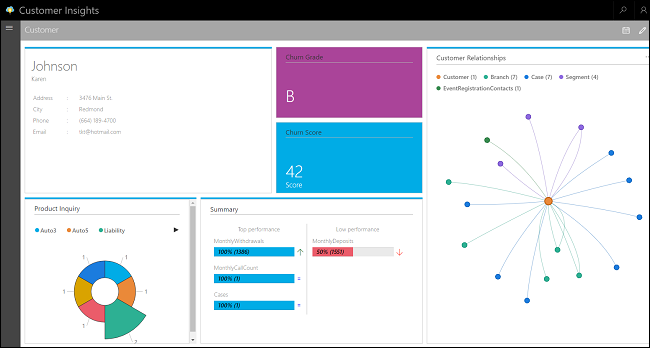
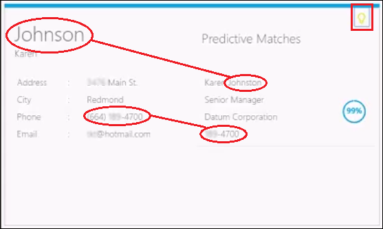

Predictive matching
==========================
[!include[pre release disclaimer](../../includes/cc-beta-prerelease-disclaimer.md)]

##What is predictive matching?

Predictive matching is the process of combining data from multiple sources. Data coming from various sources often use different fields to uniquely identify records, and contain different values. 

For example, consider the following customer records.

 

In one company's records, customers are identified by **First Name** and **Last Name**. In another company, **Name** is used. The name given is **Mike** at one company and **Michael** at another. Yet, these two records represent the same customer. Predictive matching in [!INCLUDE[pn-customer-insights](../../includes/pn-customer-insights-full.md)] uses context-based matching of entities from diverse sources to merge the data. 

##Create a Predictive Match policy

1.  Open your Customer Insights  Customer 360 application.

2.  Select **Show Menu** . 

3.  Select **All Options** > **Predictive Match**.

    

4.  Select **Add** and fill in the values.

    

    **Properties**
    |**Item**|**Description**|
    | ----------- | ---------- |
    | Policy Name | The name of the Predictive Match policy. |
    | Policy Description | A description of the policy. |
    | Relationship Threshold | Default value: 80. Only matches with a score equal or higher than this value will be displayed. |
    | Save Results | Default value: Top 1. Use to select the number of matches to save.|
    | Policy Type | Profile to Profile:   Interaction to Profile:   |

    **Match Profiles**
    |**Item**|**Description**|
    | ----------- | ---------- |
    | Profile 1 |   |
    | Profile 2 |   |
    | Profile Property |   |
    | Match Type | Default value: Default   |

5.  Select **Save** to save your new policy. It will automatically run in the background and be available for your Customer 360 analysis.

##Sample Predictive Match Policy settings

The following values were used to create a sample Predictive Match policy:

**Properties**
|**Item**|**Value**|
| ----------- | ---------- |
| Policy Name | WebRegistrationFormToContact |
| Policy Description | Matching web registration to contact info |
| Relationship Threshold | 80 |
| Save Results | Top 1 |
| Policy Type | Profile to Profile |

**Match Profiles**
|**Item**|**Value**|
| ----------- | ---------- |
| Profile 1 | Customer |
| Profile 2 | EventRegistrationContacts |
| Profile Property | Firstname; LastName |
| Profile Property | Name |
| Match Type | Name |
| Profile Property | Phone |
| Profile Property | Phone |
| Match Type | Phone |

The new policy shows up as a tile when saved.

You can see the policy in action in Customer 360.

For example, you can see the predictive matching inferences for Karen Johnson.

Click the **Show Predictive Matches** in her Info card to display the predictive matches for her contact information.

In this sample, phone numbers appear to match as well as last names despite the differences. We therefore have a matching score of 99%.

