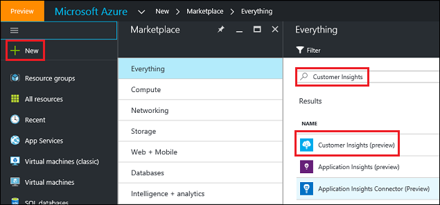
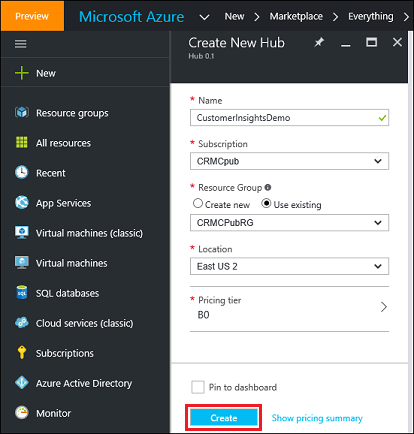

Create your Customer Insights hub
==========================
[!include[pre release disclaimer](../../includes/cc-beta-prerelease-disclaimer.md)]

This section takes you through the steps needed to create your [!INCLUDE[pn-customer-insights-full](../../includes/pn-customer-insights-full.md)] hub through the Azure portal.

1.  Sign in to the [Azure portal](https://ms.portal.azure.com/) by using your Azure account.

2.  After signing in to the Azure portal, do the following:

    1.  On the leftmost menu, select **New**.

    2.  On the **New** blade, select **Intelligence + Analytics**.

    3.  On the **Intelligence + Analytics** blade, select **[!INCLUDE[pn-customer-insights-short](../../includes/pn-customer-insights-short.md)] (preview)**.

    Alternatively, you can:
 
    1. On the leftmost menu, select **New**.

    2. In the **search box** on the **New** blade, type: **[!INCLUDE[pn-customer-insights](../../includes/pn-customer-insights-short.md)]**

    3. This will display the search results from the Marketplace that match the search query. On the **Everything** blade, select **[!INCLUDE[pn-customer-insights-short](../../includes/pn-customer-insights-short.md)] (Preview)**.

     

3.  Select **Create**.

4.  On the **Create New Hub** blade, enter a **Name** for your [!INCLUDE[pn-customer-insights-short](../../includes/pn-customer-insights-short.md)] hub.

    >[!IMPORTANT]
    >The name of the [!INCLUDE[pn-customer-insights](../../includes/pn-customer-insights-short.md)] hub must be globally unique. If you receive the error: **[!INCLUDE[pn-customer-insights](../../includes/pn-customer-insights-short.md)] name “&lt;name-you-entered&gt;” is not available**, change the name of the [!INCLUDE[pn-customer-insights](../../includes/pn-customer-insights-short.md)] hub and try creating again.

5.  Choose the Azure **Subscription** where you want your hub to be created.

6.  Create a new, or choose an existing, **Resource group** in which you want to create your hub. For the purpose of this tutorial, you can create a new resource group.

7.  Choose the **Region** in which you want to create your hub. New locations will be added over time.

8.  Choose the **Pricing tier** you want to use for your hub. Pricing tiers will be added over time.

9.  Select **Create** to start provisioning your [!INCLUDE[pn-customer-insights-short](../../includes/pn-customer-insights-short.md)] hub. It will take at least several minutes for the deployment to finish.

     

After your [!INCLUDE[pn-customer-insights](../../includes/pn-customer-insights-short.md)] hub is created, you will receive a notification in the Azure portal. After you refresh the page, your [!INCLUDE[pn-customer-insights](../../includes/pn-customer-insights-short.md)] hub should appear in the list of **All Resources** on your Azure portal **dashboard**. You can right-click the hub to pin it to your dashboard.
