Data modeling
==========================
[!include[pre release disclaimer](../../includes/cc-beta-prerelease-disclaimer.md)]

This section describes the steps for creating a data model for profiles and interactions in your [!include] hub. It will then describe how KPIs can be defined in [!include].

   >[!NOTE]
   >**WAIT!**  
   >If you have connected your [!include] hub by using [!include] sample data, you can ignore this section because the settings below were configured for you. Skip to [Step-by-step Customer 360](stepbystepcustomer360.md).

Begin by selecting your [!include] hub in the [!include]. The key **Settings** for your hub are displayed.

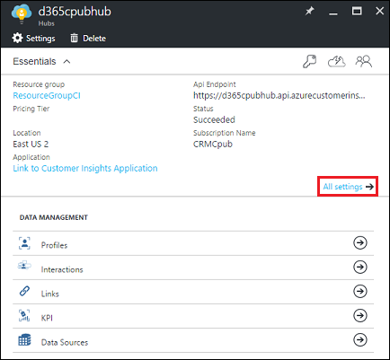 

##Add a profile

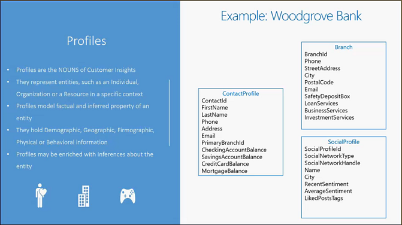 

There are two ways to create a profile definition in the [!include]:

-   You can create a profile definition by uploading a CSV file with sample profile data, where each column represents an attribute or a property of the profile.

-   Alternatively, or in addition, you can specify each property in the profile by specifying its name and type. Keys for a profile can be defined as a single property or a tuple of properties.

To create a new profile definition from the [!include]:

1.  On your [!include] hub blade, select **Profiles**.

2.  On the **Profiles** blade, select **Add Profile**.

3.  \[Optional Step\] This step describes how to add properties to your profile when you have sample profile data in a CSV file. If you do not have such sample data, or want to define each property explicitly, you can skip ahead to the next step.

    1.  On the **New Profile** blade, select **Creating from sample data**.

        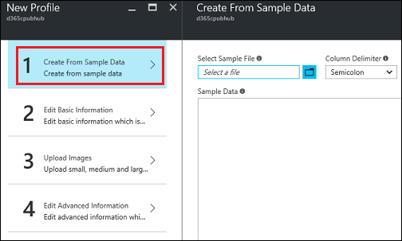 

    2.  On the **Creating from sample data** blade, select the **Select a file** dialog box or the folder icon next to it, to upload a sample CSV file.

        >[!NOTE]
        >**TRY IT!**  
        >Upload the Branch.csv sample file. Use default values and do not add an image.  
        >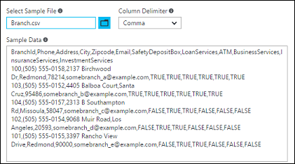 

    3.  Choose the appropriate **Column Delimiter**, and then select **OK**. A delimiter will be preselected based on the data you've uploaded.

4.  On the **New Profile** blade, select **Edit basic information** to modify any of the properties loaded from the sample file, add more properties, or to define the keys for your profile.

    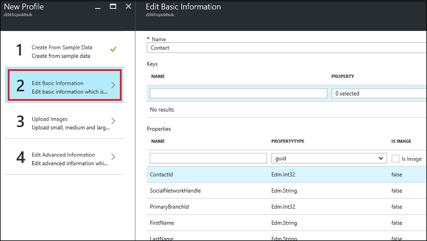 

    1.  To change the name or type of a property, select the property in the **Properties** section of the **New Profile** blade.

    2.  To add a new property, select the **Name** dialog box in the **Properties** section of the **New Profile** blade. Enter a name for the property, and then choose a **PropertyType** from the drop-down list.

    3.  To define a key for the profile, select the **Name** dialog box in the **Keys** section, and then choose a **Property** from the drop-down menu. If you want to use a tuple of properties as a key, the combination of which is unique, you can choose multiple properties in the **Property** drop-down list.

        >[!NOTE]
        >**TRY IT!**  
        >Use the following values.  
        >Key Name: branchid  
        >BranchId Property: BranchId  
        >Use default values for the rest of the settings.  
        >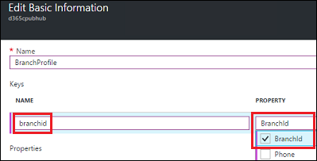     

    4.  Select **OK** to save the additions and modifications for your profile properties.

  >[!NOTE]
  >ProfileId is a reserved attribute for profiles. If you have a property with this name in your CSV schema, you will be asked to rename it before you can proceed.

5.  \[Optional\] On the **Upload Images** blade, you can associate icons of different sizes with your profile or with a specific property in a profile. The icon will be used in the [!include] app to represent the profile or property.

    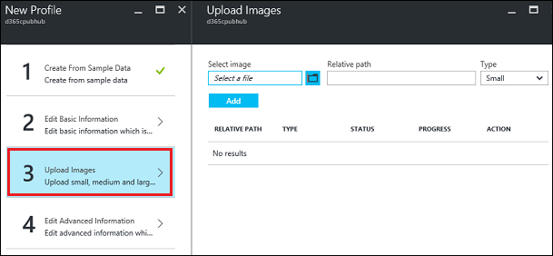 

    1.  Select **Add** to add the image to your profile.

    2.  Select **Upload** to upload the image to the Azure storage.

    3.  Select **OK** to save.

6.  Selecting **Edit Advanced Information** on the **New Profile** blade will display the JSON schema for your profile definition. You can make changes to your profile by directly editing the JSON representation. You can also use this to copy the JSON schema for creating the profiles programmatically using our REST APIs.

    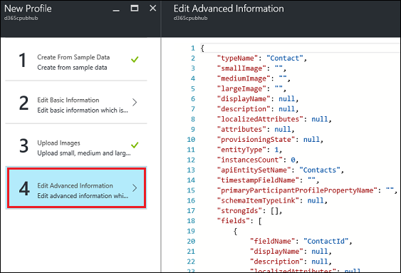 

    Select **OK** to save any edits.

7.  Select **Create** on the **New Profile** blade to provision your new profile type.

8.  Create additional profiles as needed by repeating these steps.

>[!NOTE]
>**TRY IT!**  
>Create a second profile by uploading the Contact.csv sample file.  
>Use the following values.  
>Key Name: contactId  
>ContactId Property: ContactId  
>Use default values for the rest of the settings.  

##Add an interaction

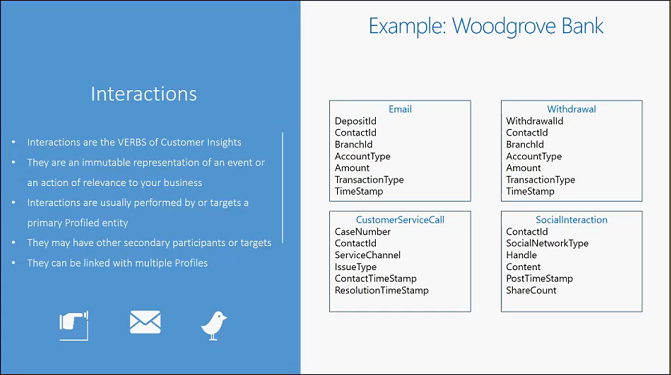 

Interactions can be created from the [!include] in two ways:

-   You can create an Interaction definition by uploading a CSV file with sample interaction data, where each column represents an attribute or a property of the interaction.

-   Alternatively, or in addition, you can specify each property of the interaction by specifying its name and type.

To create a new interaction definition from the [!include]:

1.   On your [!include] hub blade, select **Interactions**.

2.  On the **Interactions** blade, select **Add Interaction**.

    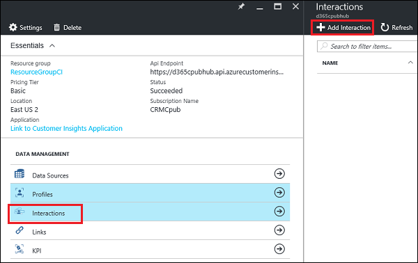 

3.  \[Optional Step\] This step describes how to add properties to your interaction when you have sample activity or interaction data in a CSV file. If you do not have such sample data or want to define each property explicitly, you can skip ahead to the next step.

    1.  On the **New Interaction** blade, select **Creating from sample data**.

        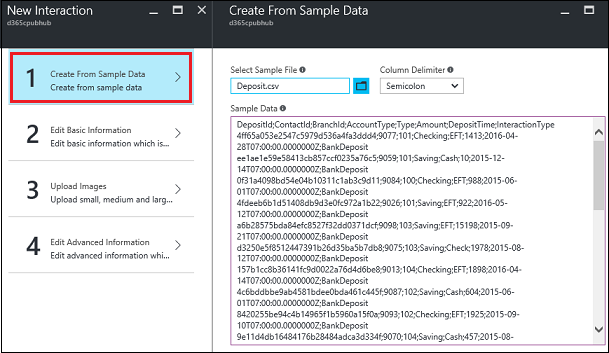 

    2.  On the **Creating from sample data** blade, select the **Select a file** dialog box or the folder icon next to it, to upload a sample CSV file.

    3.  Select **OK**.

        >[!NOTE]
        >**SAMPLE DATA**  
        >Upload the Branch.csv sample file. Use default values, and do not add an image.

4.  On the **New Interaction** blade, select **Edit basic information** to modify any of the properties loaded from the sample file.

    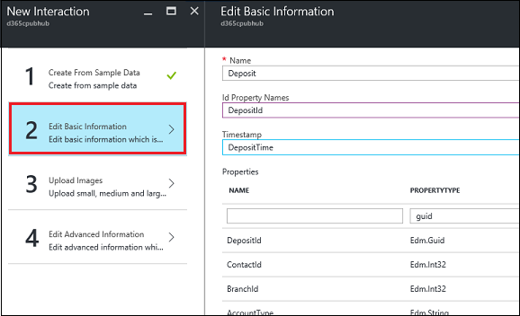 

    1.  To change the name or type of a property, select the property in the **Properties** section of the **New Interaction** blade.

    2.  To add a new property, select the **Name** dialog box in the **Properties** section of the **New Interaction** blade. Add a name for the property, and select a **PropertyType** from the drop-down list.

    3.  To identify the ID properties of the interaction, select the **Id Property Names** dialog box, and select the relevant interaction properties from the drop-down list.

        >[!NOTE]
        >This is an optional property. If you have an Id properties selected, the interaction record must have data for this column. It cannot be empty.

    4.  You can also identify the **Timestamp** of the activity or interaction based on one of the properties of type DateTimeOffset in the interaction. If you do not specify this property, the creation or update time of the interaction will be used as the default time stamp of the interaction.

    5.  Select **OK** to save the additions and modifications for your interaction properties.

  >[!NOTE]
  >InteractionId is a reserved attribute for interactions. If you have a property with this name in your CSV schema, you will be asked to rename it before you can proceed.

1.  \[Optional\] On the **Upload Images** blade, you can associate icons of different sizes with your interaction or with a specific property in an interaction. The icon will be used in the [!include] app to represent the interaction or property.

    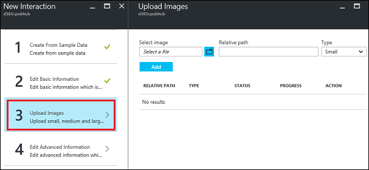 

    1.  Select **Add** to add the image to your interaction.

    2.  Select **Upload** to upload the image to the Azure storage.

    3.  Select **OK** to save.

2.  Selecting **Edit Advanced Information** on the **New Interaction** blade will display the JSON schema for your interaction definition. You can make changes to your interaction definition by directly editing its JSON representation. You can also use this to copy the JSON schema for creating the interactions programmatically using our REST APIs.

    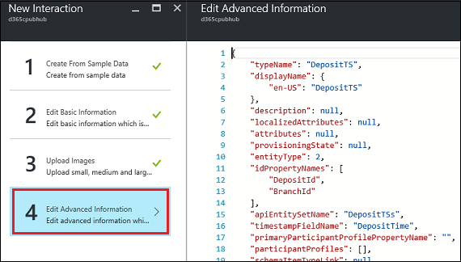 

    Select **OK** to save any edits.

3.  On the **New Interaction** blade, select **Create** to provision your new Interaction type.

>[!NOTE]
>**TRY IT!**  
>Create three more interactions by uploading the Contact.csv, Deposit.csv, and Withdrawal sample files. Use default values, and do not add an image.

##Add a link

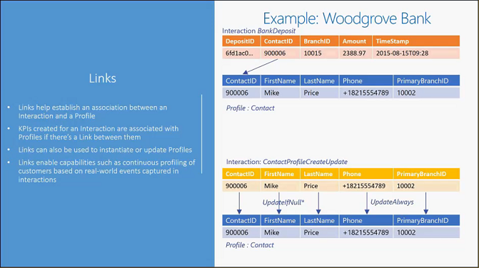 

To create a new **Link** definition from the [!include]:

1.   On your [!include[pn_customer-insights](../../includes/pn-customer-insights-short.md)] hub blade, select **Links**.

2.  On the **Links** blade, select **Add Link**.

    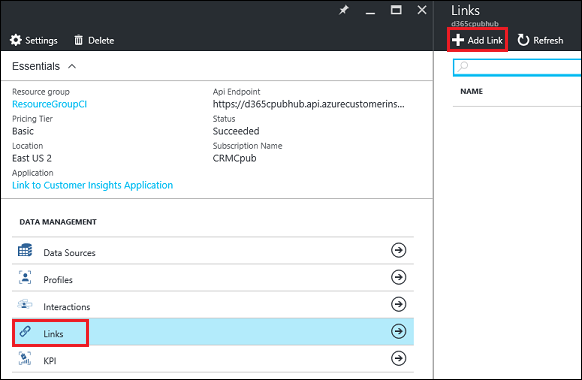 

3.  On the **New Link** blade, do the following:

    1.  Add a **Name** for the Link.

    2.  Choose an **Interaction Type**, which will be the source data for insert or update of the profile.

    3.  Choose the **Interaction Type** and **Profile Type** that you want to insert or update using this source data.

    4.  Choose one of the profile keys as the **Profile Key Group**.
    
    5.  Choose the **Interaction Properties**

    6.  To link all interaction properties to a profile property by using your data, select **Populate property mappings**. 

        >[!NOTE]
        >**TRY IT!**  
        >Use the following values.  
        >Interaction Type: `<select the branch interaction you created above>`  
        >Profile Type: `<select the branch profile you created above>`  
        >Profile Key Group: `<select the branch profile key group you created above>`  
        >Interaction Properties `<select the branch interaction you created above>`  
        >Click **Populate property mappings**.  
        >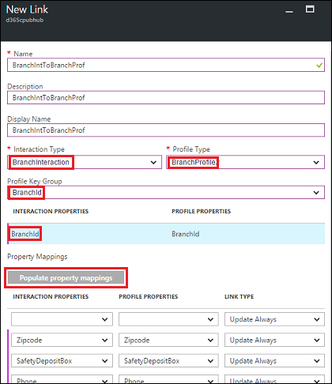     

    7.  In the **Property Mappings** section, you can link an Interaction property to a corresponding Profile property. Currently only links of type Update Always are supported. Future releases may support additional link types such as Update If Null, Update If Newer, and so on.

        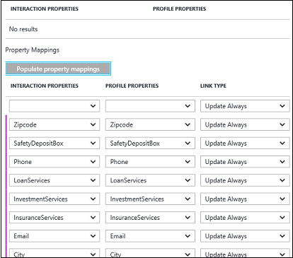 

4.  Select **Create** to provision the link between the interaction and the profile.

    >[!NOTE]
    >**TRY IT!**  
    >Create three additional links with the following settings.  
    >  
    >**Link contact interaction and profile**  
    >Interaction Type: `<select the contact interaction you created above>`  
    >Profile Type: `<select the contact profile you created above>`  
    >Profile Key Group: `<select the contact profile key group you created above>`  
    >Interaction Properties `<select the contact interaction you created above>`  
    >Click **Populate property mappings**.  
    >  
    >**Link deposit interaction and branch profile**  
    >Interaction Type: `<select the deposit interaction you created above>`  
    >Profile Type: `<select the branch profile you created above>`  
    >Profile Key Group: `<select the branch profile key group you created above>`  
    >Interaction Properties `<select the deposit interaction you created above>`  
    >Click **Populate property mappings**.  
    >  
    >**Link withdrawal interaction and branch profile**  
    >Interaction Type: `<select the deposit interaction you created above>`  
    >Profile Type: `<select the branch profile you created above>`  
    >Profile Key Group: `<select the branch profile key group you created above>`  
    >Interaction Properties `<select the deposit interaction you created above>`  
    >Click **Populate property mappings**.  

##Add upsert interactions

New content coming.

##Add a KPI

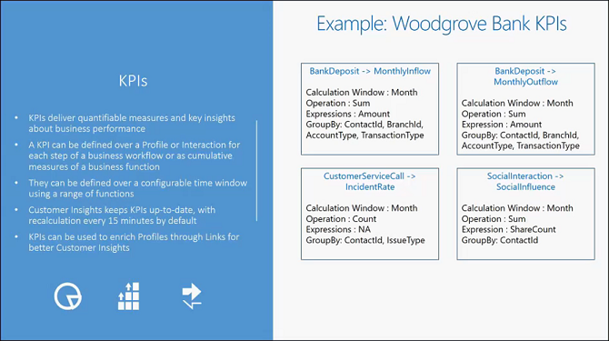 

To create a new **KPI** definition from the [!include]:

1.  On your [!include] hub blade, select **KPI**.

2.  On the **KPI** blade, select **Add KPI**.

    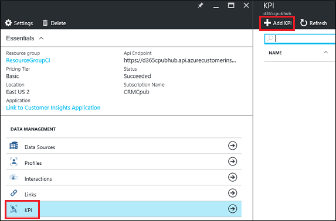 

3.  On the **New KPI** blade, do the following:

    1.  Add a **Name** for your KPI.

    2.  Add an optional **Description** of the KPI.

    3.  Choose a **Calculation Window** for the KPI from the options provided. The calculation window is the duration over which the KPI is calculated.

    4.  The **Min Value** and **Max Value** for the KPI are the lower and upper limits for the KPI value at which they will be clamped.

    5.  To choose the type that computes the KPI, select **Profile**, **Interaction**, or **KPI**.

    6.  In the **Expression** field, select the property value of the profile or interaction over which the KPI is computed.

    7. In the **Display Unit** dialog box, enter the units for the KPI value.

    8. In the **Group By** drop-down list, choose one or more profile keys or interaction IDs by which the KPI value will be grouped. If no key or ID is selected, this will be a global KPI.

    9. Select **OK**.

    10.  Choose the **Function** to use for computation of the KPI. In the current release, only one operation can be used for the KPI computation: Sum, Average, Min, Max, or Count.

    11. Select **OK**.

    12. Choose the **Filter Conditions** to use for computation of the KPI.

    13. Select **OK**.

4.  Select **OK** to provision the KPI.

    >[!NOTE]
    >**TRY IT!**  
    >Create two KPIs with the following settings.  
    >  
    >1. A KPI to calculate total monthly deposits for a branch  
    >  
    >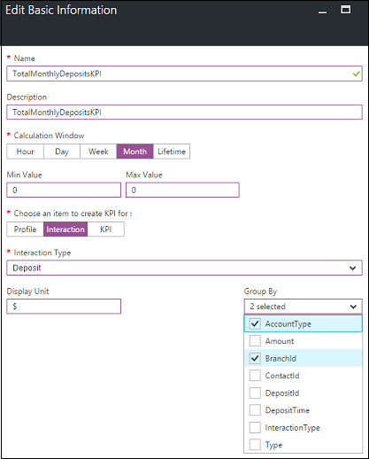    
    >**Edit Basic Information**  
    >Calculation Window: Month  
    >Choose an item to create KPI for: Interaction  
    >Interaction Type: `<select the interaction you created above for deposits>`  
    >Display Unit: $  
    >Group By: AccountType, BranchId  
    >**Function**  
    >Function: Sum  
    >Expression: BranchId - Type a letter to autofill with expression choices  
    >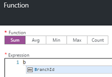    
    >**Filter Conditions**  
    >Basic and Advanced: No filters  
    >  
    >2. A KPI to calculate total monthly withdrawals for a branch  
    >  
    >**Edit Basic Information**  
    >Calculation Window: Month  
    >Choose an item to create KPI for: Interaction  
    >Interaction Type: `<select the interaction you created above for withdrawals>`  
    >Display Unit: $  
    >Group By: AccountType, BranchId  
    >**Function**  
    >Function: Sum  
    >Expression: BranchId - Type a letter to autofill with expression choices  
    >    
    >**Filter Conditions**  
    >Basic and Advanced: No filters  

After you've completed the data modeling setup, return to [Step 8](datasourceazurestorage.md#step8) in "Add Azure Blob storage as a data source" to complete the process of adding an Azure Blob container.