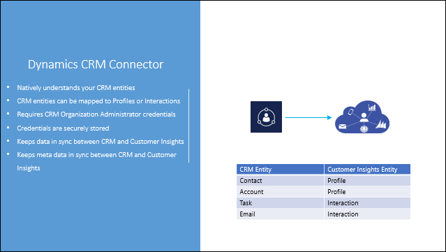
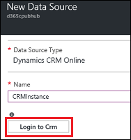
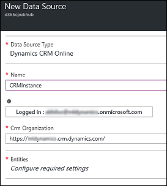
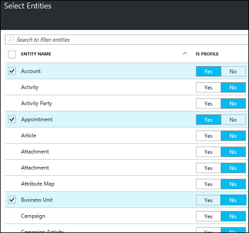
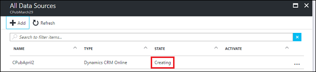
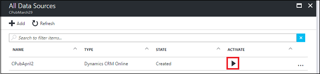
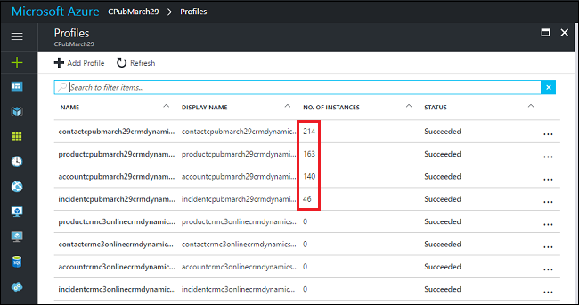

Add [!include] as a data source
==========================
[!include[pre release disclaimer](../../includes/cc-beta-prerelease-disclaimer.md)]

If you need to import data from your [!include] instance into [!include], please have the [!include] Administrator credentials for your [!include] organization ready.

 

>[!NOTE]
>**TRY IT!**  
If you have an instance of [!include] with the sample data installed, you can use it for your data connection. We'll use the sample data for data modeling and Customer 360. You'll need to have the Customer Service app installed.  
>If you don't have an instance of [!include], you can sign up for a 30-day trial and try out [!include] with our sample data. Go to [Microsoft Dynamics 365 for Customer Service](https://go.microsoft.com/fwlink/p/?linkid=829708), and then select **Get Started**.

##To use [!include] as a data source by using the [!include]

1.  On your [!include] hub blade, select **Data Sources** .

2.  On the **All Data Sources** blade, select **Add**.

     

3.  On the **New Data Source** blade, select **Data Source Type**.

4.  On the **Data Source Type** blade, select **Dynamics 365**.

     

5.  Enter a **Name** for the data source, and then select **Login to CRM**.

     

6.  This opens a new window for you to sign in to your [!include] instance. You must use **Dynamics 365 Administrator credentials** for this sign-in.

7.  If the sign-in is successful, the **New Data Source** blade will be updated with the logged-in ID and the [!include] organization name.

     

8.  Select **Configure required settings** to open the **Select Entities** blade. Depending on your [!include] configuration, the entities you see might be different from the ones below.

     

9.  Select the entities to import into [!include]. This displays a check mark next to the selected entity.

10.  If an entity should be modeled as a profile, choose **Yes** under **Is Profile**; otherwise, entities will be imported as interactions.

      

   >[!NOTE]
   >**TRY IT!**  
   >Use the following entities: 
    | Entity| Is Profile |                                                                                                                                              
    |-------|-----------------|
    | Account     | Yes |
    | Case        | Yes |
    | Contact     | Yes |
    | Product        | Yes |
    | Email     | No |
    | Phone Call        | No |

11.  On the **Select Entities** blade, select **OK**.

12.  On the **New Data Source** blade, select **Create** to provision [!include] as your data source. 
     It will take several minutes for the connection to be established. Refresh your browser to update the status.

      

13.  When the status becomes **Created**, select the **Activate** icon to activate the connection.

      

14.  After the connection is active, verify that data is being synchronized between [!include] and [!include].  
Close the **All Data Sources** blade, and open the **Profiles** and **Interactions** blades. You should see some values that aren't zero. It might take up to 24 hours for the data to be synchronized between [!include] and [!include]. 

      

Each [!include] entity you import into [!include] will have a corresponding interaction that appears on the **Interactions** blade. In addition, each entity imported as a profile will have a corresponding **Profile** type in [!include] that appears on the **Profiles** blade.

