Add [!include[](../../includes/pn-azure-blob-storage.md)] as a data source
==========================
[!include[pre release disclaimer](../../includes/cc-beta-prerelease-disclaimer.md)]

If you use [!include[](../../includes/pn-azure-shortest.md)] Storage as a data source for [!include[](../../includes/pn-customer-insights-full.md)], you must provide the connection keys to your storage account through the [!include[](../../includes/pn-azure-key-vault.md)]. This ensures security for your key.

##Set up your [!include[](../../includes/pn-azure-key-vault.md)]

[//]: # (@Jim, I think the text of the script and the explanatory table should follow step 3, because that step refers to the "following script". If the lines that begin with a hash mark are comments, can you change them to "Sign in to the Azure account" rather than "log in", "Create a new resource group if none exists", "Create a new key vault if none exists"? Step 6 refers to a URI, so should the last comment read "Get and display the secret URI"? Or should step 6 say "URL" instead?)
To use [!include[](../../includes/pn-azure-shortest.md)] Storage as a data source for [!include[](../../includes/pn-customer-insights-short.md)], you can configure your [!include[](../../includes/pn-azure-key-vault.md)] by using the connection keys for your storage account.

1.  Set up [!include[](../../includes/pn-azure-shortest.md)] [!include[](../../includes/pn-powershell-short.md)] with the instructions at [How to install and configure Azure PowerShell](https://azure.microsoft.com/documentation/articles/powershell-install-configure/).

2.  Create a [!include[](../../includes/pn-powershell-short.md)] script file named SetupAzureKeyVault.ps1

3.  Copy the following script into the file, and update the fields at the beginning of the script as described in the table.

4.  Run the script from the [!include[](../../includes/pn-powershell-short.md)] prompt. 

```
  # ------------------------------------------------------------------- #
  $keyvaultName = '<provide-a-keyvault-name>'
  $secretName = '<name-the-secret-for-your-storage-account>'
  $resourceGroupName = '<specify-a-resource-group-name>'
  $location = '<Azure-region-of-your-storage-account>'
  $connectionString = '<provide-the-connection-string>'
  $tags = @{'AllowedACIHubs'='<HubName1>;<HubName2>'}
  # ------------------------------------------------------------------- #
  
                                                                       
  # Login to Azure account.
  Login-AzureRmAccount
                                                                                     
  # Create new resource group if not exists.
  if(!(Get-AzureRmResourceGroup -Name $resourceGroupName -Location $location)){
    New-AzureRmResourceGroup -Name $resourceGroupName -Location $location
  }
                                                                                      
  # Create new key vault if not exists.
  if(!(Get-AzureRmKeyVault -VaultName $keyvaultName -ResourceGroupName $resourceGroupName)){
    New-AzureRmKeyVault -VaultName $keyvaultName -ResourceGroupName $resourceGroupName -Location $location
  }

  # Convert connection string
  $secretValue = ConvertTo-SecureString $connectionString -AsPlainText -Force
  Set-AzureKeyVaultSecret -VaultName $keyvaultName -Name $secretName -SecretValue $secretValue -Tags $tags

  # Authorize application to access key vault.
  $servicePrincipal = '38c77d00-5fcb-4cce-9d93-af4738258e3c'
  Set-AzureRmKeyVaultAccessPolicy -VaultName $keyvaultName -ServicePrincipalName $servicePrincipal -PermissionsToKeys all -PermissionsToSecrets all
                                                                                       
  # Get and display secret url.
  $secret = Get-AzureKeyVaultSecret -VaultName $keyvaultName -Name $secretName
  Write-Host "Connection key vault URL is "$secret.id"" 
```

  The values for the fields at the beginning of the script are described in the following table.

  | Value              | Description                                                                                                                                                 
  |--------------------|-------------------------------------------------------------------------------------------------------------------------------------------------------------|
  | $keyvaultName      | Enter a name for a key vault. [Azure Key Vault](https://azure.microsoft.com/documentation/articles/key-vault-whatis/) helps safeguard storage account keys. |
  | $secretName        | Enter a name for the [secret](https://azure.microsoft.com/en-us/documentation/articles/key-vault-get-started/) to be added to the key vault.                |
  | $resourceGroupName | Enter a resource group name. If the resource group does not exist, it will be created. 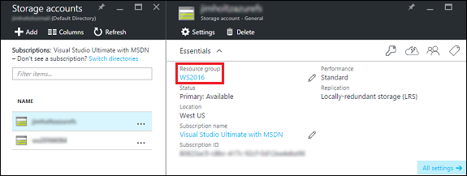  |
  | $location          | Enter the region for your Azure storage account. 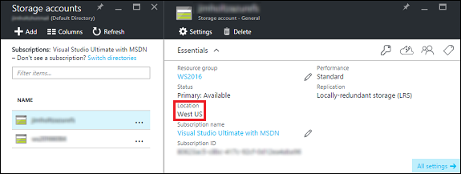                                           |
  | $connectionString       | Enter the Azure storage account key connection string. 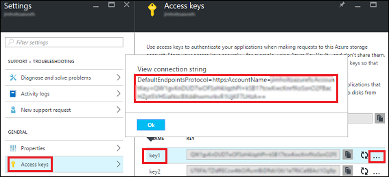                                                          |                                                        
  | $tags              | Enter the [!include[](../../includes/pn-customer-insights-short.md)] hubs to be used for data modeling.                                                                                              |

5.  The script will ask for your [!include[](../../includes/pn-azure-shortest.md)] account credentials.

6.  Save the Key Vault URI printed at the end of the script.

[//]: # (@Jim, I didn't--but I'd like to--use the "Azure Blob storage" token in this section, I do think it's the correct modifier for "container" so that it's never just "Azure Blob container." It looks like the UI screenshots show that also. The alt text, of course, would have to be changed manually.)
##Add an Azure Blob container as a data source

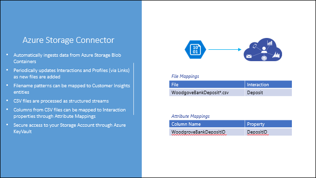 

To create an Azure Blob container as a data source by using the [!include[](../../includes/pn-azure-portal.md)]:

1.  On your [!include[](../../includes/pn-customer-insights-short.md)] hub blade, select **Data Sources**.

2.  On the **All Data Sources** blade, select **Add**.

     

3.  On the **New Data Source** blade, select **Data Source Type**.

4.  On the **Data Source Type** blade, select **AzureBlob**.

     

5.  Enter a **Name** for the data source.

6.  Paste the **Connection KeyVault URL** you saved in step 6 of "Set up your Azure Key Vault" section earlier in this topic.

    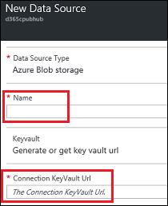 

7.  Select **Create** to provision the data source.

    >[!NOTE]
    >After the data source has been provisioned, you must first finish the steps in [Data modeling](./datamodeling.md) and come back to the data source to create file mappings between CSV files in the Azure Blob storage containers and data modeled entities (interactions). <br>
    ><br>
    >After finishing data modeling steps, return and continue with the following steps to complete the data source setup process.

    ## <a id="step8"> </a> 

8.  You'll now define how your source data files map to interactions. Right-click the data source you added, and then select **Mappings**.

    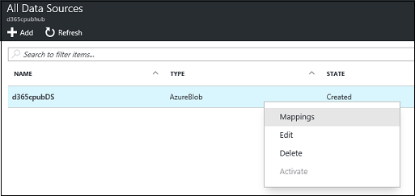 

9.  On the **File Mappings** blade, select **New File Mapping**.

10.  In the **Source Folder** dialog box, enter the folder in the Azure Storage account from where you want to pick up the CSV file. 

     You can find this by opening your storage account, going to **Overview** > **Blobs** and noting the name of the storage container.

     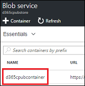 

11.  Specify a **Filename Pattern** for the source file. This can include one wildcard character, typically at the end, for instance BankDeposit*.

12.  Choose a **Target Interaction** type for which you want to insert or update the interactions, from the rows in the specified CSV file.

13.  Choose an **Error Management** policy that you want to apply for this file mapping.

14.  Choose an **Error Limit** for each processing instance.

15.  Choose a **Frequency** for the polling interval.

15.  Choose a **Polling Interval** for this file mapping.

16.  Choose an **On Complete** policy.

17.  Choose **Create** to provision the file mapping.

18.  For your data source files, the content of the files need to map to the fields and attributes that are defined in the interactions. For each file mapping, right-click the file mapping, and then select **Attribute Mappings**.

19.  Select the **Select Sample File** field, or select the folder icon next to it, to upload a sample CSV file.

20.  Select **Save**.

<!-- 
Removing for new D365 online connector approach.
     >[!NOTE]
     >**TRY IT!** <br>
     >Create three file mappings and attribute mappings with the following settings. <br>
     > <br>
     >1. A file mapping and attribute mapping for branch data <br>
     > <br>
     >**New File Mapping** <br>
     >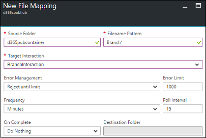 <br>  
     >Source folder: `<your Azure storage account container>` <br>
     >Filename Pattern: Branch* <br>
     >Target Interactions: `<select the interaction you created for branch>` <br>
     >Leave the remaining values as default. <br>
     >**Attribute Mappings** <br>
     >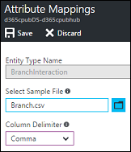 <br>  
     >Select a Sample File: Branch.csv <br>
     >Column Delimiter: Filled in for you. <br>
     >Leave the remaining values as default. <br>
     > <br>
     >2. A file mapping and attribute mapping for contact data <br>  
     > <br>
     >**New File Mapping** <br>
     >Source folder: your Azure storage account container <br>
     >Filename Pattern: Contact* <br>
     >Target Interactions: `<select the interaction you created for contact>` <br>
     >Leave the remaining values as default. <br>
     >**Attribute Mappings** <br>
     >Select a Sample File: Contact.csv <br>
     >Column Delimiter: Filled in for you. <br>
     >Leave the remaining values as default. <br>
     > <br>
     >3. A file mapping and attribute mapping for deposit data <br>  
     > <br>
     >**New File Mapping** <br>
     >Source folder: `<your Azure storage account container>` <br>
     >Filename Pattern: Deposit* <br>
     >Target Interactions: `<select the interaction you created for deposit>` <br>
     >Leave the remaining values as default. <br>
     >**Attribute Mappings** <br>
     >Select a Sample File: Deposit.csv <br>
     >Column Delimiter: Filled in for you. <br>
     >Leave the remaining values as default. <br>

21. Add your data files to the Blob storage container you created earlier. Open your Azure storage account and click **Blobs**.

     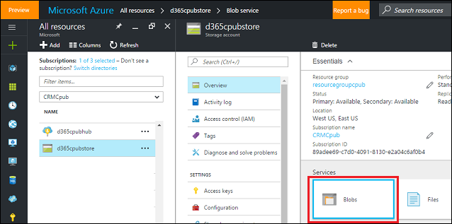 

22. Select the Blob container, click Upload, and then click the file folder. Upload your data files.

     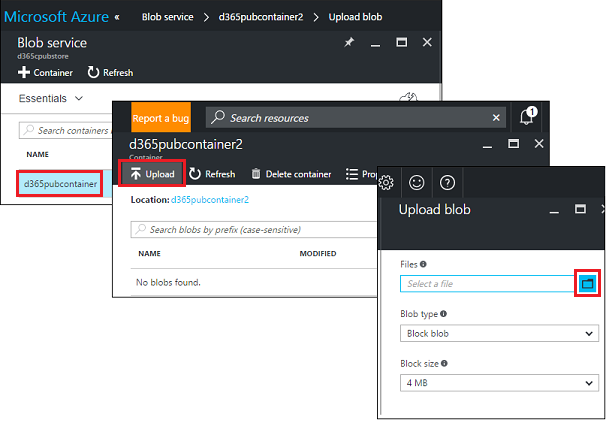 

>[!NOTE]
>**TRY IT!** <br>
>Upload the sample data files to your Blob storage container using the above steps.<br>    
-->