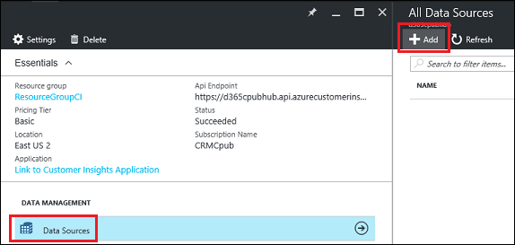
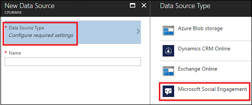
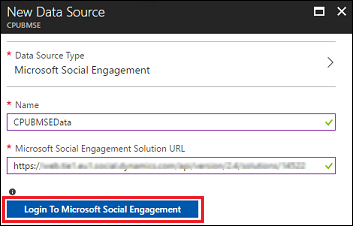
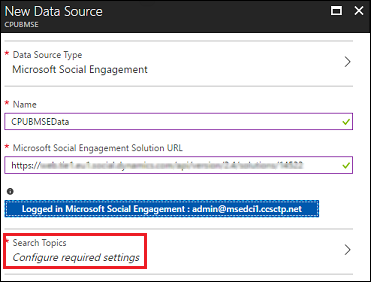
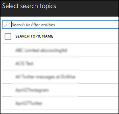
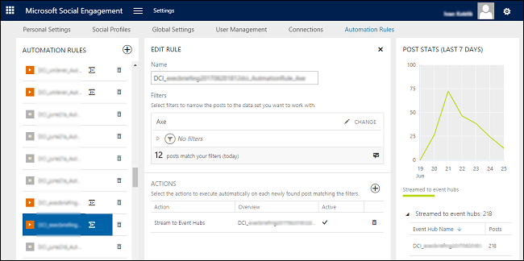

Add Microsoft Social Engagement as a data source
==========================
[!include[pre release disclaimer](../../includes/cc-beta-prerelease-disclaimer.md)]

The power of analytics increases with data from multiple sources. A prime data source these days is social media sites like Twitter, Facebook, and blogs. Social media data can be used to analyze how your customers view your company and your products. You can gain valuable insights into your customers and their preferences. All this is possible when bringing in data with the Microsoft Social Engagement connector.

For information about Social Engagement, see [Social Engagement Help & Training] (https://docs.microsoft.com/dynamics365/customer-engagement/social-engagement/help-hub).  

##To use Microsoft Social Engagement as a data source

1.  On your [!include] hub blade, select **Data Sources** .

2.  On the **All Data Sources** blade, select **Add**.

     

3.  On the **New Data Source** blade, select **Data Source Type**.

4.  On the **Data Source Type** blade, select **Microsoft Social Engagement**.

     

5.  Enter a **Name** for the data source, the Microsoft Social Engagement Solution URL, and then select **Login to Microsoft Social Engagement**.

     

    For information on how to find your solution URL, see [Connect Social Engagement to other domains](https://docs.microsoft.com/dynamics365/customer-engagement/social-engagement/connect-other-domains#add-the-solution-url-to-the-configuration-page).

6.  Sign in to your Social Engagement.

7.  Select **Configure required settings**.

     

8.  Select search topics to specify which conversations to listen to. 

     

    For information on Social Engagement search topics, see [Set up searches to listen to social media conversations] (https://docs.microsoft.com/dynamics365/customer-engagement/social-engagement/set-up-searches).

9.  Select **Create**. After a few minutes, select **Refresh** to see if your data source is created. Once created, select **Activate**.

10. Social Engagement inputs data into Customer Insights via [Azure Event Hubs] (https://azure.microsoft.com/services/event-hubs/). The Social Engagement connector creates and manages the connection between Social Engagement and Azure Event Hubs. No action by you is required. For more information, see [Stream data from Social Engagement to Microsoft Azure Event Hubs] (https://docs.microsoft.com/dynamics365/customer-engagement/social-engagement/stream-data-to-event-hubs).

    To see your automation rule in Social Engagement, go to **Settings** > **Automation Rules**.

     

    Under **ACTIONS**, select **Stream to Event Hubs** to see connection settings.

Once the connection is established between Social Engagement and Customer Insights, customer interactions are available for analysis in Customer Insights Customer 360.

##Privacy notice

By adding Microsoft Social Engagement as a data source to an instance of Dynamics 365 for Customer Insights, you are activating the transfer of Social Content and Customer Data (persisted in Social Engagement) into Customer Insights for analytical processing. The data is limited to Social Engagement search topics as configured in the Customer Insights data source settings. You can control the type of Customer Data going into Customer Insights by selecting the appropriate search topics. Twitter content is excluded from the ingestion of Social Engagement data into Customer Insights.

The JSON reference for events from Social Engagement describes the data that is transferred. More information: [JSON reference for events from Social Engagement](https://docs.microsoft.com/dynamics365/customer-engagement/social-engagement/event-hubs-json-reference-social-engagement).

At present, Customer Insights is in public preview and does not offer the same level of privacy and security commitments as Social Engagement or Dynamics 365 Customer Engagement. Customer Insights is natively built on Azure, and respective compliance and security standards for each applicable Azure service. More information: [Microsoft Azure](https://www.microsoft.com/trustcenter/cloudservices/azure). 

The Azure services used are:

- Azure Data Lake Store
- Azure Data Lake Analytics
- Azure HD Insight (Spark, Phoenix, HBase)
- Azure SQL Database
- Azure Key Vault
- Azure Secret Store
- Azure Event Hub
- Azure Stream Analytics
- Azure Redis Cache
- Azure Service Fabric
- Azure Active Directory
- Azure Monitoring
- Azure Metrics
- Azure Websites
- Azure Service Bus
- Azure Storage

Your use of Social Engagement as a data source for Customer Insights may require compliance with specific laws. Please direct any questions to the appropriate representative in your organization. Your use of Social Content is subject to source-specific license terms and restrictions. 

### See also

[Social Engagement Help & Training] (https://docs.microsoft.com/dynamics365/customer-engagement/social-engagement/help-hub)  
