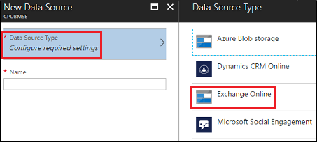
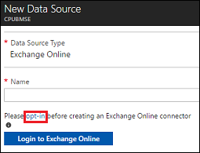
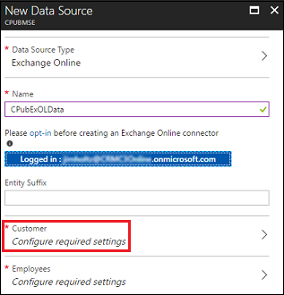
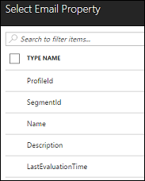
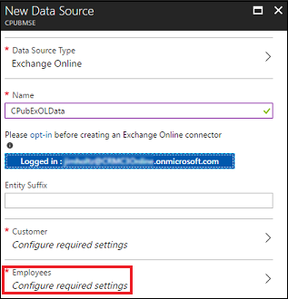

Add Exchange Online as a data source
==========================
[!include[pre release disclaimer](../../includes/cc-beta-prerelease-disclaimer.md)]

Once you connect Microsoft Exchange Online as a data source, you can easily map email addresses of customers and employees to sync Exchange data.

##Prerequisite - Customer and Employee profiles

Before setting up a connection to Exchange Online, you should have profiles that represent your customers and employees. For example, for a connection to Dynamics 365 (online) include the following entities as profiles:

- Account
- Contact
- User 

##Constraints

- You can create up to 5 Exchange Online connections for a tenant.
- You can select 1 profile type for employee type.
- You can select up to 2 profile types for customer type.
- You can select up to 2 email fields.
- You can't select the same employee profile type across 2 different Exchange Online connections.

If you need more than 1 profile type for employee or 2 profile types for customer, you can create multiple Exchange Online connections.

##To use Microsoft Exchange Online as a data source

1.  On your [!include] hub blade, select **Data Sources**.

2.  On the **All Data Sources** blade, select **Add**.

     

3.  On the **New Data Source** blade, select **Data Source Type**.

4.  On the **Data Source Type** blade, select **Exchange Online**.

     

5.  On the **New Data Source** blade, select **opt-in** and sign in with admin credentials to your Exchange Online.

     

6.  Enter a **Name** for the data source, and then select **Login to Exchange Online**.

7.  Enter your credentials and accept the permission request.

8.  For Customer, select **Configure required settings**.

     

9.  Select entities. 

10. For each entity, select the email properties, and then select **OK**.

     

11. Select **OK** to close the **Select Entities** blade.

12. On the **New Data Source** blade, for Employees, select **Configure required settings**.

     

13. For each entity, select the email properties, and then select **OK**.

14. Select **OK** to close the **Select Entities** blade.

15. Select **Create**. After a few minutes, select **Refresh** to see if your data source is created.